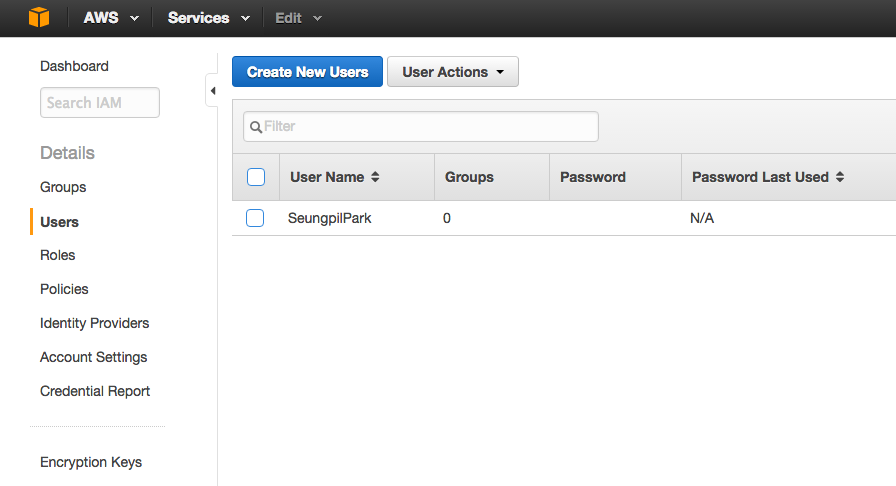
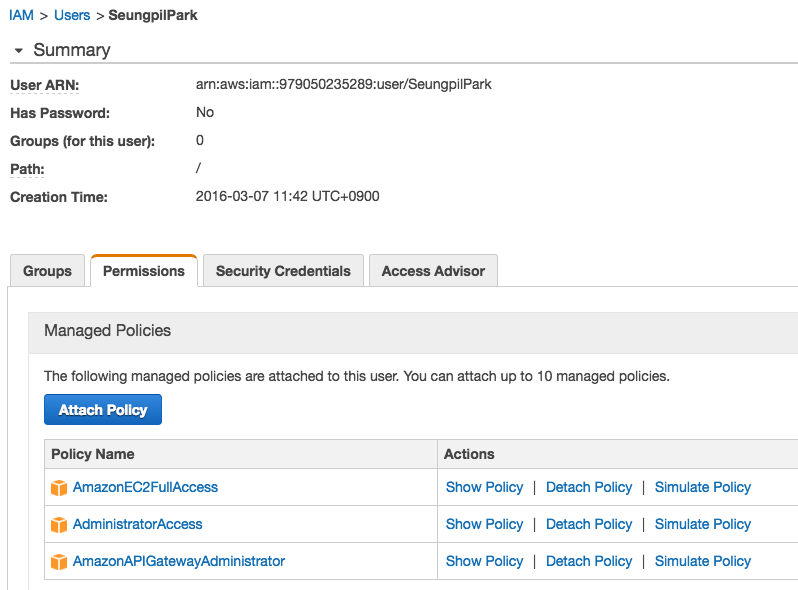
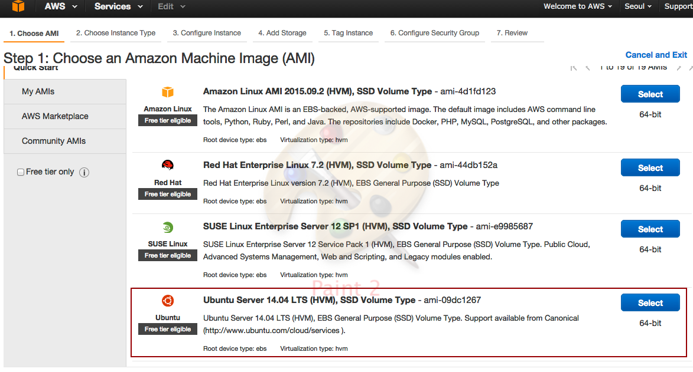
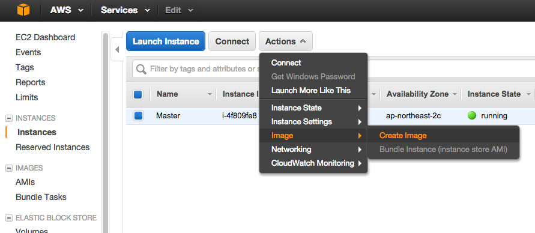
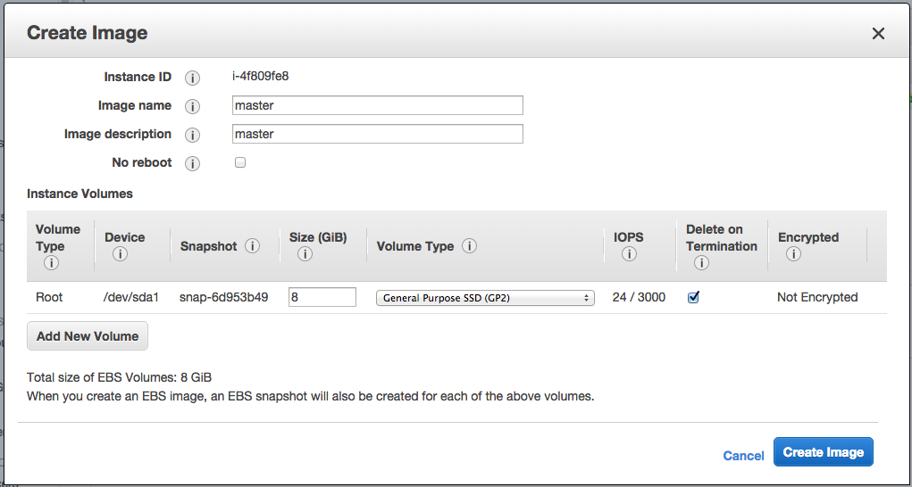
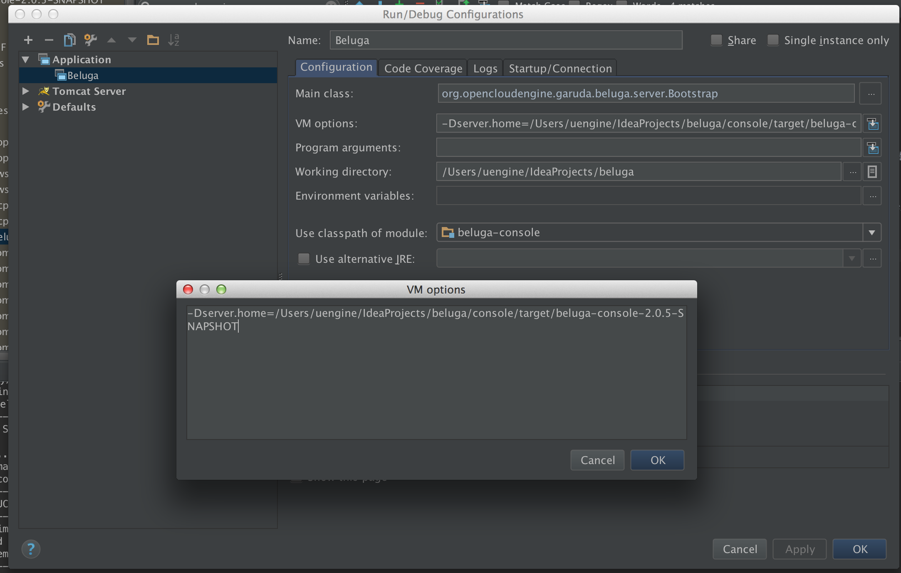
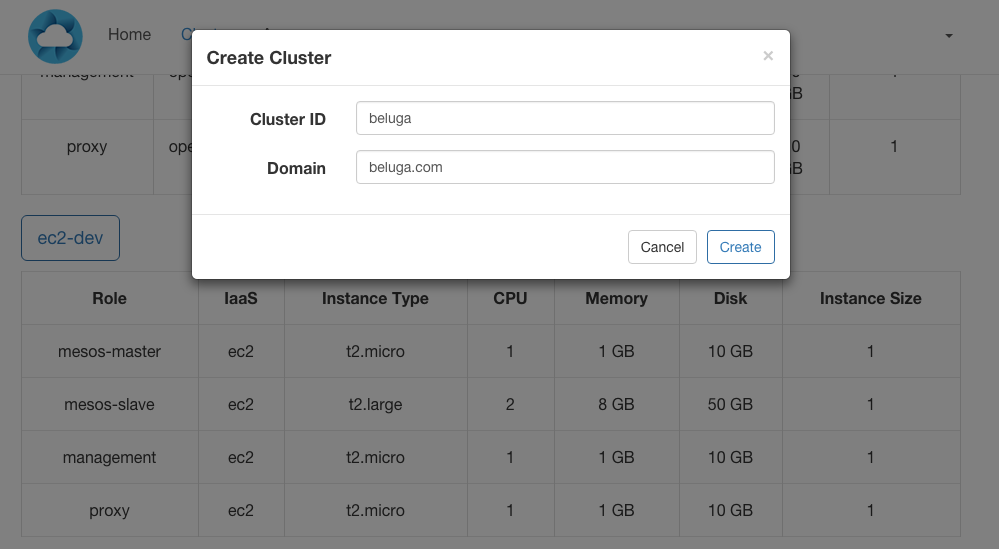
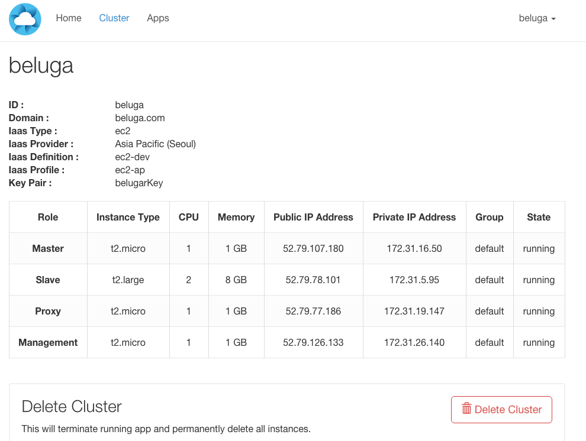

# Beluga [](https://travis-ci.org/TheOpenCloudEngine/beluga)

# 서버 운용법과 개발설명서

본 문서는 docker를 기반으로 하는 Beluga 클러스터 매니지먼트 서비스를 구축하고 운용하기 위한 가이드입니다. 
본 문서는 Beluga, Docker Cluster 및 AWS EC2 Dev-ops 구성에 대한 내용을 포함하고 있습니다. 또한 Mac os 환경에서의 구동 설정도 포함하고 있습니다.

# Training
 * [Virtual Box for Windows and Mac](docs/training-vb.md)
 * [Docker](docs/training-docker.md)
 * [HAProxy](docs/training-proxy.md)
 * [Mesos](docs/training-mesos.md)
 * [Mesos-Marathon](docs/training-marathon.md)

# 설치
본 문서의 목표는 서버 운용자로 하여금 Beluga 프로젝트의 빌드와 Beluga 실행시 Docker Cluster 를 활용하여 유저의 어플리케이션마다 독립적인 OS 환경을 제공하고, 소모되는 리소스를 Docker Cluster 환경에 분산배치 하는 것입니다.

이를 구축하기 위해서 다음의 순서로 설치를 진행하시기 바랍니다.
본 문서와 관련하여 참고할 수 있는 리소스는 다음과 같습니다.
 * [Docker](https://www.docker.com/)
 * [Mesos](http://mesos.apache.org/)
 * [Mesosphere marathon](https://github.com/mesosphere/marathon)
 * [Amazon EC2](https://aws.amazon.com/ko/ec2/)

### 목차
 - [Demo videos](#demo-videos)
 - [Prepare Beluga Server](#prepare-beluga-server)
    - [Download source](#download-source)
    - [Install JDK and Tomcat](#install-jdk-and-tomcat)
    - [Install Docker](#install-docker)
    
 - [Prepare EC2 settings](#prepare-ec2-settings)
    - [prepare account](#prepare-account)
    - [prepare security group](#prepare-security-group)
    - [prepare key pair](#prepare-key-pair)
    - [prepare IAM user and permission](#prepare-iam-user-and-permission)
    - [prepare AMI](#prepare-ami)
        - [Launch Instance](#launch-instance)
        - [Login to Instance and install script](#login-to-instance-and-install-script)
        - [Register image](#register-image)
        - [Remove Instance](#remove-instance)

 - [Beluga configuration and launch](#beluga-configuration-and-launch)
    - [Credential](#credential)
    - [Key pair and images](#key-pair-and-images)
    - [Hosts file](#hosts-file)
    - [Build](#build)
    - [Launch](#launch)
    - [Create cluster](#create-cluster)
    - [Set docker registry](#set-docker-registry)
    
 - [Optional EC2 settings](#optional-ec2-settings)
    - [Instance scale up](#instance-scale-up)
    - [Disk Mount](#disk-mount)

 - [Amazon EC2 Endpoint](#amazon-ec2-endpoint)
 
 
## Demo videos

1 . Provisioning

https://vimeo.com/145980366

2 . Scaling in / out

https://vimeo.com/145980080

## Prepare Beluga Server

### Download source

Beluga Dev-ops 환경을 위해서 dev-ops 브런치의 소스를 다운받습니다.

```
$ git clone https://github.com/TheOpenCloudEngine/beluga/tree/dev-ops

```

### Install JDK and Tomcat

#### Ubuntu

우분투에서는 설치된 소스코드의 다음 스크립트를 실행합니다.

Jdk 설치 중 **오라클 라이선스 동의** 창이 뜨면 수락을 하도록 합니다.

```
$ cd script/component
$ ./install_oracle_jdk7.sh

$ cd script/component
$ ./install_tomcat7.sh

```

### Mac OSX

#### Jdk install
[Jdk 1.7 download page](http://www.oracle.com/technetwork/java/javase/downloads/jdk7-downloads-1880260.html) 에서 Mac OS X x64 를 다운받아 설치합니다.


#### Tomcat install

1.Download a binary distribution of the core module: apache-tomcat-7.0.47.tar.gz from [here](http://tomcat.apache.org/download-70.cgi). I picked the tar.gz in Binary Distributions / Core section.

2.Opening/unarchiving the archive will create a folder structure in your Downloads folder: (btw, this free [Unarchiver app](https://itunes.apple.com/us/app/the-unarchiver/id425424353?mt=12) is perfect for all kinds of compressed files and superior to the built-in Archive Utility.app)

~/Downloads/apache-tomcat-7.0.47

3.Open to Terminal app to move the unarchived distribution to /usr/local

```
$ sudo mkdir -p /usr/local
$ sudo mv ~/Downloads/apache-tomcat-7.0.47 /usr/local

```

4.To make it easy to replace this release with future releases, we are going to create a symbolic link that we are going to use when referring to Tomcat (after removing the old link, you might have from installing a previous version):

```
$ sudo rm -f /Library/Tomcat
$ sudo ln -s /usr/local/apache-tomcat-7.0.47 /Library/Tomcat

```

5.Change ownership of the /Library/Tomcat folder hierarchy:

```
$ sudo chown -R <your_username> /Library/Tomcat

```

6.Make all scripts executable:

```
$ sudo chmod +x /Library/Tomcat/bin/*.sh

```

### Install Docker

#### Ubuntu

우분투에서는 설치된 소스코드의 다음 스크립트를 실행합니다.

```
$ cd script/cluster
$ ./install_docker_daemon.sh

```

#### Mac OSX Docker toolbox

Mac OS 에서는 Docker toolbox 를 설치합니다.

Docker toolbox 는 Mac 내부에 Docker Daemon 이 답재된 VirtualBox 를 실행시켜주고, 벨루가는 VirtualBox Docker deamon 의 environment 를
어플리케이션에 동기화 시켜서 docker client 를 실행하게 됩니다.
 
Docker toolbox 설치와 관련된 더 자세한 정보를 원하신다면 [Installation on Mac OS X - Docker Docs](https://docs.docker.com/engine/installation/mac/) 에서 찾아보십시오.

1. [Docker toolbox download](https://www.docker.com/products/docker-toolbox) 에서 Mac 버젼을 다운받습니다.

2. dmg 파일을 실행하여 설치를 완료합니다.

3. Application 에 생성된 Docker Quickstart Terminal 을 실행하여 최초 VirtualBox 를 생성합니다.

4. 위 단계를 진행하면 docker environment 가 세팅된 터미널이 나타나고, 이곳을 통해서만 docker 명령이 수행됩니다. 그러나 벨루가 자체적으로 같은 과정을 수행하기 때문에
 꼭 이 터미널을 유지시킬 필요는 없습니다.


## Prepare EC2 settings

### prepare account

아마존 EC2 의 계정이 없다면 [이곳](https://aws.amazon.com/ko/ec2/) 에서 가입을 진행합니다.

결제정보까지 입력하여 가입을 완료하여야 합니다.

가입 후 [Seoul Region 콘솔](https://ap-northeast-2.console.aws.amazon.com) 으로 이동합니다.

이후 진행되는 과정에서 선택한 레지온에서 작업을 하고 있는지 꼭 확인하도록 합니다.

[Amazon Ec2 Endpoint](#amazon-ec2-endpoint)

### prepare security group

콘솔 메뉴의 EC2 Dashboard 에서 Security Groups 를 클릭합니다.

Security Group 의 목록 중 default 그룹을 선택합니다.

아래 표대로 Inbound Rule 을 추가한 다음 저장합니다.

Inbound Rule: 

| Type            | Protocol | Port Range    | Source                |
|-----------------|----------|---------------|-----------------------|
| HTTP            | TCP      | 80            | 0.0.0.0/0             |
| Custom TCP Rule | TCP      | 8080          | 0.0.0.0/0             |
| Custom TCP Rule | TCP      | 5050          | 0.0.0.0/0             |
| Custom TCP Rule | TCP      | 5000          | 0.0.0.0/0             |
| HTTPS           | TCP      | 443           | 0.0.0.0/0             |
| All ICMP        | All      | N/A           | 0.0.0.0/0             |
| Custom TCP Rule | TCP      | 30000 - 50000 | 0.0.0.0/0             |
| Custom TCP Rule | TCP      | 2888          | 0.0.0.0/0             |
| SSH             | TCP      | 22            | 0.0.0.0/0             |
| Custom TCP Rule | TCP      | 3888          | 0.0.0.0/0             |
| Custom TCP Rule | TCP      | 2181          | 0.0.0.0/0             |
| MYSQL/Aurora    | TCP      | 3306          | 0.0.0.0/0             |
| Custom TCP Rule | TCP      | 4243          | 0.0.0.0/0             |


### prepare key pair

콘솔 메뉴의 EC2 Dashboard 에서 Key Pairs 를 클릭합니다.

Create Key Pair 를 선택하여 beluga-aws(예시) 이름의 키를 생성합니다.

생성 후 <key name>.pem 파일이 다운로드 되어 지는데 이 파일의 퍼미션을 다음 명령어로 변환하여 둡니다.

예시)

```
$ mv <Download Path>/beluga-aws.pem /home/ubuntu/beluga-aws.pem

$ chmod 400 /home/ubuntu/beluga-aws.pem

```

### prepare IAM user and permission

다음은 Belugar 에서 EC2 로 접근시 필요한 계정의 accesskey 를 생성하는 과정입니다.

콘솔 메뉴에서 IAM 으로 들어갑니다.
 
IAM 좌측메뉴에서 Users 를 클릭한 후 Create New Users 를 클릭합니다.



유저이름은 어떤 것을 하여도 상관없으니 유저를 하나 생성합니다.

유저를 생성한 이후에 AccessKey 와 Secret Access Key 를 별도로 저장해두시길 바랍니다. 가능 한 Download 받는 것을 추천드립니다.

Users 메뉴로 되돌아가서 방금 생성한 유저를 리스트에서 클릭하여 하단의 Permissions 설정에 들어갑니다.

Attach Policy 를 통해 아래 세가지의 접근권한을 설정 해 줍니다.

| Policy Name                   | Actions                                           |
|-------------------------------|---------------------------------------------------|
| AmazonEC2FullAccess           | Show Policy  |  Detach Policy  |  Simulate Policy |
| AdministratorAccess           | Show Policy  |  Detach Policy  |  Simulate Policy |
| AmazonAPIGatewayAdministrator | Show Policy  |  Detach Policy  |  Simulate Policy |



### prepare AMI

다음은 Beluga 클러스터를 생성하기 위해 클러스터 이미지를 준비하는 과정입니다.

Master,Slave,Management,Proxy 네 개의 이미지를 준비하여야 합니다.

** 이 단계를 수행하는 도중 생성되는 EC2 인스턴스, 스냅샷, 이미지에 꼭 각각의 이름을 지정하여 사용 시 혼동되는 일이 없도록 합니다. **
 
#### Launch Instance

콘솔 메뉴의 EC2 Dashboard 에서 Launch Instance 를 클릭합니다.

EC2 기본 제공 이미지 중 Ubuntu 14.04 를 선택합니다.



이미지 생성 후 계속 쓰지 않을 인스턴스이므로 빠른 작업을 위해 t2.large 로 생성합니다.
 
진행 과정 중에 Security group 을 default 로 설정 해 주도록 합니다.(생성 후에도 변경 할 수 있으니 꼭 지금 설정하지 않아도 됩니다.)
 
Key Pair 를 선택하라는 창이 나오면 [prepare key pair](#prepare-key-pair) 에서 설정한 key pair 를 선택하도록 합니다.

생성 된 인스턴스에 Master,Slave,Management,Proxy 각 단계에 맞는 name 를 입력 해 주도록 합니다.

#### Login to Instance and install script

작업 클라이언트에서 생성된 EC2 인스턴스로 접속합니다.

인스턴스의 아이피는 EC2 Dashboard 에서 확인 할 수 있습니다.

```
$ ssh ubuntu@<public-ip-of-instance> -i /home/ubuntu/beluga-aws.pem

```

각각의 역할에 따라 소스코드에 포함된 스크립트 파일을 인스턴스에서 실행하여 줍니다.

진행 과정 중 oracle-jdk 라이선스 동의가 나온다면 수락을 하도록 합니다.

##### master

```
$ vi install_master_ubuntu_14_04.sh

...Copy text of production/script/cluster/install_master_ubuntu_14_04.sh here

$ sh install_master_ubuntu_14_04.sh

```

##### slave

```
$ vi install_slave_ubuntu_14_04.sh

...Copy text of production/script/cluster/install_slave_ubuntu_14_04.sh here

$ sh install_slave_ubuntu_14_04.sh

```

##### management

```
$ vi install_management.sh

...Copy text of production/script/cluster/install_management.sh here

$ sh install_management.sh

```

##### proxy

```
$ vi install_proxy.sh

...Copy text of production/script/cluster/install_proxy.sh here

$ sh install_proxy.sh

```

#### Register image

콘솔의 EC2 Dashboard 에서 인스턴스를 선택한 후, 상단의 Actions 드롭다운 메뉴에서 Image => Create image 를 선택합니다.



역할에 맞는 이름을 기입 한 후 생성합니다.



대쉬보드의 AMIs 탭에서 생성(pending) 중인 이미지를 발견할 수 있습니다.

2 ~ 5 분 정도의 시간을 기다린 후 AMIs 다시 들어가보면 이미지가 완성 될 것입니다.

완성된 이미지를 클릭하여 하단의 Details 탭의 AMI ID 를 역할별로 구분하여 별도로 기록 해 놓도록 합니다.


#### Remove Instance

상기 과정이 끝난 인스턴스는 삭제하도록(혹은 정지) 합니다.


## Beluga configuration and launch

AWS EC2 의 이미지들의 준비가 모두 끝났다면 Beluga 를 구동하기 위한 설정을 클라이언트 PC 에서 수행합니다.

### Credential

production/conf/iaas.profile.conf 에 accessKey, credentialKey, endPoint 를 입력합니다.

accessKey, credentialKey 는 [prepare IAM user and permission](#prepare-iam-user-and-permission) 단계 에서 저장하였던 것을 사용합니다.

endPoint 는 작업을 진행 한 EC2 Region 의 endPoint 를 입력합니다.

작업한 Region 은 EC2 콘솔의 상단의 드롭다운 메뉴 또는 브라우저의 도메인으로 확인 할 수 있습니다.

Region 의 endPoint 는 해당 표에서 확인하십시오. [Amazon Ec2 Endpoint](#amazon-ec2-endpoint)

예1)AWS

```
ec2-ap.accessKey=AAAAIAT4ZAAAAH4BBBBA
ec2-ap.credentialKey=wwww7DDDDDDamMNNJJJJJJJ7paksldjflajsfowfwh
ec2-ap.endPoint=ec2.ap-northeast-2.amazonaws.com

```

예2)Openstack

```
openstack1.accessKey=demo:demo
openstack1.credentialKey=demopass
openstack1.endPoint=http://10.0.1.11:5000/v2.0

```

### Key pair and images

production/conf/define.xxx.conf 에서 다음을 수정합니다.

keyPair,keyPairFile 에는 [prepare key pair](#prepare-key-pair) 과정에서 준비하였던 key 를 사용합니다.

예)

```
userId=ubuntu
keyPair=beluga-aws
keyPairFile=/home/ubuntu/beluga-aws.pem

```

Image id 에 [prepare AMI](#prepare-ami) 과정에서 준비하였던 이미지 아이디들을 역할에 맞게 기입하도록 합니다.

예)

```
management.imageId=ami-206fa14e
proxy.imageId=ami-ed519f83
mesos-master.imageId=ami-2b6ea045
mesos-slave.imageId=ami-2c6ea042
service-db.imageId=

```

### Hosts file

오픈스택을 설치시 설정파일에 controller 의 IP 주소대신 controller라는 이름을 넣었다면 Beluga에서 접근시 controller라는 이름으로 접근하게 됩니다.
그러므로 /etc/hosts 파일에 아래 항목을 추가하도록 합니다.

```
<오픈스택 아이피 주소>  controller

예)

10.0.1.11  controller

```

### Build

소스코드 root 폴더에서 maven build 를 수행합니다.

```
$ cd beluga

$ mvn clean install

```

### Launch

빌드를 수행 하고 나면 소스코드 root 폴더의 console/target/beluga-console-2.0.5-SNAPSHOT 폴더가 생성되어 있습니다.

해당 폴더의 라이브러리 패스인 WEB-INF/lib 및의 beluga-master-2.0.5-SNAPSHOT.jar org.opencloudengine.garuda.beluga.server.Bootstrap 를 구동시켜야 합니다.
 
이때 server.home 값을 프로퍼티로 등록해주어야 합니다.

예)

```
-Dserver.home=/Users/uengine/IdeaProjects/beluga/console/target/beluga-console-2.0.5-SNAPSHOT

```

server.home 값은 생성된 console/target/beluga-console-2.0.5-SNAPSHOT 의 전체 경로( 예: /Users/uengine/IdeaProjects/beluga/console/target/beluga-console-2.0.5-SNAPSHOT ) 입니다.

Intellij 기준 디버그 모드 서버 구동을 하실 경우, Server Configuration 에서 아래 예시와 같이 세팅을 하도록 합니다. 



### Create cluster

브라우저 주소창에 http://localhost:8080/clusters/new 을 입력한 후, ec2-dev 를 선택합니다.
 
클러스터 아이디와 보유하고 있는 도메인을 기입 후 클러스터를 생성합니다.



정상적으로 클러스터가 구동되면 아래의 화면이 나와야 합니다.

EC2 대쉬보드에서 아래의 그림과 같이 실제 클러스터가 생성되었는지 확인하도록 합니다.



### Set docker registry

위 과정에서 생성된 클러스터의 Management Role 에는 도커 레지스트리가 설치되어 있습니다.

Beluga 클라이언트 PC 에서 Docker Image 를 생성 후 이 레지스트리로 저장할 수 있도록 다음 과정을 수행합니다.

#### Ubuntu

우분투에서 도커 레지스트리는 다음 명령으로 수행할 수 있습니다.

```
$ cd script/docker
$ ./add_insecure_registry.sh <Management 아이피>

```

#### Mac OSX

Mac OSX 에서는 Docker toolbox 를 사용하여 docker client 와 VirtualBox 의 커넥션 동기화를 진행해야 합니다.

Beluga 에서 제공하는 스크립트로 이를 수행할 수 있습니다.

```
$ cd script/osx
$ ./mac-osx-docker-booting.sh

$ cd script/docker
$ ./add_insecure_registry_mac.sh <Management 아이피>

```

## Optional EC2 settings

### Instance scale up

준비중.

### Disk Mount

OS 가 이미 충분한 양의 디스크에서 운용이 되고있다면 이 단계는 넘어가도 됩니다. 하지만 100GB 이하의 디스크 볼륨에서 OS 가 운용되고있거나, 장기적인 운용을 생각한다면 각 서버의 데이터 디렉토리에 대해 별도의 볼륨 디스크를 활용하시길 권장합니다.

볼륨 디스크를 추가하는 방법은 EC2 의 경우 다음 리소스를 참조합니다.

 - [EC2 인스턴스에 볼륨 추가](http://docs.aws.amazon.com/ko_kr/AWSEC2/latest/UserGuide/ec2-add-volume-to-instance.html)

1) 모든 서버에 100GB 이상의 볼륨을 생성했다고 가정합니다.

   생성한 볼륨을 서버별로 다음의 디렉토리에 마운트를 수행하여야 합니다. (프록시 서버는 중계서버이므로 디스크 용량 증가를 하지 않아도 됩니다.)
   
 - Master : /var/lib/docker
 - Slave : /var/lib/docker
 - Management : /mnt

2) 다음 명령어로 마운트를 수행할 수 있습니다.

```sh

$ sudo lsblk
.
.
NAME    MAJ:MIN RM   SIZE RO TYPE MOUNTPOINT
xvda    202:0    0     8G  0 disk 
└─xvda1 202:1    0     8G  0 part /
xvdf    202:80   0   100G  0 disk
.
.
마지막의 xvdf 볼륨이 100G 인 것을 확인할 수 있습니다.
해당 볼륨을 ext4 로 포맷합니다.

$ sudo file -s /dev/xvdf
$ sudo mkfs -t ext4 /dev/xvdf
.
.
Done
.
.

1) 에서 정의한 마운트포인트로 마운트합니다.
$ sudo mount /dev/xvdf <mount point>

예시:
$ sudo mount /dev/xvdf /var/lib/docker

df 명령어를 통해 마운트 된 사항을 볼 수 있습니다.
$ sudo df
.
.
Filesystem     1K-blocks    Used Available Use% Mounted on
/dev/xvda1       8115168 2189708   5490184  29% /
none                   4       0         4   0% /sys/fs/cgroup
udev             2009928      12   2009916   1% /dev
tmpfs             404688     404    404284   1% /run
none                5120       0      5120   0% /run/lock
none             2023436     316   2023120   1% /run/shm
none              102400       0    102400   0% /run/user
/dev/xvdf      103081248  448452  97373532   1% /var/lib/docker
.
.
```

3) 해당 마운트를 시스템 부팅때 자동으로 수행하도록 설정합니다.

```sh

/etc/fstab 파일을 백업합니다.
$ sudo cp /etc/fstab /etc/fstab.orig

$ sudo vi /etc/fstab
.
.
/dev/xvdf <mount point> ext4 defaults,nofail 0 2
 ⇒ 해당 라인을 추가합니다.
.
.
$ sudo mount -a

```

## Amazon EC2 Endpoint

| Region Name               | Region         | Endpoint                         | Protocol       |
|---------------------------|----------------|----------------------------------|----------------|
| US East (N. Virginia)     | us-east-1      | ec2.us-east-1.amazonaws.com      | HTTP and HTTPS |
| US West (N. California)   | us-west-1      | ec2.us-west-1.amazonaws.com      | HTTP and HTTPS |
| US West (Oregon)          | us-west-2      | ec2.us-west-2.amazonaws.com      | HTTP and HTTPS |
| EU (Ireland)              | eu-west-1      | ec2.eu-west-1.amazonaws.com      | HTTP and HTTPS |
| EU (Frankfurt)            | eu-central-1   | ec2.eu-central-1.amazonaws.com   | HTTP and HTTPS |
| Asia Pacific (Tokyo)      | ap-northeast-1 | ec2.ap-northeast-1.amazonaws.com | HTTP and HTTPS |
| Asia Pacific (Seoul)      | ap-northeast-2 | ec2.ap-northeast-2.amazonaws.com | HTTP and HTTPS |
| Asia Pacific (Singapore)  | ap-southeast-1 | ec2.ap-southeast-1.amazonaws.com | HTTP and HTTPS |
| Asia Pacific (Sydney)     | ap-southeast-2 | ec2.ap-southeast-2.amazonaws.com | HTTP and HTTPS |
| South America (Sao Paulo) | sa-east-1      | ec2.sa-east-1.amazonaws.com      | HTTP and HTTPS |


