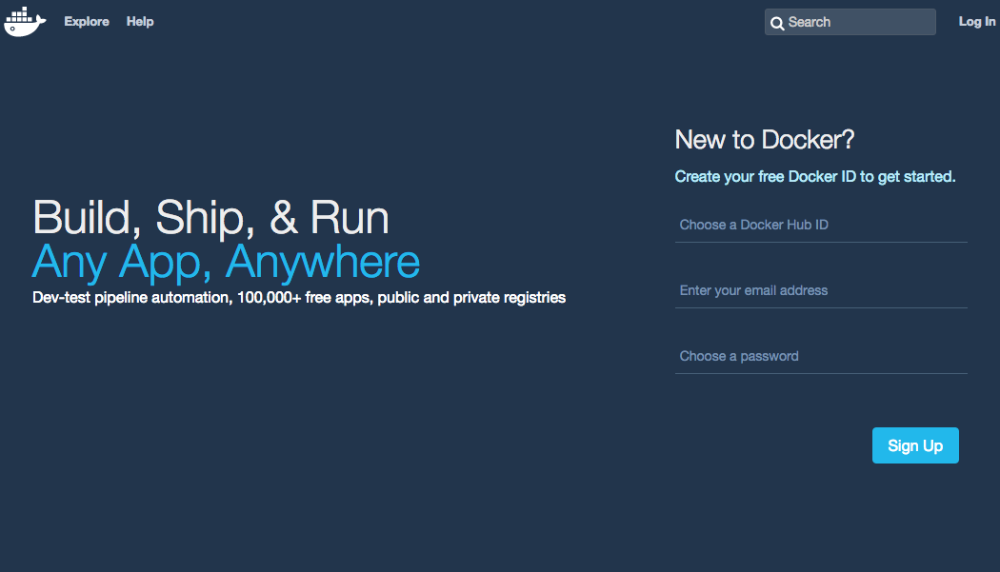
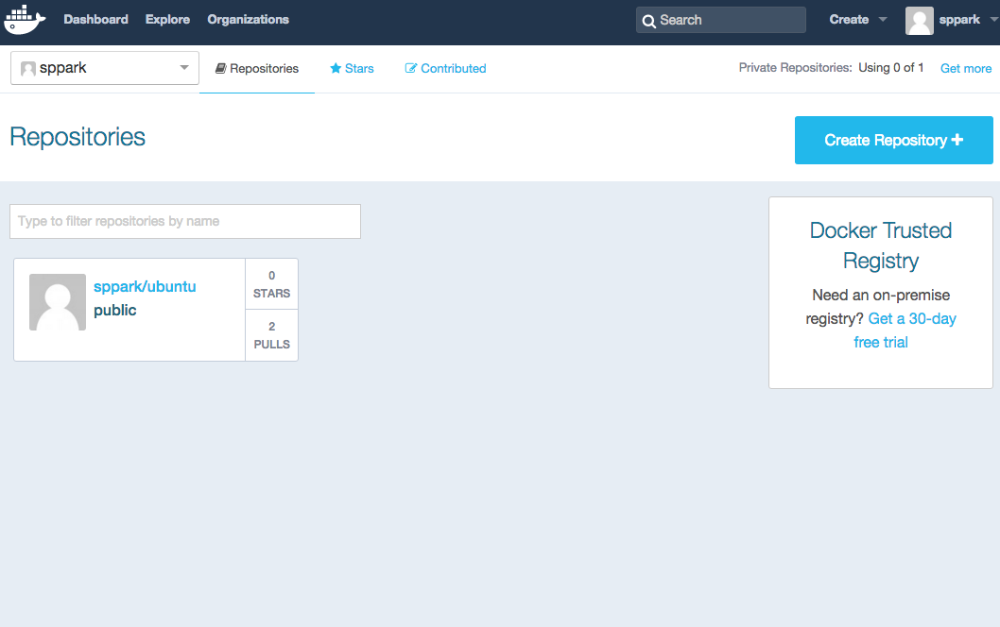

# Training Docker

### 목차
 - [Overview](#overview)
 - [Docker Install](#docker-install)
 - [Docker Image](#docker-image)
    - [Understand Image](#understand-image)
    - [Pull Image](#pull-image)
    - [Dockerfile](#dockerfile)
    - [Build Dockerfile](#build-dockerfile)
   
 - [Docker Container](#docker-container)
    - [Understand Container](#understand-container)
    - [Version management](#version-management)
    
 - [Docker Registry](#docker-registry)
    - [Docker Hub](#docker-hub)
        - [Account creation and login](#account-creation-and-login)
        - [Searching for images](#searching-for-images)
        - [Pushing a repository to Docker Hub](#pushing-a-repository-to-docker-hub)
    - [Private registry](#private-registry)
 
 - [Launch Web Application](#launch-web-application)
    - [Build Image](#build-image)
    - [Launch Application](#launch-application)
    
 - [Docker Command line reference](#docker-command-line-reference)
    - [daemon](#daemon)
    - [attach](#attach)
    - [build](#build)
    - [commit](#commit)
    - [cp](#cp)
    - [create](#create)
    - [diff](#diff)
    - [events](#events)
    - [exec](#exec)
    - [export](#export)
    - [history](#history)
    - [images](#images)
    - [import](#import)
    - [info](#info)
    - [inspect](#inspect)
    - [kill](#kill)
    - [load](#load)
    - [login](#login)
    - [logout](#logout)
    - [logs](#logs)
    - [network connect](#network-connect)
    - [network create](#network-create)
    - [network disconnect](#network-disconnect)
    - [network inspect](#network-inspect)
    - [network ls](#network-ls)
    - [network rm](#network-rm)
    - [pause](#pause)
    - [port](#port)
    - [ps](#ps)
    - [pull](#pull)
    - [push](#push)
    - [rename](#rename)
    - [restart](#restart)
    - [rm](#rm)
    - [rmi](#rmi)
    - [run](#run)
    - [save](#save)
    - [search](#search)
    - [start](#start)
    - [stats](#stats)
    - [stop](#stop)
    - [tag](#tag)
    - [top](#top)
    - [unpause](#unpause)
    - [version](#version)
    - [volume create](#volume-create)
    - [volume inspect](#volume-inspect)
    - [volume ls](#volume-ls)
    - [volume rm](#volume-rm)
    - [wait](#wait)
 - [Next Step](#next-step)

## Overview

여기서부터 진행되는 도커 섹션의 모든 진행 과정은 
[https://drive.google.com/open?id=0By_yEUK4bN_wekxjN3dpb0cyUE0](https://drive.google.com/open?id=0By_yEUK4bN_wekxjN3dpb0cyUE0) 
를 통해 다운로드 받으실 수 있습니다.

클라우드와 같이 잘 짜여지고, 잘 나뉘어진 거대한 시스템에서야 그렇다 치더라도 가상 머신은 여러모로 손실이 많은 수단 중 하나입니다. 가상 머신은 격리된 환경을 구축해준다는 데서 매력적이긴 하지만, 실제 배포용으로 쓰기에는 성능 면에서 매우 불리한 도구라고 할 수 있습니다. 당연한 이야기입니다만 일단 운영체제 위에서 또 다른 운영체제를 통째로 돌린다는 것 자체가 리소스를 비효율적으로 활용할 수밖에 없습니다.

이런 가운데 가상 머신의 단점은 극복하면서 장점만을 극대화하기 위한 최적화가 계속해서 이루어지고 있습니다. 도커 역시 이런 단점을 극복하기 위해서 나온 가상화 어플리케이션입니다. 도커는 단순한 가상 머신을 넘어서 어느 플랫폼에서나 재현가능한 어플리케이션 컨테이너를 만들어주는 걸 목표로 합니다. LXC(리눅스 컨테이너)라는 독특한 개념에서 출발하는 Docker의 가상화는 기존에 운영체제를 통째로 가상화하는 것과는 접근 자체를 달리합니다. 가상 머신이라고 하기에는 격리된 환경을 만들어주는 도구라고 하는 게 맞을 지도 모릅니다.

예를 들어, 우분투에서 CentOS라는 Docker를 통해 가상 환경을 구축하는데 얼마만큼의 시간이 걸릴까요? 먼저 여기서는 Ubuntu 상에서 작업을 한다고 가정하겠습니다.

```
$ cat /etc/issue
Ubuntu 13.10 \n \l
```

실제로 도커는 LXC를 사용하기 때문에 특정 리눅스 배포판에서 사용할 수 있고, 윈도우나 맥에서는 사용이 불가능합니다. Docker가 설치되어 있다는 가정 하에 Ubuntu에서 CentOS 가상 머신을 띄우는 데는 아래 두 명령어만 실행시키면 됩니다.

```
$ docker pull centos
$ docker run -it centos:6.4 /bin/bash
bash-4.1#
```

먼저 위의 pull 명령어를 통해서 centos 이미지를 다운로드 받습니다. 그리고 이 이미지에 쉘 명령어를 실행시킵니다. 먼저 첫번째 명령어를 실행시키는데 수 초가 걸렸습니다. 아래 명령어를 실행시키는데 역시 수초가 걸리지 않습니다. 쉘이 실행되면 bash 쉘로 바뀐 것을 알 수 있습니다. 실제로 CentOS인지 확인해보도록 하겠습니다.

```
bash-4.1# cat /etc/issue
CentOS release 6.4 (Final)
Kernel \r on an \m
```

## Docker Install

다음 명령어로 Docker 를 인스톨합니다.

```
$ sudo apt-get update
$ sudo apt-get install curl
$ curl -sSL https://get.docker.com/ | sh

$ sudo usermod -aG docker uengine
```

설치가 잘 되었나 확인하여 봅니다.

```
$ docker -v
Docker version 1.10.3, build 20f81dd
```

## Docker Image

### Understand Image

먼저 도커를 시작하면 이미지 개념을 이해할 필요가 있습니다. 
[Overview](#overview) 예제를 보면 centos 이미지를 다운로드 받고, 이 이미지에 shell을 실행시킵니다. 그러나 Docker에서 실제로 실행되는 건 이미지가 아닙니다. 이미지는 추상적인 개념입니다. 
실행되는 건 이미지를 기반으로 생성된 컨테이너입니다. 먼저 어떤 일이 일어나는지 확인해보도록 하겠습니다.

먼저 docker images 명령어로 시스템에 어떤 이미지가 있는지 확인해봅니다.

```
$ sudo docker images
REPOSITORY          TAG                 IMAGE ID            CREATED             SIZE
```

docker images 명령어는 현재 시스템에서 사용가능한 이미지 일람을 보여줍니다. 이미지는 크게 세 가지 방법을 통해서 추가할 수 있습니다.

### Pull Image

하나는 처음 예제에서와 마찬가지로 docker pull <이미지 이름>을 통해서 가져오는 방법입니다. 
바로 이 명령어를 사용하면 docker.io의 공식 저장소에서 이미지를 다운로드 받아옵니다. 

여기서는 편의상 ubuntu 이미지를 다운로드 받아오겠습니다. 
이 이미지에 대한 정보는 웹을 통해서 확인하실 수 있습니다. 
공식 저장소에 있는 이미지 정보들은 [https://index.docker.io](https://index.docker.io)에서 확인할 수 있으며 우분투 이미지에 관해서는 이 페이지에서 찾을 수 있습니다.

```
$ sudo docker pull ubuntu:14.04
14.04: Pulling from library/ubuntu
5a132a7e7af1: Pull complete 
fd2731e4c50c: Pull complete 
28a2f68d1120: Pull complete 
a3ed95caeb02: Pull complete 
Digest: sha256:45b23dee08af5e43a7fea6c4cf9c25ccf269ee113168c19722f87876677c5cb2
Status: Downloaded newer image for ubuntu:14.04
```

도커가 다운받은 항목들 하나하나가 이미지라는 것을 이해할 필요가 있습니다. 다운로드가 전부 끝났으면 이제 다시 이미지들을 확인해봅니다.

```
REPOSITORY          TAG                 IMAGE ID            CREATED             SIZE
ubuntu              14.04               07c86167cdc4        11 days ago         188 MB
```

### Dockerfile

Docker 는 Dockerfile 의 지침을 읽어 자동으로 이미지를 구축 할 수 있습니다.

Dockerfile 은 사용자가 이미지를 생성하는 명령 줄에서 호출 할 수있는 모든 명령을 포함하는 텍스트 문서입니다.
 
다음은 sshd 로 접근할 수 있는 도커 이미지를 생성하는 Dockerfile 예제입니다.

먼저, 디렉토리를 생성합니다.

```
$ mkdir sshd
```

도커파일을 생성하고 내용을 기입합니다.

```
$ vi sshd/Dockerfile

# sshd
#
# VERSION               0.0.2

FROM ubuntu:14.04
MAINTAINER uEngine solutions <admin@uengine.org>

RUN apt-get update && apt-get install -y openssh-server
RUN mkdir /var/run/sshd
RUN echo 'root:screencast' | chpasswd
RUN sed -i 's/PermitRootLogin without-password/PermitRootLogin yes/' /etc/ssh/sshd_config

# SSH login fix. Otherwise user is kicked off after login
RUN sed 's@session\s*required\s*pam_loginuid.so@session optional pam_loginuid.so@g' -i /etc/pam.d/sshd

ENV NOTVISIBLE "in users profile"
RUN echo "export VISIBLE=now" >> /etc/profile

EXPOSE 22
CMD ["/usr/sbin/sshd", "-D"]
```

위의 Dockerfile은 ssh 서버를 실행하는 일련의 과정과 명령어로 구성되어 있습니다. 각각의 부분을 간략히 살펴보겠습니다.

#### FROM

```
FROM ubuntu:14.04
```

기본 이미지 를 설정하는 명령어입니다.
Dockerfile 의 후속 지침은 기본 이미지에 덧씌워지게 됩니다.
따라서 , 유효한 Dockerfile 은 최초의 명령 으로 FROM 이 있어야합니다.

기본 이미지는 사용자의 클라이언트에 이미지가 존재하지 않을 경우 자동으로 공용 저장소에서 이미지를 다운로드 받아 쓰게 됩니다.

#### MAINTAINER

```
MAINTAINER uEngine solutions <admin@uengine.org>
```

생성 된 이미지의 저자를 기록합니다.
 
#### RUN

RUN 은 2가지의 형식을 가지고 있습니다. :

 * RUN <command> (shell form, the command is run in a shell - /bin/sh -c)
 * RUN ["executable", "param1", "param2"] (exec form)

```
RUN apt-get update && apt-get install -y openssh-server
RUN mkdir /var/run/sshd
RUN echo 'root:screencast' | chpasswd
RUN sed -i 's/PermitRootLogin without-password/PermitRootLogin yes/' /etc/ssh/sshd_config

# SSH login fix. Otherwise user is kicked off after login
RUN sed 's@session\s*required\s*pam_loginuid.so@session optional pam_loginuid.so@g' -i /etc/pam.d/sshd

ENV NOTVISIBLE "in users profile"
RUN echo "export VISIBLE=now" >> /etc/profile
```

RUN은 직접 쉘 명령어를 실행하는 명령어입니다. RUN 바로 뒤에 명령어를 입력하게 되면 쉘을 통해서 명령어가 실행됩니다.

#### ENV

```
ENV NOTVISIBLE "in users profile"
```

ENV 는 도커 컨테이너의 환경 변수를 설정할 수 있게 합니다.

#### EXPOSE CMD

```
EXPOSE 22
CMD ["/usr/sbin/sshd", "-D"]
```

EXPOSE 는 가상 머신에 오픈할 포트를 지정해줍니다. 
마지막줄의 CMD는 컨테이너에서 실행될 명령어를 지정해줍니다. 
이 글의 앞선 예에서는 docker run 을 통해서 /bin/bash를 실행했습니다만, 
여기서는 sshd 서버를 실행합니다.

### Build Dockerfile

아래의 명령어로 작성한 도커파일을 빌드합니다.
docker build 명령어는 -t 플래그를 사용해 이름과 태그를 지정할 수 있습니다. 그리고 마지막에 <dockerfile Path Directory> 은 빌드 대상 디렉토리를 가리킵니다.

```
docker build -t <image name> <dockerfile Path Directory>
```

위의 도커파일을 빌드 하기 위해서 다음 명령어로 실행합니다.

```
$ sudo docker build -t eg_sshd sshd/

Sending build context to Docker daemon  2.56 kB
Step 1 : FROM ubuntu:14.04
 ---> 07c86167cdc4
Step 2 : MAINTAINER Sven Dowideit <SvenDowideit@docker.com>
 ---> Running in e37837723229
 ---> 5fd3317e7f99
Removing intermediate container e37837723229

.
.
.

Removing intermediate container aeb472f62e37
Step 8 : ENV NOTVISIBLE "in users profile"
 ---> Running in aebc163d6c92
 ---> ea9f5bba7109
Removing intermediate container aebc163d6c92
Step 9 : RUN echo "export VISIBLE=now" >> /etc/profile
 ---> Running in aa3fbc6eb075
 ---> 19ec4234dfb9
Removing intermediate container aa3fbc6eb075
Step 10 : EXPOSE 22
 ---> Running in d5b6b2c3d932
 ---> 4389854bdb20
Removing intermediate container d5b6b2c3d932
Step 11 : CMD /usr/sbin/sshd -D
 ---> Running in 9fdbb3396fa3
 ---> 3c346ba25b29
Removing intermediate container 9fdbb3396fa3
Successfully built 3c346ba25b29
```

빌드된 도커 이미지를 확인합니다.

```
$ sudo docker images
REPOSITORY          TAG                 IMAGE ID            CREATED             SIZE
eg_sshd             latest              3c346ba25b29        10 minutes ago      251.6 MB
ubuntu              14.04               07c86167cdc4        11 days ago         188 MB
```

기본적으로 이 빌드를 통해서 생성되는 최종 이미지는 eg_sshd 가 되지만, docker images -a를 통해서 살펴보면 이름없는 도커 이미지들이 다수 생성되는 것을 알 수 있습니다.
이는 위에서 정의한 RUN 명령 하나마다 이미지가 되어서 저장되는 것입니다. 

```
$ sudo docker images -a
REPOSITORY          TAG                 IMAGE ID            CREATED             SIZE
<none>              <none>              4389854bdb20        12 minutes ago      251.6 MB
eg_sshd             latest              3c346ba25b29        12 minutes ago      251.6 MB
<none>              <none>              759120369179        12 minutes ago      251.6 MB
<none>              <none>              0ccc6e80f576        12 minutes ago      251.6 MB
<none>              <none>              19ec4234dfb9        12 minutes ago      251.6 MB
<none>              <none>              ea9f5bba7109        12 minutes ago      251.6 MB
<none>              <none>              b1e18bb21204        12 minutes ago      251.6 MB
<none>              <none>              41279e6196f5        12 minutes ago      251.6 MB
<none>              <none>              5a5c96dc4154        12 minutes ago      251.6 MB
<none>              <none>              5fd3317e7f99        14 minutes ago      188 MB
ubuntu              14.04               07c86167cdc4        11 days ago         188 MB
```

이미지 아이디가 빌드 과정에서 출력되는 아이디와 같은 것을 알 수있습니다. 
필요한 경우 중간 이미지에 접근하거나 직접 중간 이미지로부터 다른 이미지를 생성하는 것도 가능합니다. 
도커는 이러한 빌드 순서를 기억하고 각 이미지를 보존하기 때문에 같은 빌드 과정에 대해서는 캐시를 사용해 매우 빠르게 빌드가 가능하다는 점입니다. 
실제로 Docker 파일을 만드는 과정에서는 많은 시행 착오를 겪게되는데, 중간에 빌드가 실패하더라도 성공했던 명령어까지는 거의 시간 소모 없이 빠르게 진행되도록 설계되어있습니다.


## Docker Container

### Understand Container

특정 이미지의 쉘에 접근해보겠습니다.

```
$ sudo docker run -i -t ubuntu:14.04 /bin/bash
root@e20fcb0ead8b:/#
```

우분투 안에 우분투에 접속하는데 성공했습니다. 
그런데 앞서 말씀드렸다싶이 이미지에 접속했다는 말에는 함정이 있습니다. 
이 말은 마치 가상머신 ssh 프로토콜을 사용해 접근한 것과 같은 착각을 일으킵니다. 
이제 새로운 명령어를 하나 배워보도록 하겠습니다. 
앞서서 사용한 사용가능한 이미지들을 확인하는 명령어는 docker images 입니다. 
이번에 사용할 명령어는 현재 실행중인 컨테이너들을 출력하는 명령어 docker ps 입니다. 
별도의 쉘이나 터미널을 열고 docker ps 실행시켜보시기 바랍니다.

```
$ sudo docker ps
CONTAINER ID        IMAGE               COMMAND             CREATED             STATUS              PORTS               NAMES
e20fcb0ead8b        ubuntu:14.04        "/bin/bash"         2 minutes ago       Up 2 minutes                            suspicious_euler
```

방금 만든 컨테이너가 실행되고 있는 것을 알 수 있습니다. 
여기서 실행한 컨테이너 정보를 알 수 있습니다. 
ubuntu:14.04 이미지로부터 컨테이너를 생성했고, 이 컨테이너에 /bin/bash라는 쉘을 실행시켰습니다. 
그 외에도 맨 앞의 컨테이너 아이디는 앞으로 Docker에서 컨테이너를 조작할 때 사용하는 컬럼이기 때문에 필수적으로 알아둘 필요가 있습니다.

또한 위의 예제에서는 직접 명령어를 넘겨서 이미지를 컨테이너로 실행시켰지만, 
보통 이미지들은 자신이 실행할 명령어들을 가지고 있습니다. 
예를 들어 레디스, 마리아db, 루비 온 레일즈 어플리케이션을 담고 있는 이미지라면, 
각각의 어플리케이션을 실행하는 스크립트를 실행하게 됩니다. 
컨테이너는 독립된 환경에서 실행지만 컨테이너의 기본적인 역할은 이 미리 규정된 명령어를 실행하는 일입니다.
 
이 명령어가 종료되면 컨테이너도 종료 상태(Exit)에 들어갑니다. 
이러한 죽은 컨테이너의 목록까지 확인하려면 docker ps -a 명령어를 사용하면 됩니다. 
실제로 쉘을 종료하고 컨테이너 목록을 확인해보겠습니다.

```
root@e20fcb0ead8b:/# exit
exit
$ sudo docker ps -a
CONTAINER ID        IMAGE               COMMAND             CREATED             STATUS                     PORTS               NAMES
e20fcb0ead8b        ubuntu:14.04        "/bin/bash"         6 minutes ago       Exited (0) 6 seconds ago                       suspicious_euler
```

상태(Status) 컬럼에서 확인할 수 있듯이 컨테이너가 죽어있습니다. 
이번엔 restart 명령어를 통해 컨테이너를 되살려보겠습니다.

```
$ sudo docker restart e20fcb0ead8b
e20fcb0ead8b
uengine@ubuntu:~$ sudo docker ps
CONTAINER ID        IMAGE               COMMAND             CREATED             STATUS              PORTS               NAMES
e20fcb0ead8b        ubuntu:14.04        "/bin/bash"         8 minutes ago       Up 9 seconds                            suspicious_euler
```

컨테이너가 되살아났습니다. 하지만 쉘이 실행되지는 않습니다. 컨테이너 속으로 들어가기 위해서는 attach 명령어를 사용할 필요가 있습니다.

```
$ sudo docker attach e20fcb0ead8b
root@e20fcb0ead8b:/#
```

다시 docker 컨테이너 안으로 들어왔습니다. 
여기까지 도커 컨테이너의 생명 주기를 보았습니다. 
도커 컨테이너를 실행시키는 run 부터 실행이 종료되었을 때 다시 실행하는 restart 를 배웠습니다. 
이 외에도 실행을 강제로 종료시키는 stop 명령어도 있으며, 
종료된 컨테이너를 영구히 삭제해주는 rm 명령어도 있습니다. 
처음 [Overview](#overview)에서 run 명령어와 함께 사용한 -rm 플래그는 컨테이너가 종료 상태로 들어가면 자동으로 삭제를 해주는 옵션입니다.

이미지에는 접속한다는 개념이 없습니다. 
실제로 실행되는 가상 머신은 항상 컨테이너입니다. 
컨테이너란 격리된 환경에서 특정한 명령을 실행시켜주는 가상 머신과 같은 무언가입니다. 

쉘을 실행시키지 않았을 때 이 가상 머신을 조작할 수 있는 방법으로는 컨테이너에 ssh 서비스를 올려 ssh 프로토콜로 접근하는 방법입니다.
앞서 제작한 Dockerfile 이 이것을 가능하게 합니다.

eg_sshd 이미지로 컨테이너를 구동해 봅니다.

```
$ sudo docker images
REPOSITORY          TAG                 IMAGE ID            CREATED             SIZE
eg_sshd             latest              3c346ba25b29        36 minutes ago      251.6 MB
ubuntu              14.04               07c86167cdc4        11 days ago         188 MB

$ sudo docker run -d -P --name test_sshd eg_sshd
5c6d86adfd2e065b877f4665f8efe16fc038af6c233efd50a090f2cad87f9a4c

$ sudo docker ps
CONTAINER ID        IMAGE               COMMAND               CREATED             STATUS              PORTS                   NAMES
5c6d86adfd2e        eg_sshd             "/usr/sbin/sshd -D"   7 seconds ago       Up 6 seconds        0.0.0.0:32770->22/tcp   test_sshd
```

PORTS 부분의 0.0.0.0:32770->22/tcp 를 살펴봅니다.
이것은 앞선 Dockerfile 의 EXPOSE 22 로 인해서, 컨테이너의 22번 포트가 로컬 머신의 32770 포트로 바인딩이 되었다는 의미입니다.

이것을 명령어로 알 수 있으려면 다음을 실행합니다.

```
$ sudo docker port test_sshd 22
0.0.0.0:32770
```

컨테이너로 ssh 접속을 시도하여 봅니다.
예제에 쓰인 이미지의 root 계정은 screencast 입니다. 

```
$ ssh root@localhost -p 32770
The authenticity of host '[localhost]:32770 ([::1]:32770)' can't be established.
ECDSA key fingerprint is 64:ab:f6:2d:54:94:86:e6:8b:2a:ce:7b:19:b1:c2:fa.
Are you sure you want to continue connecting (yes/no)? yes
Warning: Permanently added '[localhost]:32770' (ECDSA) to the list of known hosts.
root@localhost's password: 
Welcome to Ubuntu 14.04 LTS (GNU/Linux 3.13.0-79-generic x86_64)

 * Documentation:  https://help.ubuntu.com/

The programs included with the Ubuntu system are free software;
the exact distribution terms for each program are described in the
individual files in /usr/share/doc/*/copyright.

Ubuntu comes with ABSOLUTELY NO WARRANTY, to the extent permitted by
applicable law.

root@5c6d86adfd2e:~# 
```
 
### Version management

도커에서 이미지는 불변이지만 이 이미지 위에 무언가를 더해서 새로운 이미지를 만들어내는 일이 가능합니다. 
좀 더 정확히 말하면 컨테이너는 변경가능(Mutabe)합니다. 
특정한 이미지로부터 생성된 컨테이너에 어떤 변경사항을 더하고, 
이 변경된 상태를 이미지로 만들어내는 것이 가능합니다.

먼저, ubuntu 기본 이미지를 bash 를 사용하여 부팅합니다.

```
$ sudo docker run -i -t  ubuntu:14.04 /bin/bash
root@eeafb06bdc57:/# 
```

컨테이너에 Git을 설치합니다. 위에서 실행한 쉘에 다음과 같은 명령어를 입력합니다.

```
root@eeafb06bdc57:/# apt-get install -y git
...

root@eeafb06bdc57:/# git --version
git version 1.9.1
```

exit 명령어로 컨테이너의 shell 에서 빠져나간 후, docker ps 명령어로 컨테이너를 검색합니다.

```
root@eeafb06bdc57:/# exit

$ sudo docker ps
CONTAINER ID        IMAGE               COMMAND             CREATED             STATUS              PORTS               NAMES
```

shell 이 종료된 시점에 컨테이너도 종료되었기 때문에, 종료된 컨테이너까지 검색하도록 docker ps -a 를 사용합니다.

```
$ sudo docker ps -a
CONTAINER ID        IMAGE               COMMAND             CREATED             STATUS                     PORTS               NAMES
eeafb06bdc57        ubuntu:14.04        "/bin/bash"         9 minutes ago       Exited (0) 4 minutes ago                       trusting_jang
```

해당 컨테이너에는 우분투의 패키지 관리자인 apt-get을 통해서 버전 관리 시스템인 Git 이 설치 되어 있습니다. 
여기서 도커는 VCS 처럼, 어떤 컨테이너와 이 컨테이너의 부모 이미지 간의 파일의 변경사항을 확인할 수 있는 명령어를 제공합니다. 
마치 git diff 명령어로 프로젝트의 변경사항을 확인하듯이, 
docker diff 명령어로 부모 이미지와 여기서 파생된 컨테이너의 파일 시스템 간의 변경사항을 확인할 수 있습니다.

```
$ sudo docker diff eeafb06bdc57
C /etc
C /etc/alternatives
A /etc/alternatives/rcp
A /etc/alternatives/rcp.1.gz
A /etc/alternatives/rlogin
A /etc/alternatives/rlogin.1.gz
A /etc/alternatives/rsh
.
.
```

이제 기본 우분투 14.04 이미지에 Git 이 설치된 새로운 이미지를 생성해보도록 하겠습니다. 
이 작업도 VCS와 매우 비슷합니다. 도커에서는 이 작업을 commit이라고 합니다.

```
$ sudo docker commit eeafb06bdc57 ubuntu:git
sha256:248cf008cbea5b7cf6d616c69b3c80a9142136f6f75bc2509005e56649d90315
uengine@ubuntu:~$ sudo docker images | grep git
ubuntu              git                 248cf008cbea        16 seconds ago      225.6 MB
```

이미지가 쉽게 생성이 되었습니다. 
커밋을 하고 뒤에 이름을 붙여주면 바로 새로운 도커 이미지가 생성됩니다. 
이미지로부터 컨테이너를 실행시키고 이 컨테이너의 수정사항을 통해서 새로운 이미지를 만들었습니다. 
이제 이 이미지를 통해서 컨테이너를 실행시켜(run) git 이 실행되는지 직접 확인 해 봅니다.

```
$ sudo docker run -i -t ubuntu:git /bin/bash
root@ec127aef48cf:/# git --version
git version 1.9.1
```

이 이미지를 삭제하도록 하겠습니다. 
중요한 사항은, 이미지에서 (종료상태를 포함한) 파생된 컨테이너가 하나라도 있다면 이미지는 삭제할 수 없습니다. 
따라서 먼저 컨테이너를 종료하고, 삭제까지 해주어야합니다. 
docker rm은 컨테이너를 삭제하는 명령어입니다. 
docker rmi는 이미지를 삭제하는 명령어입니다.

먼저 컨테이너를 지우고, 이미지를 삭제해보겠습니다.

```
$ sudo docker ps -a
CONTAINER ID        IMAGE               COMMAND             CREATED             STATUS                      PORTS               NAMES
ec127aef48cf        ubuntu:git          "/bin/bash"         3 minutes ago       Exited (0) 18 seconds ago                       sleepy_northcutt
eeafb06bdc57        ubuntu:14.04        "/bin/bash"         26 minutes ago      Exited (0) 20 minutes ago                       trusting_jang

$ sudo docker rm ec127aef48cf
ec127aef48cf

$ sudo docker rmi ubuntu:git
Untagged: ubuntu:git
Deleted: sha256:248cf008cbea5b7cf6d616c69b3c80a9142136f6f75bc2509005e56649d90315
Deleted: sha256:0ed549cc160c7df64df7724fffb97f7e5da5c50421cd50eeacf15d4825f8fcfa
```

## Docker Registry

앞서 [Pull Image](#pull-image) 를 통하여 도커 이미지를 다운로드 받는 것을 배웠고, 
[Dockerfile](#dockerfile) 에서 이미지를 생성하는 것도 배웠습니다.

이번에는 가지고 있는 이미지를 공용, 또는 개인 레파지토리에 저장하는 법을 배워보도록 합니다.

### Docker Hub

도커 허브는 도커 회사가 운영하는 공공 레지스트리 서비스 입니다.
도커 허브를 통하여 이미지를 다운로드하고 업로드 할 수 있습니다.
일반적으로 docker pull 을 통한 이미지 다운로드는 특별한 tag 가 붙지 않는다면, 도커 허브를 통하여 다운로드 받아지게 됩니다. 
또한 webhooks 같은 인증, 작업 그룹 구조 , 워크 플로우 도구를 제공 하고 공개적으로 공유하고 싶지 않은 이미지를 저장하는 개인 저장소 및 개인 정보 보호 도구를 구축 할 수 있습니다.

도커 클라이언트는 도커 허브 서비스를 사용하기 위해 docker search, pull, login, push 커맨드를 사용합니다.
 
먼저 도커 허브에 로그인 하기 위해서 [https://hub.docker.com/](https://hub.docker.com/) 에 가입을 하도록 합니다.




#### Account creation and login

docker login 명령어를 사용하면 사용자 이름, 비밀번호, 이메일 주소를 입력 하라는 메시지가 표시됩니다. 
로그인 후에는 자동으로 사용자 정보가 기록된 credentials 를 저장하게 됩니다. 

```
$ sudo docker login
Username: sppark
Password: 
Email: sppark@uengine.org
WARNING: login credentials saved in /home/uengine/.docker/config.json
Login Succeeded
```

#### Searching for images

docker search 명령어를 사용하여 도커 허브 레지스트리를 검색 할 수 있습니다. 
이미지 이름, 사용자 이름 또는 이미지 설명 으로 검색 할 수 있습니다.

```
$ sudo docker search centos
NAME                            DESCRIPTION                                     STARS     OFFICIAL   AUTOMATED
centos                          The official build of CentOS.                   2022      [OK]       
jdeathe/centos-ssh              CentOS-6 6.7 x86_64 / CentOS-7 7.2.1511 x8...   17                   [OK]
jdeathe/centos-ssh-apache-php   CentOS-6 6.7 x86_64 / Apache / PHP / PHP M...   14                   [OK]
million12/centos-supervisor     Base CentOS-7 with supervisord launcher, h...   9                    [OK]
blalor/centos                   Bare-bones base CentOS 6.5 image                8                    [OK]
nimmis/java-centos              This is docker images of CentOS 7 with dif...   7                    [OK]
torusware/speedus-centos        Always updated official CentOS docker imag...   7                    [OK]
nickistre/centos-lamp           LAMP on centos setup                            3                    [OK]
nathonfowlie/centos-jre         Latest CentOS image with the JRE pre-insta...   3                    [OK]
centos/mariadb55-centos7                                                        3                    [OK]
consol/sakuli-centos-xfce       Sakuli end-2-end testing and monitoring co...   2                    [OK]
lighthopper/orientdb-centos     A Dockerfile for creating an OrientDB imag...   1                    [OK]
yajo/centos-epel                CentOS with EPEL and fully updated              1                    [OK]
timhughes/centos                Centos with systemd installed and running       1                    [OK]
layerworx/centos                CentOS container with etcd, etcdctl, confd...   1                    [OK]
pacur/centos-7                  Pacur CentOS 7                                  1                    [OK]
pacur/centos-6                  Pacur CentOS 6                                  1                    [OK]
darksheer/centos                Base Centos Image -- Updated hourly             1                    [OK]
softvisio/centos                Centos                                          1                    [OK]
ustclug/centos                   USTC centos                                    0                    [OK]
blacklabelops/centos            CentOS Base Image! Built and Updates Daily!     0                    [OK]
jsmigel/centos-epel             Docker base image of CentOS w/ EPEL installed   0                    [OK]
grayzone/centos                 auto build for centos.                          0                    [OK]
lighthopper/openjdk-centos      A Dockerfile for creating an OpenJDK image...   0                    [OK]
januswel/centos                 yum update-ed CentOS image                      0                    [OK]

```

#### Pushing a repository to Docker Hub

도커 허브로 이미지를 저장하기 전에, 도커 이미지의 이름은
 
```
<사용자의 도커허브 아이디>/이미지 이름
```

형식이어야 합니다.

docker tag 명령어는 이미지로부터 새로운 이미지의 이름을 파생시킬 수 있게 합니다. 
ubuntu:14.04 이미지로부터 새로운 이미지를 파생시켜 보도록 하겠습니다.
예시에서는 도커허브 아이디가 sppark 라고 가정합니다.

```
$ sudo docker tag ubuntu:14.04 sppark/ubuntu

$ sudo docker images
REPOSITORY          TAG                 IMAGE ID            CREATED             SIZE
sppark/ubuntu       latest              a0d4a44ae66e        9 hours ago         188 MB
ubuntu              14.04               a0d4a44ae66e        9 hours ago         188 MB
```

도커 허브에 이미지를 업로드합니다.

```
$ sudo docker push sppark/ubuntu
The push refers to a repository [docker.io/sppark/ubuntu]
5f70bf18a086: Pushed 
c01527795ce9: Pushed 
f301be1d9cc5: Pushed 
a591b287e755: Pushed 
latest: digest: sha256:1284357ceef1c154f5dc863aa8eb20a3e90c4b997ed46b6f2c530817dc1219de size: 4128
```

[https://hub.docker.com/](https://hub.docker.com/) 에 접속하여 로그인 하여 보면, 이미지가 업로드 된 것을 볼 수 있습니다.




### Private registry

도커 허브를 이용하지 않고 별도의 개인 저장소를 이용할 수 있습니다. 
이 경우 도커 허브의 역할을 하는 시스템이 미리 구축된 이미지를 다운받아 사용하게 됩니다.
 
도커 허브에 배포되어 있는 registry:2 이미지로 컨테이너를 구동합니다.

```
$ sudo docker run -d -p 5000:5000 --restart=always --name registry registry:2
Unable to find image 'registry:2' locally
2: Pulling from library/registry

fdd5d7827f33: Pull complete 
a3ed95caeb02: Pull complete 
a79b4a92697e: Pull complete 
6cbb75c7cc30: Pull complete 
4831699594bc: Pull complete 
Digest: sha256:20f5d95004b71fe14dbe7468eff33f18ee7fa52502423c5d107d4fb0abb05c1d
Status: Downloaded newer image for registry:2
7580bf298f96102ece65a858f2ea687db89029c2983831354b49072b108c7517

$ sudo docker ps
CONTAINER ID        IMAGE               COMMAND                  CREATED             STATUS              PORTS                    NAMES
7580bf298f96        registry:2          "/bin/registry /etc/d"   32 seconds ago      Up 31 seconds       0.0.0.0:5000->5000/tcp   registry
```

docker ps 로 컨테이너를 조회해보면 컨테이너의 5000 번 포트가 로컬 머신의 5000 번 포트와 연결되었음을 알 수 있습니다.

로컬 머신의 5000 번 포트를 확인 해 봅니다.

```
$ netstat -lntp
(No info could be read for "-p": geteuid()=1000 but you should be root.)
Active Internet connections (only servers)
Proto Recv-Q Send-Q Local Address           Foreign Address         State       PID/Program name
tcp        0      0 0.0.0.0:22              0.0.0.0:*               LISTEN      -               
tcp6       0      0 :::22                   :::*                    LISTEN      -               
tcp6       0      0 :::5000                 :::*                    LISTEN      - 

```

구축한 registry 를 저장소로 이용하기 위해서는 도커 데몬을 실행 시 registry 주소를 알려주고 재시작 하여야 합니다.
 
```
$ sudo vi /etc/default/docker

마지막 줄에 DOCKER_OPTS="--insecure-registry localhost:5000" 를 기입합니다.

# Docker Upstart and SysVinit configuration file

#
# THIS FILE DOES NOT APPLY TO SYSTEMD
#
#   Please see the documentation for "systemd drop-ins":
#   https://docs.docker.com/engine/articles/systemd/
#

.
.
.

DOCKER_OPTS="--insecure-registry localhost:5000"

$ sudo service docker restart
docker stop/waiting
docker start/running, process 6820

```

구축한 저장소로 이미지를 push 하기 위해서는 이미지의 태그에 저장소 주소를 명시해야 합니다. 

```
<레지스트리 주소>/이미지 이름

```

```
$ sudo docker images
REPOSITORY          TAG                 IMAGE ID            CREATED             SIZE
sppark/ubuntu       latest              a0d4a44ae66e        12 hours ago        188 MB
ubuntu              14.04               a0d4a44ae66e        12 hours ago        188 MB
registry            2                   83139345d017        7 days ago          165.8 MB

$ sudo docker tag ubuntu:14.04 localhost:5000/ubuntu

$ sudo docker images
REPOSITORY              TAG                 IMAGE ID            CREATED             SIZE
localhost:5000/ubuntu   latest              a0d4a44ae66e        12 hours ago        188 MB
sppark/ubuntu           latest              a0d4a44ae66e        12 hours ago        188 MB
ubuntu                  14.04               a0d4a44ae66e        12 hours ago        188 MB
registry                2                   83139345d017        7 days ago          165.8 MB

```

localhost:5000/ubuntu 이미지를 저장소에 추가 해 봅니다.

```
$ sudo docker push localhost:5000/ubuntu
The push refers to a repository [localhost:5000/ubuntu]
5f70bf18a086: Pushed 
c01527795ce9: Pushed 
f301be1d9cc5: Pushed 
a591b287e755: Pushed 
latest: digest: sha256:448684b210f07699e45370cd6dd6d187bdbbe2255e3caecf2866f04b85de8029 size: 1129

```

## Launch Web Application

이제까지 학습 한 내용을 바탕으로 간단한 hello world 어플리케이션을 도커를 사용하여 브라우저에 띄워보도록 하겠습니다.

### Build Image

예제 어플리케이션을 다운받아 구동시키는 이미지를 생성하도록 하겠습니다.

먼저 디렉토리를 만들고 도커파일을 만듭니다.

```
$ mkdir hello-world

$ vi hello-world/Dockerfile

# hello-world
#
# VERSION               0.0.2

FROM ubuntu:14.04
MAINTAINER uEngine <http://www.uengine.org>

RUN apt-get update && apt-get install -y curl wget unzip
RUN curl -sL https://deb.nodesource.com/setup | sudo bash -
RUN sudo apt-get install -y nodejs
RUN wget https://s3.ap-northeast-2.amazonaws.com/beluga-uengine/tutorial/nodejs-hello-world-master.zip
RUN unzip nodejs-hello-world-master.zip
 
EXPOSE 9000
CMD ["node", "nodejs-hello-world-master/web.js"]

```

위의 도커 파일은 curl,wget,unzip,nodejs 를 차례대로 인스톨 하고, nodejs-hello-world-master.zip 을 다운받아 압축을 푼 후 
nodejs 서버를 구동시키는 순서를 담고 있습니다. 
hello-world 어플리케이션은 9000 포트를 사용하여 서버를 띄우도록 되어있으며 도커 컨테이너는 EXPOSE 를 이용해 포트로 접근하능 하게 합니다.
마지막으로 CMD 를 사용하여 컨테이너가 구동될 때 자동으로 web.js 파일을 nodejs 로 실행하도록 되어있습니다.

이 Dockerfile 을 빌드하도록 합니다.

```
$ sudo docker build -t hello-world hello-world/
Sending build context to Docker daemon 2.048 kB
Step 1 : FROM ubuntu:14.04
 ---> a0d4a44ae66e
Step 2 : MAINTAINER uEngine <http://www.uengine.org>
 ---> Running in 31dc0089f67a
 ---> 72416c86ddce
Removing intermediate container 31dc0089f67a

.
.
.

Removing intermediate container 2d5eecf07769
Successfully built e59466cbf1f3

```

### Launch Application

9000 포트를 연결하여 컨테이너를 구동합니다.

```
$ sudo docker run -d -p 9000:9000 hello-world
Server running at http://127.0.0.1:1337/
Listening on 9000

```

브라우저에 실습중인 로컬 머신의 주소와 포트를 입력하면 hello-world 가 브라우저에 출력되는 것을 볼 수 있습니다.

예) http://192.168.0.7:9000/


## Docker Command line reference

### daemon

```
Usage: docker daemon [OPTIONS]

A self-sufficient runtime for linux containers.

Options:
  --api-cors-header=""                   Set CORS headers in the remote API
  --authorization-plugin=[]              Set authorization plugins to load
  -b, --bridge=""                        Attach containers to a network bridge
  --bip=""                               Specify network bridge IP
  --cgroup-parent=                       Set parent cgroup for all containers
  -D, --debug                            Enable debug mode
  --default-gateway=""                   Container default gateway IPv4 address
  --default-gateway-v6=""                Container default gateway IPv6 address
  --cluster-store=""                     URL of the distributed storage backend
  --cluster-advertise=""                 Address of the daemon instance on the cluster
  --cluster-store-opt=map[]              Set cluster options
  --config-file=/etc/docker/daemon.json  Daemon configuration file
  --dns=[]                               DNS server to use
  --dns-opt=[]                           DNS options to use
  --dns-search=[]                        DNS search domains to use
  --default-ulimit=[]                    Set default ulimit settings for containers
  --exec-opt=[]                          Set exec driver options
  --exec-root="/var/run/docker"          Root of the Docker execdriver
  --fixed-cidr=""                        IPv4 subnet for fixed IPs
  --fixed-cidr-v6=""                     IPv6 subnet for fixed IPs
  -G, --group="docker"                   Group for the unix socket
  -g, --graph="/var/lib/docker"          Root of the Docker runtime
  -H, --host=[]                          Daemon socket(s) to connect to
  --help                                 Print usage
  --icc=true                             Enable inter-container communication
  --insecure-registry=[]                 Enable insecure registry communication
  --ip=0.0.0.0                           Default IP when binding container ports
  --ip-forward=true                      Enable net.ipv4.ip_forward
  --ip-masq=true                         Enable IP masquerading
  --iptables=true                        Enable addition of iptables rules
  --ipv6                                 Enable IPv6 networking
  -l, --log-level="info"                 Set the logging level
  --label=[]                             Set key=value labels to the daemon
  --log-driver="json-file"               Default driver for container logs
  --log-opt=[]                           Log driver specific options
  --mtu=0                                Set the containers network MTU
  --disable-legacy-registry              Do not contact legacy registries
  -p, --pidfile="/var/run/docker.pid"    Path to use for daemon PID file
  --registry-mirror=[]                   Preferred Docker registry mirror
  -s, --storage-driver=""                Storage driver to use
  --selinux-enabled                      Enable selinux support
  --storage-opt=[]                       Set storage driver options
  --tls                                  Use TLS; implied by --tlsverify
  --tlscacert="~/.docker/ca.pem"         Trust certs signed only by this CA
  --tlscert="~/.docker/cert.pem"         Path to TLS certificate file
  --tlskey="~/.docker/key.pem"           Path to TLS key file
  --tlsverify                            Use TLS and verify the remote
  --userns-remap="default"               Enable user namespace remapping
  --userland-proxy=true                  Use userland proxy for loopback traffic
```

Options with [] may be specified multiple times.

The Docker daemon is the persistent process that manages containers. Docker uses the same binary for both the daemon and client. To run the daemon you type docker daemon.

To run the daemon with debug output, use docker daemon -D.

### attach

```
Usage: docker attach [OPTIONS] CONTAINER

Attach to a running container

  --detach-keys="<sequence>"       Set up escape key sequence
  --help                           Print usage
  --no-stdin                       Do not attach STDIN
  --sig-proxy=true                 Proxy all received signals to the process
```

The docker attach command allows you to attach to a running container using the container’s ID or name, either to view its ongoing output or to control it interactively. You can attach to the same contained process multiple times simultaneously, screen sharing style, or quickly view the progress of your detached process.

To stop a container, use CTRL-c. This key sequence sends SIGKILL to the container. If --sig-proxy is true (the default),CTRL-c sends a SIGINT to the container. You can detach from a container and leave it running using the using CTRL-p CTRL-q key sequence.

``
Note: A process running as PID 1 inside a container is treated specially by Linux: it ignores any signal with the default action. So, the process will not terminate on SIGINT or SIGTERM unless it is coded to do so.
``

It is forbidden to redirect the standard input of a docker attach command while attaching to a tty-enabled container (i.e.: launched with -t).

### build

```
Usage: docker build [OPTIONS] PATH | URL | -

Build a new image from the source code at PATH

  --build-arg=[]                  Set build-time variables
  --cpu-shares                    CPU Shares (relative weight)
  --cgroup-parent=""              Optional parent cgroup for the container
  --cpu-period=0                  Limit the CPU CFS (Completely Fair Scheduler) period
  --cpu-quota=0                   Limit the CPU CFS (Completely Fair Scheduler) quota
  --cpuset-cpus=""                CPUs in which to allow execution, e.g. `0-3`, `0,1`
  --cpuset-mems=""                MEMs in which to allow execution, e.g. `0-3`, `0,1`
  --disable-content-trust=true    Skip image verification
  -f, --file=""                   Name of the Dockerfile (Default is 'PATH/Dockerfile')
  --force-rm                      Always remove intermediate containers
  --help                          Print usage
  --isolation=""                  Container isolation technology
  -m, --memory=""                 Memory limit for all build containers
  --memory-swap=""                A positive integer equal to memory plus swap. Specify -1 to enable unlimited swap.
  --no-cache                      Do not use cache when building the image
  --pull                          Always attempt to pull a newer version of the image
  -q, --quiet                     Suppress the build output and print image ID on success
  --rm=true                       Remove intermediate containers after a successful build
  --shm-size=[]                   Size of `/dev/shm`. The format is `<number><unit>`. `number` must be greater than `0`.  Unit is optional and can be `b` (bytes), `k` (kilobytes), `m` (megabytes), or `g` (gigabytes). If you omit the unit, the system uses bytes. If you omit the size entirely, the system uses `64m`.
  -t, --tag=[]                    Name and optionally a tag in the 'name:tag' format
  --ulimit=[]                     Ulimit options
```

Builds Docker images from a Dockerfile and a “context”. A build’s context is the files located in the specified PATH or URL. The build process can refer to any of the files in the context. For example, your build can use an ADD instruction to reference a file in the context.

The URL parameter can specify the location of a Git repository; the repository acts as the build context. The system recursively clones the repository and its submodules using a git clone --depth 1 --recursive command. This command runs in a temporary directory on your local host. After the command succeeds, the directory is sent to the Docker daemon as the context. Local clones give you the ability to access private repositories using local user credentials, VPNs, and so forth.

Git URLs accept context configuration in their fragment section, separated by a colon :. The first part represents the reference that Git will check out, this can be either a branch, a tag, or a commit SHA. The second part represents a subdirectory inside the repository that will be used as a build context.

### commit

```
Usage: docker commit [OPTIONS] CONTAINER [REPOSITORY[:TAG]]

Create a new image from a container's changes

  -a, --author=""     Author (e.g., "John Hannibal Smith <hannibal@a-team.com>")
  -c, --change=[]     Apply specified Dockerfile instructions while committing the image
  --help              Print usage
  -m, --message=""    Commit message
  -p, --pause=true    Pause container during commit
```

It can be useful to commit a container’s file changes or settings into a new image. This allows you debug a container by running an interactive shell, or to export a working dataset to another server. Generally, it is better to use Dockerfiles to manage your images in a documented and maintainable way.

The commit operation will not include any data contained in volumes mounted inside the container.

By default, the container being committed and its processes will be paused while the image is committed. This reduces the likelihood of encountering data corruption during the process of creating the commit. If this behavior is undesired, set the --pause option to false.

The --change option will apply Dockerfile instructions to the image that is created. Supported Dockerfile instructions:

```
CMD|ENTRYPOINT|ENV|EXPOSE|LABEL|ONBUILD|USER|VOLUME|WORKDIR
```

### cp

```
Usage: docker cp [OPTIONS] CONTAINER:SRC_PATH DEST_PATH | -
       docker cp [OPTIONS] SRC_PATH | - CONTAINER:DEST_PATH

Copy files/folders between a container and the local filesystem

  -L, --follow-link          Always follow symbol link in SRC_PATH
  --help                     Print usage
```

The docker cp utility copies the contents of SRC_PATH to the DEST_PATH. You can copy from the container’s file system to the local machine or the reverse, from the local filesystem to the container. If - is specified for either the SRC_PATH or DEST_PATH, you can also stream a tar archive from STDIN or to STDOUT. The CONTAINER can be a running or stopped container. The SRC_PATH or DEST_PATH can be a file or directory.

The docker cp command assumes container paths are relative to the container’s / (root) directory. This means supplying the initial forward slash is optional; The command sees compassionate_darwin:/tmp/foo/myfile.txt and compassionate_darwin:tmp/foo/myfile.txt as identical. Local machine paths can be an absolute or relative value. The command interprets a local machine’s relative paths as relative to the current working directory where docker cp is run.

The cp command behaves like the Unix cp -a command in that directories are copied recursively with permissions preserved if possible. Ownership is set to the user and primary group at the destination. For example, files copied to a container are created with UID:GID of the root user. Files copied to the local machine are created with the UID:GID of the user which invoked the docker cp command. If you specify the -L option, docker cp follows any symbolic link in the SRC_PATH.


### create

Creates a new container.

```
Usage: docker create [OPTIONS] IMAGE [COMMAND] [ARG...]

Create a new container

  -a, --attach=[]               Attach to STDIN, STDOUT or STDERR
  --add-host=[]                 Add a custom host-to-IP mapping (host:ip)
  --blkio-weight=0              Block IO weight (relative weight)
  --blkio-weight-device=[]      Block IO weight (relative device weight, format: `DEVICE_NAME:WEIGHT`)
  --cpu-shares=0                CPU shares (relative weight)
  --cap-add=[]                  Add Linux capabilities
  --cap-drop=[]                 Drop Linux capabilities
  --cgroup-parent=""            Optional parent cgroup for the container
  --cidfile=""                  Write the container ID to the file
  --cpu-period=0                Limit CPU CFS (Completely Fair Scheduler) period
  --cpu-quota=0                 Limit CPU CFS (Completely Fair Scheduler) quota
  --cpuset-cpus=""              CPUs in which to allow execution (0-3, 0,1)
  --cpuset-mems=""              Memory nodes (MEMs) in which to allow execution (0-3, 0,1)
  --device=[]                   Add a host device to the container
  --device-read-bps=[]          Limit read rate (bytes per second) from a device (e.g., --device-read-bps=/dev/sda:1mb)
  --device-read-iops=[]         Limit read rate (IO per second) from a device (e.g., --device-read-iops=/dev/sda:1000)
  --device-write-bps=[]         Limit write rate (bytes per second) to a device (e.g., --device-write-bps=/dev/sda:1mb)
  --device-write-iops=[]        Limit write rate (IO per second) to a device (e.g., --device-write-iops=/dev/sda:1000)
  --disable-content-trust=true  Skip image verification
  --dns=[]                      Set custom DNS servers
  --dns-opt=[]                  Set custom DNS options
  --dns-search=[]               Set custom DNS search domains
  -e, --env=[]                  Set environment variables
  --entrypoint=""               Overwrite the default ENTRYPOINT of the image
  --env-file=[]                 Read in a file of environment variables
  --expose=[]                   Expose a port or a range of ports
  --group-add=[]                Add additional groups to join
  -h, --hostname=""             Container host name
  --help                        Print usage
  -i, --interactive             Keep STDIN open even if not attached
  --ip=""                       Container IPv4 address (e.g. 172.30.100.104)
  --ip6=""                      Container IPv6 address (e.g. 2001:db8::33)
  --ipc=""                      IPC namespace to use
  --isolation=""                Container isolation technology
  --kernel-memory=""            Kernel memory limit
  -l, --label=[]                Set metadata on the container (e.g., --label=com.example.key=value)
  --label-file=[]               Read in a line delimited file of labels
  --link=[]                     Add link to another container
  --log-driver=""               Logging driver for container
  --log-opt=[]                  Log driver specific options
  -m, --memory=""               Memory limit
  --mac-address=""              Container MAC address (e.g. 92:d0:c6:0a:29:33)
  --memory-reservation=""       Memory soft limit
  --memory-swap=""              A positive integer equal to memory plus swap. Specify -1 to enable unlimited swap.
  --memory-swappiness=""        Tune a container's memory swappiness behavior. Accepts an integer between 0 and 100.
  --name=""                     Assign a name to the container
  --net="bridge"                Connect a container to a network
                                'bridge': create a network stack on the default Docker bridge
                                'none': no networking
                                'container:<name|id>': reuse another container's network stack
                                'host': use the Docker host network stack
                                '<network-name>|<network-id>': connect to a user-defined network
  --net-alias=[]                Add network-scoped alias for the container
  --oom-kill-disable            Whether to disable OOM Killer for the container or not
  --oom-score-adj=0             Tune the host's OOM preferences for containers (accepts -1000 to 1000)
  -P, --publish-all             Publish all exposed ports to random ports
  -p, --publish=[]              Publish a container's port(s) to the host
  --pid=""                      PID namespace to use
  --privileged                  Give extended privileges to this container
  --read-only                   Mount the container's root filesystem as read only
  --restart="no"                Restart policy (no, on-failure[:max-retry], always, unless-stopped)
  --security-opt=[]             Security options
  --stop-signal="SIGTERM"       Signal to stop a container
  --shm-size=[]                 Size of `/dev/shm`. The format is `<number><unit>`. `number` must be greater than `0`.  Unit is optional and can be `b` (bytes), `k` (kilobytes), `m` (megabytes), or `g` (gigabytes). If you omit the unit, the system uses bytes. If you omit the size entirely, the system uses `64m`.
  -t, --tty                     Allocate a pseudo-TTY
  -u, --user=""                 Username or UID
  --ulimit=[]                   Ulimit options
  --uts=""                      UTS namespace to use
  -v, --volume=[host-src:]container-dest[:<options>]
                                Bind mount a volume. The comma-delimited
                                `options` are [rw|ro], [z|Z], or
                                [[r]shared|[r]slave|[r]private]. The
                                'host-src' is an absolute path or a name
                                value.
  --volume-driver=""            Container's volume driver
  --volumes-from=[]             Mount volumes from the specified container(s)
  -w, --workdir=""              Working directory inside the container
```

The docker create command creates a writeable container layer over the specified image and prepares it for running the specified command. The container ID is then printed to STDOUT. This is similar to docker run -d except the container is never started. You can then use the docker start <container_id> command to start the container at any point.

This is useful when you want to set up a container configuration ahead of time so that it is ready to start when you need it. The initial status of the new container is created.

### diff

```
Usage: docker diff [OPTIONS] CONTAINER

Inspect changes on a container's filesystem

  --help              Print usage
```

List the changed files and directories in a container᾿s filesystem There are 3 events that are listed in the diff:

1. A - Add
2. D - Delete
3. C - Change

### events

```
Usage: docker events [OPTIONS]

Get real time events from the server

  -f, --filter=[]    Filter output based on conditions provided
  --help             Print usage
  --since=""         Show all events created since timestamp
  --until=""         Stream events until this timestamp
```

Docker containers report the following events:

```
attach, commit, copy, create, destroy, die, exec_create, exec_start, export, kill, oom, pause, rename, resize, restart, start, stop, top, unpause, update
```

Docker images report the following events:

```
delete, import, pull, push, tag, untag
```

Docker volumes report the following events:

```
create, mount, unmount, destroy
```

Docker networks report the following events:

```
create, connect, disconnect, destroy
```

The --since and --until parameters can be Unix timestamps, date formatted timestamps, or Go duration strings (e.g. 10m, 1h30m) computed relative to the client machine’s time. If you do not provide the --since option, the command returns only new and/or live events. Supported formats for date formatted time stamps include RFC3339Nano, RFC3339, 2006-01-02T15:04:05, 2006-01-02T15:04:05.999999999, 2006-01-02Z07:00, and 2006-01-02. The local timezone on the client will be used if you do not provide either a Z or a +-00:00 timezone offset at the end of the timestamp. When providing Unix timestamps enter seconds[.nanoseconds], where seconds is the number of seconds that have elapsed since January 1, 1970 (midnight UTC/GMT), not counting leap seconds (aka Unix epoch or Unix time), and the optional .nanoseconds field is a fraction of a second no more than nine digits long.

### exec

```
Usage: docker exec [OPTIONS] CONTAINER COMMAND [ARG...]

Run a command in a running container

  -d, --detach               Detached mode: run command in the background
  --detach-keys              Specify the escape key sequence used to detach a container
  --help                     Print usage
  -i, --interactive          Keep STDIN open even if not attached
  --privileged               Give extended Linux capabilities to the command
  -t, --tty                  Allocate a pseudo-TTY
  -u, --user=                Username or UID (format: <name|uid>[:<group|gid>])
```

The docker exec command runs a new command in a running container.

The command started using docker exec only runs while the container’s primary process (PID 1) is running, and it is not restarted if the container is restarted.

If the container is paused, then the docker exec command will fail with an error:

```
$ docker pause test
test
$ docker ps
CONTAINER ID        IMAGE               COMMAND             CREATED             STATUS                   PORTS               NAMES
1ae3b36715d2        ubuntu:latest       "bash"              17 seconds ago      Up 16 seconds (Paused)                       test
$ docker exec test ls
FATA[0000] Error response from daemon: Container test is paused, unpause the container before exec
$ echo $?
1
```

### export

```
Usage: docker export [OPTIONS] CONTAINER

Export the contents of a container's filesystem as a tar archive

  --help             Print usage
  -o, --output=""    Write to a file, instead of STDOUT
```

The docker export command does not export the contents of volumes associated with the container. If a volume is mounted on top of an existing directory in the container, docker export will export the contents of the underlying directory, not the contents of the volume.

### history

```
Usage: docker history [OPTIONS] IMAGE

Show the history of an image

  -H, --human=true     Print sizes and dates in human readable format
  --help               Print usage
  --no-trunc           Don't truncate output
  -q, --quiet          Only show numeric IDs
```

### images

```
Usage: docker images [OPTIONS] [REPOSITORY[:TAG]]

List images

  -a, --all            Show all images (default hides intermediate images)
  --digests            Show digests
  -f, --filter=[]      Filter output based on conditions provided
  --help               Print usage
  --no-trunc           Don't truncate output
  -q, --quiet          Only show numeric IDs
```

The default docker images will show all top level images, their repository and tags, and their size.

Docker images have intermediate layers that increase reusability, decrease disk usage, and speed up docker build by allowing each step to be cached. These intermediate layers are not shown by default.

The SIZE is the cumulative space taken up by the image and all its parent images. This is also the disk space used by the contents of the Tar file created when you docker save an image.

An image will be listed more than once if it has multiple repository names or tags. This single image (identifiable by its matching IMAGE ID) uses up the SIZE listed only once.

### import

```
Usage: docker import file|URL|- [REPOSITORY[:TAG]]

Create an empty filesystem image and import the contents of the
tarball (.tar, .tar.gz, .tgz, .bzip, .tar.xz, .txz) into it, then
optionally tag it.

  -c, --change=[]     Apply specified Dockerfile instructions while importing the image
  --help              Print usage
  -m, --message=      Set commit message for imported image
```

You can specify a URL or - (dash) to take data directly from STDIN. The URL can point to an archive (.tar, .tar.gz, .tgz, .bzip, .tar.xz, or .txz) containing a filesystem or to an individual file on the Docker host. If you specify an archive, Docker untars it in the container relative to the / (root). If you specify an individual file, you must specify the full path within the host. To import from a remote location, specify a URI that begins with the http:// or https:// protocol.

The --change option will apply Dockerfile instructions to the image that is created. Supported Dockerfile instructions:

```
CMD|ENTRYPOINT|ENV|EXPOSE|ONBUILD|USER|VOLUME|WORKDIR
```

### info

```
Usage: docker info [OPTIONS]

Display system-wide information

  --help              Print usage
```

### inspect

```
Usage: docker inspect [OPTIONS] CONTAINER|IMAGE [CONTAINER|IMAGE...]

Return low-level information on a container or image

  -f, --format=""         Format the output using the given go template
  --help                  Print usage
  --type=container|image  Return JSON for specified type, permissible
                          values are "image" or "container"
  -s, --size              Display total file sizes if the type is container
```

By default, this will render all results in a JSON array. If the container and image have the same name, this will return container JSON for unspecified type. If a format is specified, the given template will be executed for each result.

### kill

```
Usage: docker kill [OPTIONS] CONTAINER [CONTAINER...]

Kill a running container using SIGKILL or a specified signal

  --help                 Print usage
  -s, --signal="KILL"    Signal to send to the container
```

The main process inside the container will be sent SIGKILL, or any signal specified with option --signal.

``
Note: ENTRYPOINT and CMD in the shell form run as a subcommand of /bin/sh -c, which does not pass signals. This means that the executable is not the container’s PID 1 and does not receive Unix signals.
``

### load

```
Usage: docker load [OPTIONS]

Load an image from a tar archive or STDIN

  --help             Print usage
  -i, --input=""     Read from a tar archive file, instead of STDIN. The tarball may be compressed with gzip, bzip, or xz
```

Loads a tarred repository from a file or the standard input stream. Restores both images and tags.

### login

```
Usage: docker login [OPTIONS] [SERVER]

Register or log in to a Docker registry server, if no server is
specified "https://index.docker.io/v1/" is the default.

  -e, --email=""       Email
  --help               Print usage
  -p, --password=""    Password
  -u, --username=""    Username
```

If you want to login to a self-hosted registry you can specify this by adding the server name.

```
example:
$ docker login localhost:8080
```

docker login requires user to use sudo or be root, except when:

1. connecting to a remote daemon, such as a docker-machine provisioned docker engine.
2. user is added to the docker group. This will impact the security of your system; the docker group is root equivalent. See Docker Daemon Attack Surface for details.

### logout

```
Usage: docker logout [SERVER]

Log out from a Docker registry, if no server is
specified "https://index.docker.io/v1/" is the default.

  --help          Print usage
```

For example:

```
$ docker logout localhost:8080
```

### logs

```
Usage: docker logs [OPTIONS] CONTAINER

Fetch the logs of a container

  -f, --follow              Follow log output
  --help                    Print usage
  --since=""                Show logs since timestamp
  -t, --timestamps          Show timestamps
  --tail="all"              Number of lines to show from the end of the logs
```

``
Note: this command is available only for containers with json-file and journald logging drivers.
``

The docker logs command batch-retrieves logs present at the time of execution.

### network connect

```
Usage:  docker network connect [OPTIONS] NETWORK CONTAINER

Connects a container to a network

  --alias=[]         Add network-scoped alias for the container
  --help             Print usage
  --ip               IPv4 Address
  --ip6              IPv6 Address
  --link=[]          Add a link to another container
```

Connects a container to a network. You can connect a container by name or by ID. Once connected, the container can communicate with other containers in the same network.

```
$ docker network connect multi-host-network container1
```

### network create

```
Usage:  docker network create [OPTIONS] NETWORK-NAME

Creates a new network with a name specified by the user

--aux-address=map[]      Auxiliary ipv4 or ipv6 addresses used by network driver
-d --driver=DRIVER       Driver to manage the Network bridge or overlay. The default is bridge.
--gateway=[]             ipv4 or ipv6 Gateway for the master subnet
--help                   Print usage
--internal               Restricts external access to the network
--ip-range=[]            Allocate container ip from a sub-range
--ipam-driver=default    IP Address Management Driver
--ipam-opt=map[]         Set custom IPAM driver specific options
-o --opt=map[]           Set custom driver specific options
--subnet=[]              Subnet in CIDR format that represents a network segment
```

Creates a new network. The DRIVER accepts bridge or overlay which are the built-in network drivers. If you have installed a third party or your own custom network driver you can specify that DRIVER here also. If you don’t specify the --driver option, the command automatically creates a bridge network for you. When you install Docker Engine it creates a bridge network automatically. This network corresponds to the docker0 bridge that Engine has traditionally relied on. When launch a new container with docker run it automatically connects to this bridge network. You cannot remove this default bridge network but you can create new ones using the network create command.

```
$ docker network create -d bridge my-bridge-network
```

### network disconnect

```
Usage:  docker network disconnect [OPTIONS] NETWORK CONTAINER


Disconnects a container from a network

  -f, --force        Force the container to disconnect from a network
  --help             Print usage
```

Disconnects a container from a network. The container must be running to disconnect it from the network.

```
$ docker network disconnect multi-host-network container1
```

### network inspect

```
Usage:  docker network inspect [OPTIONS] NETWORK [NETWORK..]

Displays detailed information on a network

  -f, --format=       Format the output using the given go template.
  --help             Print usage
```

Returns information about one or more networks. By default, this command renders all results in a JSON object. For example, if you connect two containers to the default bridge network:

```
$ sudo docker run -itd --name=container1 busybox
f2870c98fd504370fb86e59f32cd0753b1ac9b69b7d80566ffc7192a82b3ed27

$ sudo docker run -itd --name=container2 busybox
bda12f8922785d1f160be70736f26c1e331ab8aaf8ed8d56728508f2e2fd4727
```

### docker network ls

```
Usage:  docker network ls [OPTIONS]

Lists all the networks created by the user
  -f, --filter=[]       Filter output based on conditions provided
  --help                Print usage
  --no-trunc            Do not truncate the output
  -q, --quiet           Only display numeric IDs
```

Lists all the networks the Engine daemon knows about. This includes the networks that span across multiple hosts in a cluster, for example:

```
$ sudo docker network ls
    NETWORK ID          NAME                DRIVER
    7fca4eb8c647        bridge              bridge
    9f904ee27bf5        none                null
    cf03ee007fb4        host                host
    78b03ee04fc4        multi-host          overlay
```

### network rm

```
Usage:  docker network rm [OPTIONS] NETWORK [NETWORK...]

Deletes one or more networks

  --help             Print usage
```

Removes one or more networks by name or identifier. To remove a network, you must first disconnect any containers connected to it. To remove the network named ‘my-network’:

```
$ docker network rm my-network
```

To delete multiple networks in a single docker network rm command, provide multiple network names or ids. The following example deletes a network with id 3695c422697f and a network named my-network:

```
$ docker network rm 3695c422697f my-network
```

When you specify multiple networks, the command attempts to delete each in turn. If the deletion of one network fails, the command continues to the next on the list and tries to delete that. The command reports success or failure for each deletion.

### pause

```
Usage: docker pause [OPTIONS] CONTAINER [CONTAINER...]

Pause all processes within a container

  --help          Print usage
```

The docker pause command uses the cgroups freezer to suspend all processes in a container. Traditionally, when suspending a process the SIGSTOP signal is used, which is observable by the process being suspended. With the cgroups freezer the process is unaware, and unable to capture, that it is being suspended, and subsequently resumed.

### port

```
Usage: docker port [OPTIONS] CONTAINER [PRIVATE_PORT[/PROTO]]

List port mappings for the CONTAINER, or lookup the public-facing port that is
NAT-ed to the PRIVATE_PORT

  --help          Print usage
```

You can find out all the ports mapped by not specifying a PRIVATE_PORT, or just a specific mapping:

```
$ docker ps
CONTAINER ID        IMAGE               COMMAND             CREATED             STATUS              PORTS                                            NAMES
b650456536c7        busybox:latest      top                 54 minutes ago      Up 54 minutes       0.0.0.0:1234->9876/tcp, 0.0.0.0:4321->7890/tcp   test
$ docker port test
7890/tcp -> 0.0.0.0:4321
9876/tcp -> 0.0.0.0:1234
$ docker port test 7890/tcp
0.0.0.0:4321
$ docker port test 7890/udp
2014/06/24 11:53:36 Error: No public port '7890/udp' published for test
$ docker port test 7890
0.0.0.0:4321
```

### ps

```
Usage: docker ps [OPTIONS]

List containers

  -a, --all             Show all containers (default shows just running)
  -f, --filter=[]       Filter output based on these conditions:
                        - exited=<int> an exit code of <int>
                        - label=<key> or label=<key>=<value>
                        - status=(created|restarting|running|paused|exited)
                        - name=<string> a container's name
                        - id=<ID> a container's ID
                        - before=(<container-name>|<container-id>)
                        - since=(<container-name>|<container-id>)
                        - ancestor=(<image-name>[:tag]|<image-id>|<image@digest>) - containers created from an image or a descendant.
  --format=[]           Pretty-print containers using a Go template
  --help                Print usage
  -l, --latest          Show the latest created container (includes all states)
  -n=-1                 Show n last created containers (includes all states)
  --no-trunc            Don't truncate output
  -q, --quiet           Only display numeric IDs
  -s, --size            Display total file sizes
```

Running docker ps --no-trunc showing 2 linked containers.

```
$ docker ps
CONTAINER ID        IMAGE                        COMMAND                CREATED              STATUS              PORTS               NAMES
4c01db0b339c        ubuntu:12.04                 bash                   17 seconds ago       Up 16 seconds       3300-3310/tcp       webapp
d7886598dbe2        crosbymichael/redis:latest   /redis-server --dir    33 minutes ago       Up 33 minutes       6379/tcp            redis,webapp/db
```

docker ps will show only running containers by default. To see all containers: docker ps -a

docker ps will group exposed ports into a single range if possible. E.g., a container that exposes TCP ports 100, 101, 102 will display 100-102/tcp in the PORTS column.

### pull

```
Usage: docker pull [OPTIONS] NAME[:TAG] | [REGISTRY_HOST[:REGISTRY_PORT]/]NAME[:TAG]

Pull an image or a repository from the registry

  -a, --all-tags                Download all tagged images in the repository
  --disable-content-trust=true  Skip image verification
  --help                        Print usage
```

Most of your images will be created on top of a base image from the Docker Hub registry.

Docker Hub contains many pre-built images that you can pull and try without needing to define and configure your own.

It is also possible to manually specify the path of a registry to pull from. For example, if you have set up a local registry, you can specify its path to pull from it. A repository path is similar to a URL, but does not contain a protocol specifier (https://, for example).

### push

```
Usage: docker push [OPTIONS] NAME[:TAG]

Push an image or a repository to the registry

  --disable-content-trust=true   Skip image signing
  --help                         Print usage
```

Use docker push to share your images to the Docker Hub registry or to a self-hosted one.

Killing the docker push process, for example by pressing CTRL-c while it is running in a terminal, will terminate the push operation.

### rename

```
Usage: docker rename [OPTIONS] OLD_NAME NEW_NAME

Rename a container

  --help          Print usage

```

The docker rename command allows the container to be renamed to a different name.

### restart

```
Usage: docker restart [OPTIONS] CONTAINER [CONTAINER...]

Restart a container

  --help             Print usage
  -t, --time=10      Seconds to wait for stop before killing the container
```

### rm

```
Usage: docker rm [OPTIONS] CONTAINER [CONTAINER...]

Remove one or more containers

  -f, --force            Force the removal of a running container (uses SIGKILL)
  --help                 Print usage
  -l, --link             Remove the specified link
  -v, --volumes          Remove the volumes associated with the container
```

### rmi

```
Usage: docker rmi [OPTIONS] IMAGE [IMAGE...]

Remove one or more images

  -f, --force          Force removal of the image
  --help               Print usage
  --no-prune           Do not delete untagged parents
```

You can remove an image using its short or long ID, its tag, or its digest. If an image has one or more tag referencing it, you must remove all of them before the image is removed. Digest references are removed automatically when an image is removed by tag.

### run

```
Usage: docker run [OPTIONS] IMAGE [COMMAND] [ARG...]

Run a command in a new container

  -a, --attach=[]               Attach to STDIN, STDOUT or STDERR
  --add-host=[]                 Add a custom host-to-IP mapping (host:ip)
  --blkio-weight=0              Block IO weight (relative weight)
  --blkio-weight-device=[]      Block IO weight (relative device weight, format: `DEVICE_NAME:WEIGHT`)
  --cpu-shares=0                CPU shares (relative weight)
  --cap-add=[]                  Add Linux capabilities
  --cap-drop=[]                 Drop Linux capabilities
  --cgroup-parent=""            Optional parent cgroup for the container
  --cidfile=""                  Write the container ID to the file
  --cpu-period=0                Limit CPU CFS (Completely Fair Scheduler) period
  --cpu-quota=0                 Limit CPU CFS (Completely Fair Scheduler) quota
  --cpuset-cpus=""              CPUs in which to allow execution (0-3, 0,1)
  --cpuset-mems=""              Memory nodes (MEMs) in which to allow execution (0-3, 0,1)
  -d, --detach                  Run container in background and print container ID
  --detach-keys                 Specify the escape key sequence used to detach a container
  --device=[]                   Add a host device to the container
  --device-read-bps=[]          Limit read rate (bytes per second) from a device (e.g., --device-read-bps=/dev/sda:1mb)
  --device-read-iops=[]         Limit read rate (IO per second) from a device (e.g., --device-read-iops=/dev/sda:1000)
  --device-write-bps=[]         Limit write rate (bytes per second) to a device (e.g., --device-write-bps=/dev/sda:1mb)
  --device-write-iops=[]        Limit write rate (IO per second) to a device (e.g., --device-write-bps=/dev/sda:1000)
  --disable-content-trust=true  Skip image verification
  --dns=[]                      Set custom DNS servers
  --dns-opt=[]                  Set custom DNS options
  --dns-search=[]               Set custom DNS search domains
  -e, --env=[]                  Set environment variables
  --entrypoint=""               Overwrite the default ENTRYPOINT of the image
  --env-file=[]                 Read in a file of environment variables
  --expose=[]                   Expose a port or a range of ports
  --group-add=[]                Add additional groups to run as
  -h, --hostname=""             Container host name
  --help                        Print usage
  -i, --interactive             Keep STDIN open even if not attached
  --ip=""                       Container IPv4 address (e.g. 172.30.100.104)
  --ip6=""                      Container IPv6 address (e.g. 2001:db8::33)
  --ipc=""                      IPC namespace to use
  --isolation=""                Container isolation technology
  --kernel-memory=""            Kernel memory limit
  -l, --label=[]                Set metadata on the container (e.g., --label=com.example.key=value)
  --label-file=[]               Read in a file of labels (EOL delimited)
  --link=[]                     Add link to another container
  --log-driver=""               Logging driver for container
  --log-opt=[]                  Log driver specific options
  -m, --memory=""               Memory limit
  --mac-address=""              Container MAC address (e.g. 92:d0:c6:0a:29:33)
  --memory-reservation=""       Memory soft limit
  --memory-swap=""              A positive integer equal to memory plus swap. Specify -1 to enable unlimited swap.
  --memory-swappiness=""        Tune a container's memory swappiness behavior. Accepts an integer between 0 and 100.
  --name=""                     Assign a name to the container
  --net="bridge"                Connect a container to a network
                                'bridge': create a network stack on the default Docker bridge
                                'none': no networking
                                'container:<name|id>': reuse another container's network stack
                                'host': use the Docker host network stack
                                '<network-name>|<network-id>': connect to a user-defined network
  --net-alias=[]                Add network-scoped alias for the container
  --oom-kill-disable            Whether to disable OOM Killer for the container or not
  --oom-score-adj=0             Tune the host's OOM preferences for containers (accepts -1000 to 1000)
  -P, --publish-all             Publish all exposed ports to random ports
  -p, --publish=[]              Publish a container's port(s) to the host
  --pid=""                      PID namespace to use
  --privileged                  Give extended privileges to this container
  --read-only                   Mount the container's root filesystem as read only
  --restart="no"                Restart policy (no, on-failure[:max-retry], always, unless-stopped)
  --rm                          Automatically remove the container when it exits
  --shm-size=[]                 Size of `/dev/shm`. The format is `<number><unit>`. `number` must be greater than `0`.  Unit is optional and can be `b` (bytes), `k` (kilobytes), `m` (megabytes), or `g` (gigabytes). If you omit the unit, the system uses bytes. If you omit the size entirely, the system uses `64m`.
  --security-opt=[]             Security Options
  --sig-proxy=true              Proxy received signals to the process
  --stop-signal="SIGTERM"       Signal to stop a container
  -t, --tty                     Allocate a pseudo-TTY
  -u, --user=""                 Username or UID (format: <name|uid>[:<group|gid>])
  --ulimit=[]                   Ulimit options
  --uts=""                      UTS namespace to use
  -v, --volume=[host-src:]container-dest[:<options>]
                                Bind mount a volume. The comma-delimited
                                `options` are [rw|ro], [z|Z], or
                                [[r]shared|[r]slave|[r]private]. The
                                'host-src' is an absolute path or a name
                                value.
  --volume-driver=""            Container's volume driver
  --volumes-from=[]             Mount volumes from the specified container(s)
  -w, --workdir=""              Working directory inside the container
```

The docker run command first creates a writeable container layer over the specified image, and then starts it using the specified command. That is, docker run is equivalent to the API /containers/create then /containers/(id)/start. A stopped container can be restarted with all its previous changes intact using docker start. See docker ps -a to view a list of all containers.

### save

```
Usage: docker save [OPTIONS] IMAGE [IMAGE...]

Save an image(s) to a tar archive (streamed to STDOUT by default)

  --help             Print usage
  -o, --output=""    Write to a file, instead of STDOUT
```

Produces a tarred repository to the standard output stream. Contains all parent layers, and all tags + versions, or specified repo:tag, for each argument provided.

### search

```
Usage: docker search [OPTIONS] TERM

Search the Docker Hub for images

  --automated          Only show automated builds
  --help               Print usage
  --no-trunc           Don't truncate output
  -s, --stars=0        Only displays with at least x stars
```

Search Docker Hub for images

### start

```
Usage: docker start [OPTIONS] CONTAINER [CONTAINER...]

Start one or more containers

  -a, --attach               Attach STDOUT/STDERR and forward signals
  --detach-keys              Specify the escape key sequence used to detach a container
  --help                     Print usage
  -i, --interactive          Attach container's STDIN
```

### stats

```
Usage: docker stats [OPTIONS] [CONTAINER...]

Display a live stream of one or more containers' resource usage statistics

  -a, --all          Show all containers (default shows just running)
  --help             Print usage
  --no-stream        Disable streaming stats and only pull the first result
```

The docker stats command returns a live data stream for running containers. To limit data to one or more specific containers, specify a list of container names or ids separated by a space. You can specify a stopped container but stopped containers do not return any data.

If you want more detailed information about a container’s resource usage, use the /containers/(id)/stats API endpoint.

### stop

```
Usage: docker stop [OPTIONS] CONTAINER [CONTAINER...]

Stop a container by sending SIGTERM and then SIGKILL after a
grace period

  --help             Print usage
  -t, --time=10      Seconds to wait for stop before killing it
```

The main process inside the container will receive SIGTERM, and after a grace period, SIGKILL.

### tag

```
Usage: docker tag [OPTIONS] IMAGE[:TAG] [REGISTRYHOST/][USERNAME/]NAME[:TAG]

Tag an image into a repository

  --help               Print usage
```

### top

```
Usage: docker top [OPTIONS] CONTAINER [ps OPTIONS]

Display the running processes of a container

  --help          Print usage
```

### unpause

```
Usage: docker unpause [OPTIONS] CONTAINER [CONTAINER...]

Unpause all processes within a container

  --help          Print usage
```

The docker unpause command uses the cgroups freezer to un-suspend all processes in a container.

### update

```
Usage: docker update [OPTIONS] CONTAINER [CONTAINER...]

Updates container resource limits

  --help=false               Print usage
  --blkio-weight=0           Block IO (relative weight), between 10 and 1000
  --cpu-shares=0             CPU shares (relative weight)
  --cpu-period=0             Limit the CPU CFS (Completely Fair Scheduler) period
  --cpu-quota=0              Limit the CPU CFS (Completely Fair Scheduler) quota
  --cpuset-cpus=""           CPUs in which to allow execution (0-3, 0,1)
  --cpuset-mems=""           Memory nodes (MEMs) in which to allow execution (0-3, 0,1)
  -m, --memory=""            Memory limit
  --memory-reservation=""    Memory soft limit
  --memory-swap=""           A positive integer equal to memory plus swap. Specify -1 to enable unlimited swap
  --kernel-memory=""         Kernel memory limit: container must be stopped
```

The docker update command dynamically updates container resources. Use this command to prevent containers from consuming too many resources from their Docker host. With a single command, you can place limits on a single container or on many. To specify more than one container, provide space-separated list of container names or IDs.

With the exception of the --kernel-memory value, you can specify these options on a running or a stopped container. You can only update --kernel-memory on a stopped container. When you run docker update on stopped container, the next time you restart it, the container uses those values.

### version

```
Usage: docker version [OPTIONS]

Show the Docker version information.

  -f, --format=""    Format the output using the given go template
  --help             Print usage
```

By default, this will render all version information in an easy to read layout. If a format is specified, the given template will be executed instead.

### volume create

```
Usage: docker volume create [OPTIONS]

Create a volume

  -d, --driver=local    Specify volume driver name
  --help                Print usage
  --name=               Specify volume name
  -o, --opt=map[]       Set driver specific options
```

Creates a new volume that containers can consume and store data in. If a name is not specified, Docker generates a random name.

### volume inspect

```
Usage: docker volume inspect [OPTIONS] VOLUME [VOLUME...]

Inspect one or more volumes

  -f, --format=       Format the output using the given go template.
  --help              Print usage
```

Returns information about a volume. By default, this command renders all results in a JSON array. You can specify an alternate format to execute a given template for each result.

### volume ls

```
Usage: docker volume ls [OPTIONS]

List volumes

  -f, --filter=[]      Provide filter values (i.e. 'dangling=true')
  --help               Print usage
  -q, --quiet          Only display volume names
```

Lists all the volumes Docker knows about. You can filter using the -f or --filter flag. The filtering format is a key=value pair. To specify more than one filter, pass multiple flags (for example, --filter "foo=bar" --filter "bif=baz")

There is a single supported filter dangling=value which takes a boolean of true or false.

### volume rm

```
Usage: docker volume rm [OPTIONS] VOLUME [VOLUME...]

Remove a volume

  --help             Print usage
```

Removes one or more volumes. You cannot remove a volume that is in use by a container.

### wait

```
Usage: docker wait [OPTIONS] CONTAINER [CONTAINER...]

Block until a container stops, then print its exit code.

  --help          Print usage
```

## Next Step

[Mesos 학습 바로가기](training-mesos.md) 


