### 목차
 - [Overview](#overview)
 - [Understand Marathon](#understand-marathon)
 - [Install Marathon](#understand-marathon)
 - [Start Marathon](#start-marathon)
 - [Using the Marathon GUI](#using-the-marathon-gui)
 - [Marathon REST API](#marathon-rest-api)
 - [Deploying A Web App Using Docker](#deploying-a-web-app-using-docker)
 - [Next Step](#next-step)
 
 
    
    
## Overview

앞선 과정에서 메소스를 설치하고 간단한 프레임워크를 만들어 메소스에서 실행시켜 보았습니다.

이제부터의 과정은 간단한 프레임워크가 아닌, 메소스피어 마라톤 프레임워크를 실행시키고, 마라톤 프레임워크를 이용하여 웹 어플리케이션을 도커 컨테이너에 배포시키는 과정을 진행하도록 하겠습니다.
 
메소스 교육과정 에서 완성된 메소스 클러스터 VM 에서 바로 실습을 집행하도록 합니다.

마라톤은 아파치 메소스 과 메소스피어 DCOS(Datacenter Operating System) 을 위한 컨테이너 오케스트레이션 플랫폼입니다.

## Understand Marathon

마라톤의 동작에 관해 아래 그림을 참고해 보도록 하겠습니다.

그림은 아파치 메소스와 마라톤 프레임워크가 실행되고 있고, 또 다른 메소스 프레임워크인 크로노스가 함께 실행되고 있습니다.
 
마라톤은 마라톤 타스크 작업으로 크로노스 스케쥴러의 두 인스턴스를 시작합니다.

두 크로노스 작업 중 하나가 죽으면 (슬레이브 내부의 오작동이나 전력 손실 등을 이유로) 마라톤은 다른 슬레이브에 크로노스 인스턴스를 다시 시작합니다.

크로노스 자체가 프레임워크이며 메소스 자원 이벤트 를 수신 하기 때문에, 크로노스 스스로 메소스 에 작업을 시작할 수 있습니다.
 
아래 그림에서 보여지는 것처럼, 크로노스는 현재 두개의 타스크를 실행하고 있습니다.

하나는 Mysql 데이터베이스를 덤프하여 AWS S3 스토리지로 백업하는 역할을 수행하고, 다른 하나는 Rake 서비스로 이메일 송신 기능을 수행하고 있습니다.

마라톤 역시 그밖의 Jetty 서버, Sintra, Rails, JBoss, Rails 등을 구동하고 있습니다.

마라톤은 이처럼 다른 메소스 프레임워크도 하나의 어플리케이션처럼 관리하여 여러 타스크 도구들이 유기적으로 자원을 할당받아 하나의 완성된 데이터 센터를 유지할 수 있게 합니다.


다음 그림은 조금 더 어플리케이션의 관점에서 바라본 마라톤의 구성 모습입니다.

마라톤에 각기 다른 수의 타스크들이 (검색 엔진 1개, Jetty 3개, Rails5 개) 실행되고 있습니다.


웹 사이트 사용자수가 늘어나서 트랜잭션이 증가함에 따라, 운영자는 검색 서비스 와 Rails 기반 응용 프로그램을 확장하기로 결정합니다.
 
이 과정은 마라톤 REST API 를 통해 타스크를 더 확장하도록 요청하는 것으로 가능합니다.

마라톤은 마라톤 시스템과 설정한 제한 용량을 벗어나지 않는 한도 내에서, 여유 공간이 있는 기기에 새로운 작업을 배치합니다.


만일 데이터 센터의 노동자가 실수로 하나의 서버의 파워를 뽑아버렸다고 생각해 봅니다. 마라톤은 사라진 서버에서 실행중이던 검색 서비스와 Rails 응용프로그램을 

다른 서버에서 재시작 하게 됩니다. 컨테이너 기반의 분산 배치는 이처럼 엔지니어로 하여금 서비스 리커버리에 들이는 많은 노력과 시간을 절약하게 하여 줍니다.


## Install Marathon

메소스 클러스터 환경이 주키퍼와 함께 돌아가고 있다고 가정하에, 메소스 마스터 서버마다 마라톤을 설치하도록 합니다.

실습에서는 메소스 마스터 서버가 하나이므로 한곳에서만 설치를 진행하면 됩니다.

```
$ sudo apt-get install marathon
Reading package lists... Done
Building dependency tree       
Reading state information... Done
The following NEW packages will be installed:
  marathon
0 upgraded, 1 newly installed, 0 to remove and 31 not upgraded.
.
.
$ sudo service marathon restart
```

브라우저에 마스터 서버주소:8080 으로 접속하시면, 마라톤 UI 가 떠 있는 것을 볼 수 있습니다.

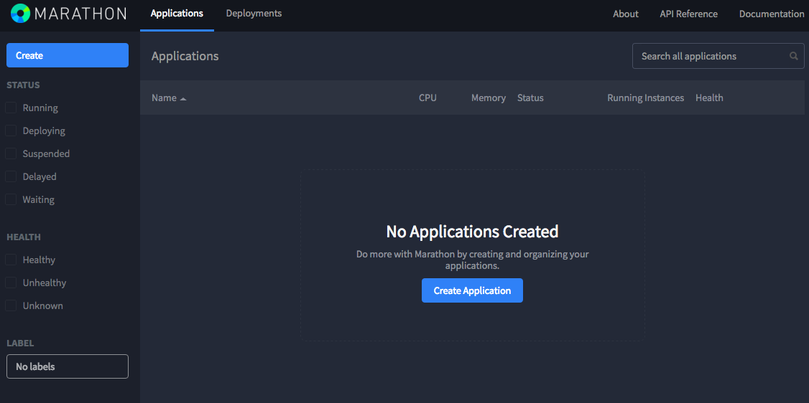

마라톤을 별도로 빌드하여 설치 할 경우에는 메소스와 연동하는 과정이 필요하지만, 메소스피어에서 제공한 패키지로 설치를 진행하였기 때문에 별다른 연동 과정 없이 
메소스 클러스의 주키퍼로부터 정보를 받아와 실행 될 것입니다.

메소스 클러스터와 잘 연동이 되었지 확인하기 위해 UI 에서 About 을 클릭합니다. 그림과 같이 현재 메소스 마스터 및 주키퍼의 설정 상태가 나타나야 합니다.
 
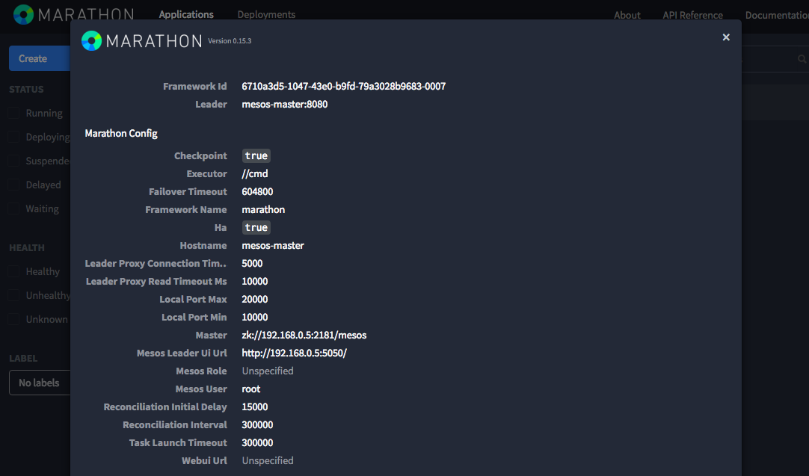


## Start Marathon

마라톤이 정상 동작하므로 이제 이 마라톤에 간단한 웹 어플리케이션을 실행시켜보겠습니다.

마라톤 UI 에서 Create Application 을 클릭합니다. python -m SimpleHTTPServer 명령어로 파이선 어플리케이션을 생성해보겠습니다.

그림과 같이 화면에 입력 후 Create 버튼을 클릭합니다.

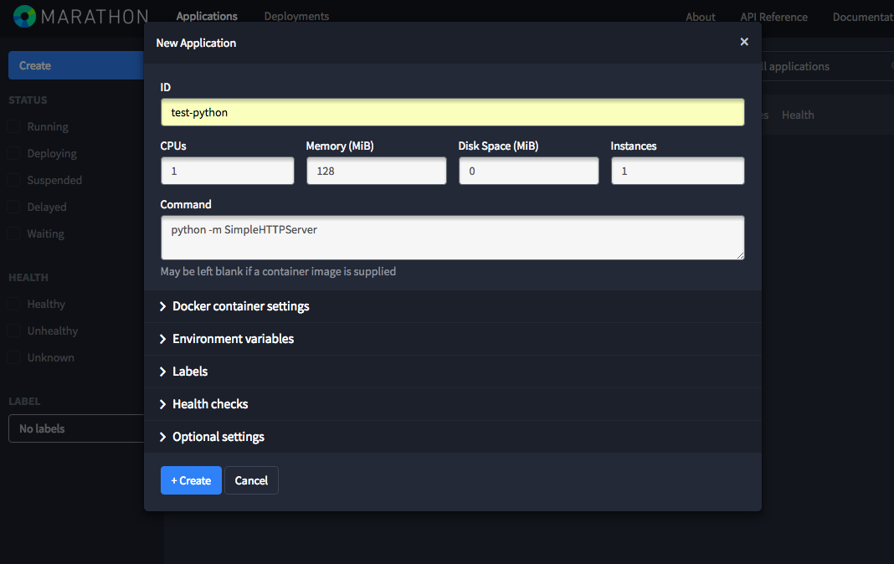

수초가 지난 후 test-python 의 상태가 Running 으로 변한것을 볼 수 있습니다.

슬레이브 서버에서, 이 파이썬 어플리케이션이 실제로 동작하는지 확인해보도록 합니다.

 - 슬레이브 서버에서(문서의 192.168.0.6 대신 실제 슬레이브 서버의 아이피를 넣도록 합니다.)
 
```
$ netstat -nlp | grep 8000
(No info could be read for "-p": geteuid()=1000 but you should be root.)
tcp        0      0 0.0.0.0:8000            0.0.0.0:*               LISTEN      - 

$ curl http://192.168.0.6:8000/
<!DOCTYPE html PUBLIC "-//W3C//DTD HTML 3.2 Final//EN"><html>
<title>Directory listing for /</title>
<body>
<h2>Directory listing for /</h2>
<hr>
<ul>
<li><a href="stderr">stderr</a>
<li><a href="stdout">stdout</a>
</ul>
<hr>
</body>
</html>
```

메소스 마라톤은 모든 프로세스에 대해 stderr (standard error) 과 stdout (standard out) 파일을 제공합니다.

curl 로 실제 SimpleHTTPServer 가 실행될 때 나타나는 로그인지 확인하여 볼 수 있습니다.

```
$ curl http://192.168.0.6:8000/stderr
I0323 22:06:37.120326  5976 exec.cpp:143] Version: 0.28.0
I0323 22:06:37.123612  5984 exec.cpp:217] Executor registered on slave c7ecb89b-691a-458b-8bd6-b7e0a8e38c0d-S17
192.168.0.6 - - [23/Mar/2016 22:09:07] "GET / HTTP/1.1" 200 -
192.168.0.6 - - [23/Mar/2016 22:10:28] "GET /stderr HTTP/1.1" 200 -

$ curl http://192.168.0.6:8000/stdout
Registered executor on 192.168.0.6
Starting task test-python.13fa1489-f0f8-11e5-9f24-0242aa66ba43
sh -c 'python -m SimpleHTTPServer'
Forked command at 5986
```

## Using the Marathon GUI

슬레이브 서버에서 이 파이썬 프로세스를 죽인 후, 마라톤에 의해 다시 리커버리 되는지를 지켜보도록 하겠습니다.

```
$ ps -ef | grep python
root      5986  5976  0 22:06 ?        00:00:00 sh -c python -m SimpleHTTPServer
root      5987  5986  0 22:06 ?        00:00:00 python -m SimpleHTTPServer
uengine   5999  1319  0 22:16 pts/0    00:00:00 grep --color=auto python

$ sudo pkill -f -9 python
Killed

$ ps -ef | grep python
root      6274  6264  0 22:34 ?        00:00:00 sh -c python -m SimpleHTTPServer
root      6275  6274  0 22:34 ?        00:00:00 python -m SimpleHTTPServer
uengine   6277  1319  0 22:34 pts/0    00:00:00 grep --color=auto python
```

pkill 명령어로 파이선을 종료했지만 곧 되살아 남을 볼 수 있습니다. 이 과정동안 일어나는 일을 알아보기 위해 메소스 마스터서버의 로그를 살펴보도록 하겠습니다.

```
I0323 22:34:06.612828  6195 master.cpp:4763] Status update TASK_FAILED (UUID: d40de225-5659-4175-9921-8eb66559c9f0) for task test-python.63fe2bf4-f0fa-11e5-9f24-0242aa66ba43 of framework 6710a3d5-1047-43e0-b9fd-79a3028b9683-0007 from slave c7ecb89b-691a-458b-8bd6-b7e0a8e38c0d-S17 at slave(1)@192.168.0.6:5051 (192.168.0.6)
I0323 22:34:06.612893  6195 master.cpp:4811] Forwarding status update TASK_FAILED (UUID: d40de225-5659-4175-9921-8eb66559c9f0) for task test-python.63fe2bf4-f0fa-11e5-9f24-0242aa66ba43 of framework 6710a3d5-1047-43e0-b9fd-79a3028b9683-0007
I0323 22:34:06.612958  6195 master.cpp:6421] Updating the state of task test-python.63fe2bf4-f0fa-11e5-9f24-0242aa66ba43 of framework 6710a3d5-1047-43e0-b9fd-79a3028b9683-0007 (latest state: TASK_FAILED, status update state: TASK_FAILED)
I0323 22:34:06.625485  6194 master.cpp:3918] Processing ACKNOWLEDGE call d40de225-5659-4175-9921-8eb66559c9f0 for task test-python.63fe2bf4-f0fa-11e5-9f24-0242aa66ba43 of framework 6710a3d5-1047-43e0-b9fd-79a3028b9683-0007 (marathon) at scheduler-dc49883a-1460-47f5-b24a-551a6b7a0c7c@127.0.0.1:35231 on slave c7ecb89b-691a-458b-8bd6-b7e0a8e38c0d-S17
I0323 22:34:06.625529  6194 master.cpp:6487] Removing task test-python.63fe2bf4-f0fa-11e5-9f24-0242aa66ba43 with resources cpus(*):1; mem(*):128; ports(*):[31961-31961] of framework 6710a3d5-1047-43e0-b9fd-79a3028b9683-0007 on slave c7ecb89b-691a-458b-8bd6-b7e0a8e38c0d-S17 at slave(1)@192.168.0.6:5051 (192.168.0.6)
I0323 22:34:06.963693  6196 http.cpp:312] HTTP GET for /master/state from 192.168.0.23:51209 with User-Agent='Mozilla/5.0 (Macintosh; Intel Mac OS X 10_9_5) AppleWebKit/537.36 (KHTML, like Gecko) Chrome/49.0.2623.87 Safari/537.36'
I0323 22:34:07.300413  6194 master.cpp:5324] Sending 1 offers to framework 6710a3d5-1047-43e0-b9fd-79a3028b9683-0007 (marathon) at scheduler-dc49883a-1460-47f5-b24a-551a6b7a0c7c@127.0.0.1:35231
I0323 22:34:07.302944  6198 master.cpp:3641] Processing DECLINE call for offers: [ 6710a3d5-1047-43e0-b9fd-79a3028b9683-O77 ] for framework 6710a3d5-1047-43e0-b9fd-79a3028b9683-0007 (marathon) at scheduler-dc49883a-1460-47f5-b24a-551a6b7a0c7c@127.0.0.1:35231
I0323 22:34:07.639720  6200 master.cpp:3720] Processing REVIVE call for framework 6710a3d5-1047-43e0-b9fd-79a3028b9683-0007 (marathon) at scheduler-dc49883a-1460-47f5-b24a-551a6b7a0c7c@127.0.0.1:35231
I0323 22:34:07.639801  6200 hierarchical.cpp:988] Removed offer filters for framework 6710a3d5-1047-43e0-b9fd-79a3028b9683-0007
I0323 22:34:07.640025  6200 master.cpp:5324] Sending 1 offers to framework 6710a3d5-1047-43e0-b9fd-79a3028b9683-0007 (marathon) at scheduler-dc49883a-1460-47f5-b24a-551a6b7a0c7c@127.0.0.1:35231
I0323 22:34:07.651563  6197 master.cpp:3104] Processing ACCEPT call for offers: [ 6710a3d5-1047-43e0-b9fd-79a3028b9683-O78 ] on slave c7ecb89b-691a-458b-8bd6-b7e0a8e38c0d-S17 at slave(1)@192.168.0.6:5051 (192.168.0.6) for framework 6710a3d5-1047-43e0-b9fd-79a3028b9683-0007 (marathon) at scheduler-dc49883a-1460-47f5-b24a-551a6b7a0c7c@127.0.0.1:35231
I0323 22:34:07.651859  6197 master.hpp:177] Adding task test-python.eb192855-f0fb-11e5-9f24-0242aa66ba43 with resources cpus(*):1; mem(*):128; ports(*):[31513-31513] on slave c7ecb89b-691a-458b-8bd6-b7e0a8e38c0d-S17 (192.168.0.6)
I0323 22:34:07.651892  6197 master.cpp:3589] Launching task test-python.eb192855-f0fb-11e5-9f24-0242aa66ba43 of framework 6710a3d5-1047-43e0-b9fd-79a3028b9683-0007 (marathon) at scheduler-dc49883a-1460-47f5-b24a-551a6b7a0c7c@127.0.0.1:35231 with resources cpus(*):1; mem(*):128; ports(*):[31513-31513] on slave c7ecb89b-691a-458b-8bd6-b7e0a8e38c0d-S17 at slave(1)@192.168.0.6:5051 (192.168.0.6)
I0323 22:34:07.721892  6193 master.cpp:4763] Status update TASK_RUNNING (UUID: 55d54674-a642-40a2-af7c-08479527367c) for task test-python.eb192855-f0fb-11e5-9f24-0242aa66ba43 of framework 6710a3d5-1047-43e0-b9fd-79a3028b9683-0007 from slave c7ecb89b-691a-458b-8bd6-b7e0a8e38c0d-S17 at slave(1)@192.168.0.6:5051 (192.168.0.6)
I0323 22:34:07.721946  6193 master.cpp:4811] Forwarding status update TASK_RUNNING (UUID: 55d54674-a642-40a2-af7c-08479527367c) for task test-python.eb192855-f0fb-11e5-9f24-0242aa66ba43 of framework 6710a3d5-1047-43e0-b9fd-79a3028b9683-0007
I0323 22:34:07.721999  6193 master.cpp:6421] Updating the state of task test-python.eb192855-f0fb-11e5-9f24-0242aa66ba43 of framework 6710a3d5-1047-43e0-b9fd-79a3028b9683-0007 (latest state: TASK_RUNNING, status update state: TASK_RUNNING)
I0323 22:34:07.727771  6196 master.cpp:3918] Processing ACKNOWLEDGE call 55d54674-a642-40a2-af7c-08479527367c for task test-python.eb192855-f0fb-11e5-9f24-0242aa66ba43 of framework 6710a3d5-1047-43e0-b9fd-79a3028b9683-0007 (marathon) at scheduler-dc49883a-1460-47f5-b24a-551a6b7a0c7c@127.0.0.1:35231 on slave c7ecb89b-691a-458b-8bd6-b7e0a8e38c0d-S17
I0323 22:34:08.302884  6199 master.cpp:5324] Sending 1 offers to framework 6710a3d5-1047-43e0-b9fd-79a3028b9683-0007 (marathon) at scheduler-dc49883a-1460-47f5-b24a-551a6b7a0c7c@127.0.0.1:35231
I0323 22:34:08.305418  6198 master.cpp:3641] Processing DECLINE call for offers: [ 6710a3d5-1047-43e0-b9fd-79a3028b9683-O79 ] for framework 6710a3d5-1047-43e0-b9fd-79a3028b9683-0007 (marathon) at scheduler-dc49883a-1460-47f5-b24a-551a6b7a0c7c@127.0.0.1:35231
```

위 로그는 매우 명시적으로 프로세스 흐름이 기록되어 있습니다. 로그의 순서는 다음과 같습니다.

1. 메소스 슬레이브 서버가 메소스 마스터 서버로 test-python 타스크의 스테이터스를 TASK_FAILED 로 전송합니다.
2. 메소스 마스터가 test-python 의 스테이터스를 마라톤 프레임워크로 전송합니다.
3. 마라톤 프레임워크가 메소스에게 test-python 에 할당되었던 리소스를 수거하도록 요청합니다.
4. 마라톤 프레임워크가 메소스에게 test-python 에 리소스 재분배 및 실행을 요청합니다.(스케쥴러)
5. test-python 타스크가 실행됩니다.
6. 메소스 슬레이브가 test-python 의 스테이터스를 TASK_RUNNING 으로 메소스 마스터에게 전송합니다.
7. 메소스 마스터가 마라톤 프레임워크로 test-python 의 스테이터스를 전송합니다.

위의 과정으로 단일 프로세스의 동작과정을 살펴보았습니다.

그러나 이 SimpleHTTPServer 어플리케이션을 다수로 동작시켜야 할 경우, 다수의 어플리케이션이 모두 8000 포트를 쓴다면 서비스 운영이 되지 않습니다.

마라톤은 어플리케이션을 디플로이 시킬 때, 별도의 설정을 하지 않는다면 기본적으로 랜덤한 포트를 어플리케이션마다 지급합니다. 이 값은 PORT 변수에 들어가게 됩니다.
 
따라서, SimpleHTTPServer 를 실행시킬 때 python -m SimpleHTTPServer $PORT 형식으로 명령어를 내리게 되면 SimpleHTTPServer 이 마라톤에서 자동할당해 준 
포트로 바인딩이 되게 됩니다. 

웹 UI 에서 기존의 test-python 를 삭제 후 그림과 같은 값을 입력하여 새로 생성하여 보도록 하겠습니다.

다수의 프로세스를 생성해야 함으로 cpu 는 0.1, 메모리는 32MB 로 설정하도록 합니다.

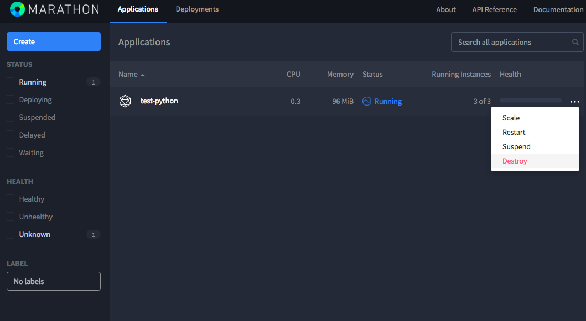

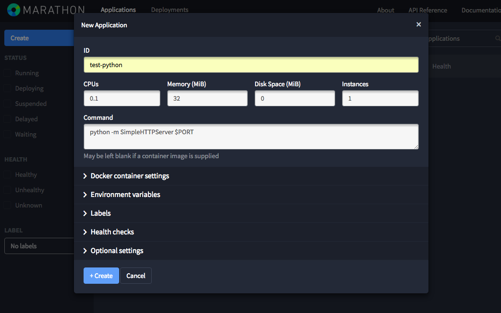

어플리케이션이 디플로이 된 후, GUI 에서 어플리케이션을 클릭하게 되면 아래와 같은 화면이 나옵니다.

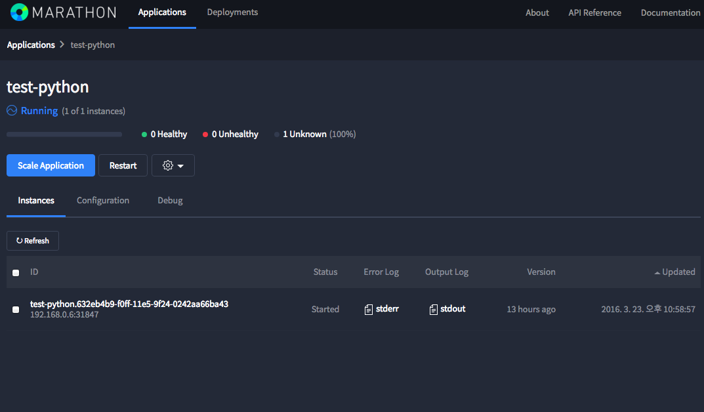

test-python 어플리케이션이 한개의 타스크를 가동중에 있고, 이 타스크가 192.168.0.6(슬레이브 아이피):31847 포트로 서비스되고 있다는 정보를 알 수 있습니다. 
실제로 브라우저에서 이 주소로 접속하여 웹 서버가 떠 있는지 확인하도록 합니다.

다음은 스케일-인-아웃 기능을 보도록 하겠습니다.

다시 GUI 의 어플리케이션 화면으로 돌아와서, 그림과 같이 스케일 사이즈를 3으로 설정하여 봅니다.

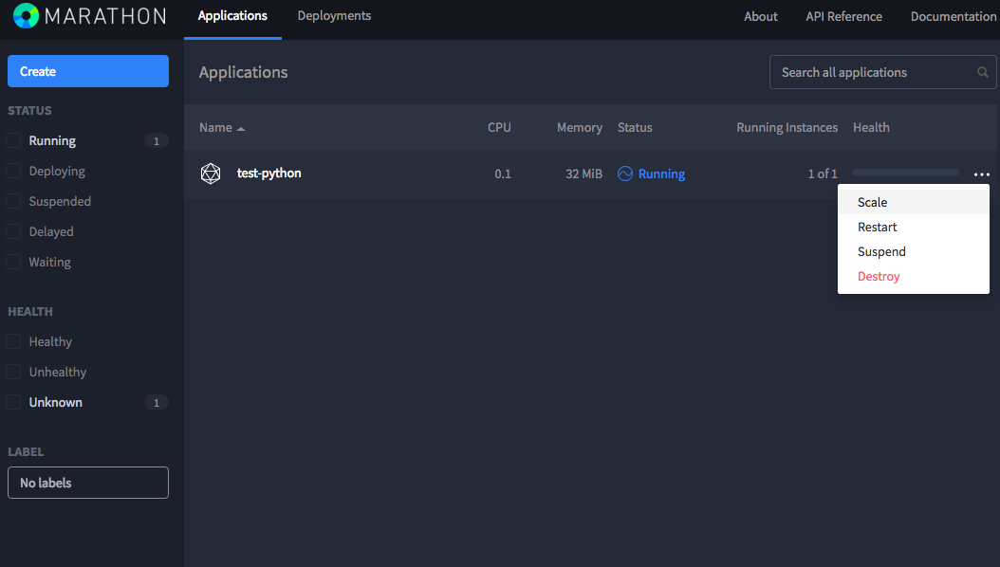

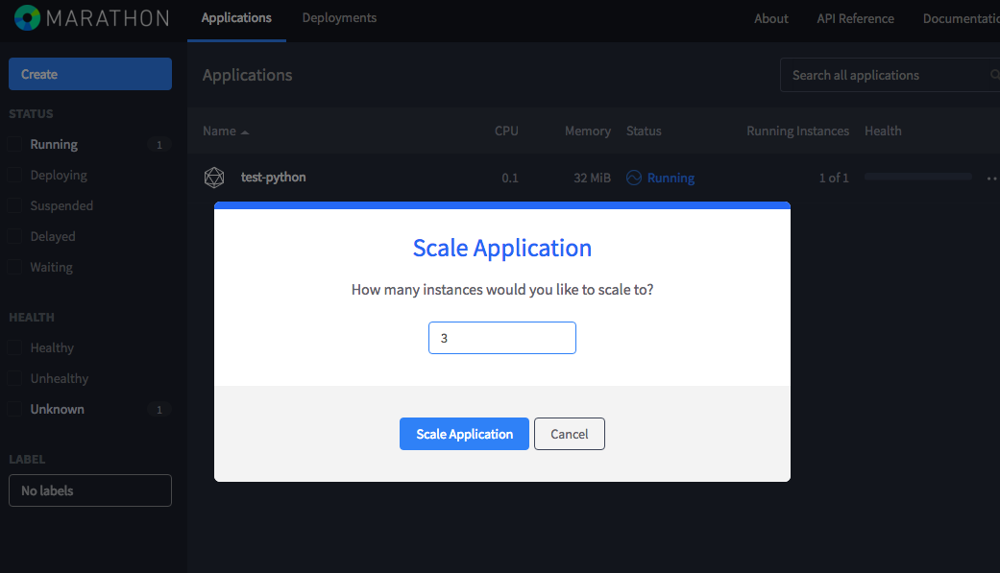

곧 Running instances 의 숫자가 3으로 변하는 것을 볼 수 있습니다.

어플리케이션 정보를 클릭하면, 세개의 타스크 리스트와 각각의 포트 바인딩 상황을 볼 수 있습니다.

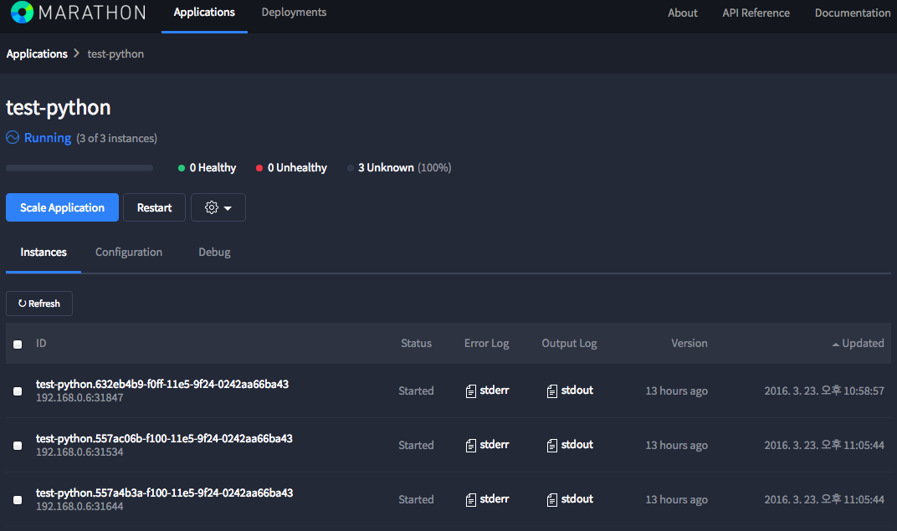

슬레이브 서버에서, 실제로 프로세스를 검사해 보도록 하겠습니다.

```
$ ps -ef | grep python
root      6298  6288  0 22:48 ?        00:00:00 sh -c python -m SimpleHTTPServer $PORT
root      6299  6298  0 22:48 ?        00:00:00 python -m SimpleHTTPServer 31794
root      6326  6306  0 22:52 ?        00:00:00 sh -c python -m SimpleHTTPServer $PORT
root      6327  6326  0 22:52 ?        00:00:00 python -m SimpleHTTPServer 31106
root      6328  6307  0 22:52 ?        00:00:00 sh -c python -m SimpleHTTPServer $PORT
root      6329  6328  0 22:52 ?        00:00:00 python -m SimpleHTTPServer 31817
uengine   6331  1319  0 22:52 pts/0    00:00:00 grep --color=auto python
```

기존 1개의 타스크에서 3개의 타스크로 확장이 되는 동안, 메소스 마스터의 로그를 통해 어떠한 순서로 동작하는지 살펴보도록 하겠습니다.

```
I0323 23:05:44.102913  6193 master.cpp:3720] Processing REVIVE call for framework 6710a3d5-1047-43e0-b9fd-79a3028b9683-0007 (marathon) at scheduler-dc49883a-1460-47f5-b24a-551a6b7a0c7c@127.0.0.1:35231
I0323 23:05:44.102969  6193 hierarchical.cpp:988] Removed offer filters for framework 6710a3d5-1047-43e0-b9fd-79a3028b9683-0007
I0323 23:05:44.103119  6193 master.cpp:5324] Sending 1 offers to framework 6710a3d5-1047-43e0-b9fd-79a3028b9683-0007 (marathon) at scheduler-dc49883a-1460-47f5-b24a-551a6b7a0c7c@127.0.0.1:35231
I0323 23:05:44.112539  6195 master.cpp:3104] Processing ACCEPT call for offers: [ 6710a3d5-1047-43e0-b9fd-79a3028b9683-O103 ] on slave c7ecb89b-691a-458b-8bd6-b7e0a8e38c0d-S17 at slave(1)@192.168.0.6:5051 (192.168.0.6) for framework 6710a3d5-1047-43e0-b9fd-79a3028b9683-0007 (marathon) at scheduler-dc49883a-1460-47f5-b24a-551a6b7a0c7c@127.0.0.1:35231
I0323 23:05:44.112845  6195 master.hpp:177] Adding task test-python.557ac06b-f100-11e5-9f24-0242aa66ba43 with resources cpus(*):0.1; mem(*):32; ports(*):[31534-31534] on slave c7ecb89b-691a-458b-8bd6-b7e0a8e38c0d-S17 (192.168.0.6)
I0323 23:05:44.112884  6195 master.cpp:3589] Launching task test-python.557ac06b-f100-11e5-9f24-0242aa66ba43 of framework 6710a3d5-1047-43e0-b9fd-79a3028b9683-0007 (marathon) at scheduler-dc49883a-1460-47f5-b24a-551a6b7a0c7c@127.0.0.1:35231 with resources cpus(*):0.1; mem(*):32; ports(*):[31534-31534] on slave c7ecb89b-691a-458b-8bd6-b7e0a8e38c0d-S17 at slave(1)@192.168.0.6:5051 (192.168.0.6)
I0323 23:05:44.113044  6195 master.hpp:177] Adding task test-python.557a4b3a-f100-11e5-9f24-0242aa66ba43 with resources cpus(*):0.1; mem(*):32; ports(*):[31644-31644] on slave c7ecb89b-691a-458b-8bd6-b7e0a8e38c0d-S17 (192.168.0.6)
I0323 23:05:44.113075  6195 master.cpp:3589] Launching task test-python.557a4b3a-f100-11e5-9f24-0242aa66ba43 of framework 6710a3d5-1047-43e0-b9fd-79a3028b9683-0007 (marathon) at scheduler-dc49883a-1460-47f5-b24a-551a6b7a0c7c@127.0.0.1:35231 with resources cpus(*):0.1; mem(*):32; ports(*):[31644-31644] on slave c7ecb89b-691a-458b-8bd6-b7e0a8e38c0d-S17 at slave(1)@192.168.0.6:5051 (192.168.0.6)
I0323 23:05:44.249315  6198 master.cpp:4763] Status update TASK_RUNNING (UUID: 4a5450a4-baa9-473d-bd12-65b78b2fbcd7) for task test-python.557ac06b-f100-11e5-9f24-0242aa66ba43 of framework 6710a3d5-1047-43e0-b9fd-79a3028b9683-0007 from slave c7ecb89b-691a-458b-8bd6-b7e0a8e38c0d-S17 at slave(1)@192.168.0.6:5051 (192.168.0.6)
I0323 23:05:44.249375  6198 master.cpp:4811] Forwarding status update TASK_RUNNING (UUID: 4a5450a4-baa9-473d-bd12-65b78b2fbcd7) for task test-python.557ac06b-f100-11e5-9f24-0242aa66ba43 of framework 6710a3d5-1047-43e0-b9fd-79a3028b9683-0007
I0323 23:05:44.249567  6198 master.cpp:6421] Updating the state of task test-python.557ac06b-f100-11e5-9f24-0242aa66ba43 of framework 6710a3d5-1047-43e0-b9fd-79a3028b9683-0007 (latest state: TASK_RUNNING, status update state: TASK_RUNNING)
I0323 23:05:44.252485  6200 master.cpp:4763] Status update TASK_RUNNING (UUID: e9bc5073-e5bd-4c03-b63d-7f17e9d3142e) for task test-python.557a4b3a-f100-11e5-9f24-0242aa66ba43 of framework 6710a3d5-1047-43e0-b9fd-79a3028b9683-0007 from slave c7ecb89b-691a-458b-8bd6-b7e0a8e38c0d-S17 at slave(1)@192.168.0.6:5051 (192.168.0.6)
I0323 23:05:44.252527  6200 master.cpp:4811] Forwarding status update TASK_RUNNING (UUID: e9bc5073-e5bd-4c03-b63d-7f17e9d3142e) for task test-python.557a4b3a-f100-11e5-9f24-0242aa66ba43 of framework 6710a3d5-1047-43e0-b9fd-79a3028b9683-0007
I0323 23:05:44.252579  6200 master.cpp:6421] Updating the state of task test-python.557a4b3a-f100-11e5-9f24-0242aa66ba43 of framework 6710a3d5-1047-43e0-b9fd-79a3028b9683-0007 (latest state: TASK_RUNNING, status update state: TASK_RUNNING)
I0323 23:05:44.255939  6194 master.cpp:3918] Processing ACKNOWLEDGE call 4a5450a4-baa9-473d-bd12-65b78b2fbcd7 for task test-python.557ac06b-f100-11e5-9f24-0242aa66ba43 of framework 6710a3d5-1047-43e0-b9fd-79a3028b9683-0007 (marathon) at scheduler-dc49883a-1460-47f5-b24a-551a6b7a0c7c@127.0.0.1:35231 on slave c7ecb89b-691a-458b-8bd6-b7e0a8e38c0d-S17
I0323 23:05:44.260550  6193 master.cpp:3918] Processing ACKNOWLEDGE call e9bc5073-e5bd-4c03-b63d-7f17e9d3142e for task test-python.557a4b3a-f100-11e5-9f24-0242aa66ba43 of framework 6710a3d5-1047-43e0-b9fd-79a3028b9683-0007 (marathon) at scheduler-dc49883a-1460-47f5-b24a-551a6b7a0c7c@127.0.0.1:35231 on slave c7ecb89b-691a-458b-8bd6-b7e0a8e38c0d-S17
I0323 23:05:44.684875  6194 master.cpp:5324] Sending 1 offers to framework 6710a3d5-1047-43e0-b9fd-79a3028b9683-0007 (marathon) at scheduler-dc49883a-1460-47f5-b24a-551a6b7a0c7c@127.0.0.1:35231
I0323 23:05:44.686877  6196 master.cpp:3641] Processing DECLINE call for offers: [ 6710a3d5-1047-43e0-b9fd-79a3028b9683-O104 ] for framework 6710a3d5-1047-43e0-b9fd-79a3028b9683-0007 (marathon) at scheduler-dc49883a-1460-47f5-b24a-551a6b7a0c7c@127.0.0.1:35231
```

위 로그의 진행과정은 다음과 같습니다.

1. 마라톤이 스케쥴러가 메소스 마스터에 타스크 실행 요청을 합니다.
2. 메소스 슬레이브에 test-python 타스크가 추가되고 실행됩니다.
3. 메소스 슬레이브에 test-python 타스크가 추가되고 실행됩니다.
4. 메소스 마스터가 마라톤 프레임워크에 TASK_RUNNING 스테이터스를 전송합니다.
5. 메소스 마스터가 마라톤 프레임워크에 TASK_RUNNING 스테이터스를 전송합니다.

위 로그를 통해 마라톤 스케쥴러가 메소스에 타스크를 추가할 경우 타스크 등록완료 후 다음 타스크를 등록하는 것이 아니라 병렬적으로 타스크 스케쥴을 수행함을 알 수 있습니다.

## Marathon REST API

마라톤 REST API 도큐먼트는 [http://mesosphere.github.io/marathon/docs/rest-api.html](http://mesosphere.github.io/marathon/docs/rest-api.html) 에 있습니다.

이 교재에서는 몇가지 간단한 REST API CALL 을 수행 해 보도록 하겠습니다.

메소스 마스터 서버에서, 다음 순서대로 실행하여 봅니다.

```
# get metrics on the running apps
$ curl http://0.0.0.0:8080/metrics | python -m json.tool | less
{
    "counters": {
        "org.eclipse.jetty.servlet.ServletContextHandler.active-dispatches": {
            "count": 1
        },
        "org.eclipse.jetty.servlet.ServletContextHandler.active-requests": {
            "count": 1
        },
        "org.eclipse.jetty.servlet.ServletContextHandler.active-suspended": {
            "count": 0
        }
    },
.
.
(키보드 q 를 누르시면 빠져나갈 수 있습니다.)
# look at the apps you have installed
$ curl http://0.0.0.0:8080/v2/apps | python -m json.tool

# look at a specific app, named test from Ex4 and Ex5
$ curl http://0.0.0.0:8080/v2/apps/test-python | python -m json.tool

# delete that app
$ curl -X DELETE http://0.0.0.0:8080/v2/apps/test-python | python -m json.tool

# show that the app is gone
$ curl http://0.0.0.0:8080/v2/apps/test-python | python -m json.tool
```

## Deploying A Web App Using Docker

이번 파트에서는 도커 컨테이너에서 웹 어플리케이션을 띄우고, 도커 컨테이너의 포트와 마라톤 슬레이브 서버의 포트를 어떻게 바인딩 시킬 수 있는가에 대해 알아보겠습니다.

작업해야 할 목표에 대한 것을 간단한 그림으로 나타내면 다음과 같습니다.

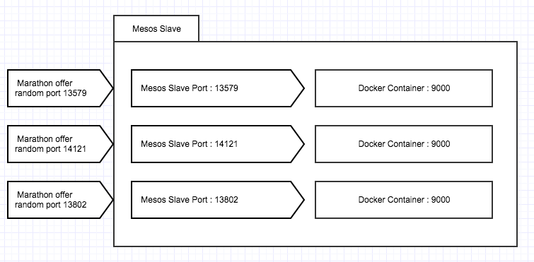

내부에 9000 포트의 웹 어플리케이션이 실행되고 있는 도커 컨테이너가 있다고 가정합니다.
 
그림의 예시에서는 마라톤 프레임워크로 이 컨테이너를 구동할 때, 도커 컨테이너의 9000 포트를 마라톤 프레임워크가 생성한 랜덤한 포트로 (슬레이브 머신의 포트) 바인딩 시키게 되면, 
도커 컨테이너 내부에서 구축한 웹 어플리케이션이 메소스의 PORT 변수에 대해 일일이 대응하는 코드를 작성할 필요가 없이 외부에서 접속 가능한 도커 웹 컨테이너를 생성할 수 있습니다.
 
이 과정을 마라톤 Rest Api 를 사용하여 바로 실습을 해 보도록 합니다.

먼저, Dockerfile 을 작성하고 이미지를 생성하도록 합니다.

이 과정은 도커 교재의 [Launch Web Application](/docs/training-docker.md#launch-web-application) 진행과정과 같으니 이미 이 튜토리얼을 진행하여 hello-world 
이미지를 가지고 있다면 넘어가도록 합니다.

슬레이브 서버에 Docker 가 설치되어 있다고 가정하고, 슬레이브 서버에서 작업하도록 합니다.

```
# 도커 파일 생성

$ mkdir hello-world

$ vi hello-world/Dockerfile

# hello-world
#
# VERSION               0.0.2

FROM ubuntu:14.04
MAINTAINER uEngine <http://www.uengine.org>

RUN apt-get update && apt-get install -y curl wget unzip
RUN curl -sL https://deb.nodesource.com/setup | sudo bash -
RUN sudo apt-get install -y nodejs
RUN wget https://s3.ap-northeast-2.amazonaws.com/beluga-uengine/tutorial/nodejs-hello-world-master.zip
RUN unzip nodejs-hello-world-master.zip
 
EXPOSE 9000
CMD ["node", "nodejs-hello-world-master/web.js"]

# 도커 파일 빌드

$ sudo docker build -t hello-world hello-world/
Sending build context to Docker daemon 2.048 kB
Step 1 : FROM ubuntu:14.04
 ---> a0d4a44ae66e
Step 2 : MAINTAINER uEngine <http://www.uengine.org>
 ---> Running in 31dc0089f67a
 ---> 72416c86ddce
Removing intermediate container 31dc0089f67a

.
.
.

Removing intermediate container 2d5eecf07769
Successfully built e59466cbf1f3

# 빌드 이미지 확인

$ sudo docker images
REPOSITORY              TAG                 IMAGE ID            CREATED             SIZE
hello-world             latest              06e8dd4381b3        8 hours ago         268.3 MB
```

슬레이브 서버에서 앞서 메소스 파트에서 설정했던 /etc/mesos-slave/containerizers 파일이 docker 구동을 허락하고 있는지 확인하도록 합니다.

```
$ cat /etc/mesos-slave/containerizers
docker,mesos
```

마스터 서버에서 도커 구동에 관한 스펙을 json 파일로 작성하고, 이 json 파일을 rest api 로 전송하여 도커 컨테이너 어플리케이션을 구동하도록 합니다.

```
# Json 작성

$ vi helloworld.json
{
  "id": "hello-world",
  "cpus": 0.1,
  "mem": 32.0,
  "instances": 3,
  "container": {
    "type": "DOCKER",
    "docker": {
      "image": "hello-world",
      "network": "BRIDGE",
      "portMappings": [
        { "containerPort": 9000, "hostPort": 0, "servicePort": 0, "protocol": "tcp" }
      ]
    }
  }
}

# instances 값 만큼 어플리케이션의 스케일 수가 정해지게 됩니다.

# Rest 요청 (마스터 서버의 주소를 넣도록 합니다.)

$ curl -X POST http://192.168.0.5:8080/v2/apps -d @helloworld.json -H "Content-type: application/json" | python -m json.tool

  % Total    % Received % Xferd  Average Speed   Time    Time     Time  Current
                                 Dload  Upload   Total   Spent    Left  Speed
100  1228    0   883  100   345  14220   5556 --:--:-- --:--:-- --:--:-- 16054
{
    "acceptedResourceRoles": null,
    "args": null,
    "backoffFactor": 1.15,
    "backoffSeconds": 1,
    "cmd": null,
    "constraints": [
        [
            "hostname",
            "UNIQUE",
            ""
        ]
    ],
.
.
```

마라톤 UI 에서 타스크를 확인하여 실제로 브라우저를 통해 어플리케이션이 동작하는지 살펴보도록 합니다.

또한 UI 에서 stdout 파일을 다운받아 도커 컨테이너의 구동 로그를 확인해 보도록 합니다.

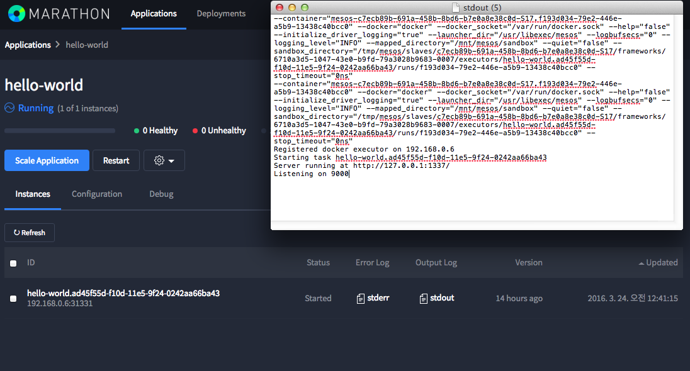

```
# 컨테이너 구동 로그

--container="mesos-c7ecb89b-691a-458b-8bd6-b7e0a8e38c0d-S17.f193d034-79e2-446e-a5b9-13438c40bcc0" --docker="docker" --docker_socket="/var/run/docker.sock" --help="false" --initialize_driver_logging="true" --launcher_dir="/usr/libexec/mesos" --logbufsecs="0" --logging_level="INFO" --mapped_directory="/mnt/mesos/sandbox" --quiet="false" --sandbox_directory="/tmp/mesos/slaves/c7ecb89b-691a-458b-8bd6-b7e0a8e38c0d-S17/frameworks/6710a3d5-1047-43e0-b9fd-79a3028b9683-0007/executors/hello-world.ad45f55d-f10d-11e5-9f24-0242aa66ba43/runs/f193d034-79e2-446e-a5b9-13438c40bcc0" --stop_timeout="0ns"
--container="mesos-c7ecb89b-691a-458b-8bd6-b7e0a8e38c0d-S17.f193d034-79e2-446e-a5b9-13438c40bcc0" --docker="docker" --docker_socket="/var/run/docker.sock" --help="false" --initialize_driver_logging="true" --launcher_dir="/usr/libexec/mesos" --logbufsecs="0" --logging_level="INFO" --mapped_directory="/mnt/mesos/sandbox" --quiet="false" --sandbox_directory="/tmp/mesos/slaves/c7ecb89b-691a-458b-8bd6-b7e0a8e38c0d-S17/frameworks/6710a3d5-1047-43e0-b9fd-79a3028b9683-0007/executors/hello-world.ad45f55d-f10d-11e5-9f24-0242aa66ba43/runs/f193d034-79e2-446e-a5b9-13438c40bcc0" --stop_timeout="0ns"
Registered docker executor on 192.168.0.6
Starting task hello-world.ad45f55d-f10d-11e5-9f24-0242aa66ba43
Server running at http://127.0.0.1:1337/
Listening on 9000
```

슬레이브 서버에 실제 도커 컨테이너를 검색하여 봅니다.

```
$ sudo docker ps
CONTAINER ID        IMAGE               COMMAND                  CREATED             STATUS              PORTS                     NAMES
5be2a2e5db40        hello-world         "node nodejs-hello-wo"   10 minutes ago      Up 10 minutes       0.0.0.0:31028->9000/tcp   mesos-c7ecb89b-691a-458b-8bd6-b7e0a8e38c0d-S17.85b59aee-af0a-4a1f-85c8-453b6dc6b9fe
da58a06c2175        hello-world         "node nodejs-hello-wo"   10 minutes ago      Up 10 minutes       0.0.0.0:31881->9000/tcp   mesos-c7ecb89b-691a-458b-8bd6-b7e0a8e38c0d-S17.bab0e13b-5aad-4dc9-b487-c1a35879c66c
4a72acb37590        hello-world         "node nodejs-hello-wo"   10 minutes ago      Up 10 minutes       0.0.0.0:31747->9000/tcp   mesos-c7ecb89b-691a-458b-8bd6-b7e0a8e38c0d-S17.e5a51c1d-757c-4150-afc2-8684db5eef6b
```

## Next Step

지금 까지 메소스 마라톤 프레임워크에서 도커 컨테이너 웹 어플리케이션을 디플로이 하는 과정을 배워보았습니다.

그런데 도커 컨테이너들의 웹 포트가 제각각이라서 이 포트들을 하나의 FQDN 형식의 도메인으로 서비스 해야 할 필요성이 있습니다.

다음 파트에서는 HAProxy 를 사용하여 각각의 웹 도커 컨테이너들을 하나의 도메인으로 서비스 하는 것을 배워보겠습니다.

[HAProxy 학습 바로가기](training-proxy.md)

 