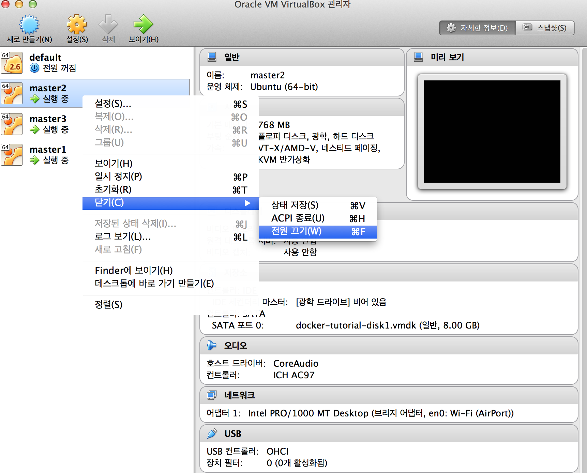

# Training Mesos

### 목차
 - [Overview](#overview)
 - [Zookeeper](#zookeeper)
    - [Understand zookeeper](#understand-zookeeper)
    - [Install zookeeper](#install-zookeeper)
    - [Standalone Operation](#standalone-operation)
    - [Running Replicated ZooKeeper](#running-replicated-zookeeper)
 - [Apache Mesos](#apache-mesos)
    - [Understand Mesos](#understand-mesos)
    - [Install Mesos](#install-mesos)
    - [Configuration Mesos](#configuration-mesos)
        - [Master Server](#master-server)
        - [Slave Server](#slave-server)
        - [Validate Configuration](#slave-server)
    - [Mesos Frameworks](#mesos-frameworks)
        - [Mesos framework components](#mesos-framework-components)
        - [Running framework](#running-framework)
 - [Next Step](#next-step)
    
    
## Overview

여기서부터 진행되는 주키퍼,메소스,메소스 마라톤 섹션의 모든 진행 과정은 
[https://drive.google.com/open?id=0By_yEUK4bN_wSE1JT09vQmdVSFU](https://drive.google.com/open?id=0By_yEUK4bN_wSE1JT09vQmdVSFU) 
를 통해 다운로드 받으실 수 있습니다.

진행에 어려움이 있을 시에는 사전에 설치가 완료된 위의 이미지를 다운받아 도움을 받을 수 있도록 합니다. 

## Zookeeper

### Understand zookeeper

분산 시스템을 설계 하다보면, 가장 문제점 중의 하나가 분산된 시스템간의 정보를 어떻게 공유할것이고, 
클러스터에 있는 서버들의 상태를 체크할 필요가 있으며 또한, 
분산된 서버들간에 동기화를 위한 락(lock)을 처리하는 것들이 문제로 부딪힙니다.

이러한 문제를 해결하는 시스템을 코디네이션 서비스 시스템 (coordination service)라고 하는데, 
Apache Zookeeper가 대표적입니다. 
이 코디네이션 서비스는 분산 시스템 내에서 중요한 상태 정보나 설정 정보등을 유지하기 때문에, 
코디네이션 서비스의 장애는 전체 시스템의 장애를 유발하기 때문에, 
이중화등을 통하여 고가용성을 제공해야 합니다. 
ZooKeeper는 이러한 특성을 잘 제공하고 있는데, 그런 이유로 이미 유명한 분산 솔루션에 많이 사용되고 있습니다. 
NoSQL의 한종류인 Apache HBase, 대용량 분산 큐 시스템인 Kafka등이 그 대표적인 사례입니다.

분산 시스템을 코디네이션 하는 용도로 디자인이 되었기 때문에, 
데이타 억세스가 빨라야 하며, 
자체적으로 장애에 대한 대응성을 가져야 합니다. 
그래서 Zookeeper는 자체적으로 클러스터링을 제공하며, 
장애에도 데이타 유실 없이 fail over/fail back이 가능합니다.

``
분산 프로그램 작성의 어려움: 부분적 실패(partial failure)
``

주키퍼가 부분적 실패를 완전히 사라지게 할 수는 없지만, 부분적 실패를 안전하게 다루면서 분산 응용 프로그램을 구출할 수 있도록 도와주는 도구를 제공합니다.

 * 주키퍼는 단순하다.

단순한 몇 개의 핵심적인 연산을 제공하는 간소화(stripped-down)된 하나의 파일시스템

이벤트와 관련된 순서화(ordering)와 통지(notification) \같은 추상화도 제공

 

 * 주키퍼는 다양하게 활용된다

상호조정에 필요한 다양한 데이터 구조체와 프로토콜 구축을 위한 풍부한 프리미티브 제공

 

 * 주키퍼는 고가용성을 지원한다

클러스터상에서 동작하고, 고가용성을 보장하도록 설계됨.

 

 * 주키퍼는 느슨하게 연결된 상호작용을 제공한다

상호작용 참여자의 익명성을 보장한다. 서로의 존재나 네트워크 세부사항을 모르더라도 프로세스가 상호 발견하고 상호 소통할 수 있도록 해준다.

 

 * 주키퍼는 라이브러리다

상호조정 패턴에 대한 구현물과 구현 방법을 오픈소스로 제공


#### ZNode

ZooKeeper 가 data 를 저장하는 방법에 대하여 알아보겠습니다.

ZooKeeper 가 제공해주는 파일시스템에 저장되는 파일 하나하나를 znode 라고 부릅니다.
znode 는 unix-like 시스템에서 쓰이는 file system 처럼 node 간에 hierarchy namespace 를 가지고, 이를 /(slash)를 이용하여 구분합니다.

일반적인 file system 과 다른 부분이 있습니다. ZooKeeper 는 file 과 directory 의 구분이 없이 znode라는 것 하나만을 제공합니다. 
즉, directory 에도 내용을 적을 수 있는, directory 와 file 간의 구분이 없는 file system 이라고 할 수 있습니다.
namespace hierarchy 를 가지기 때문에 관련 있는 일들을 눈에 보이는 하나의 묶음으로 관리할 수 있으면서, 
directory 가 내용을 가질 수 있게 함으로써(혹은 file 간에 hierarchy 를 가진다고 하기도 합니다.) 
불필요한 file 을 생성해야 하는 것을 막을 수 있습니다.


### Install zookeeper

우분투에서 주키퍼를 인스톨합니다.

```
$ sudo apt-get install zookeeper
Reading package lists... Done
Building dependency tree       
Reading state information... Done
.
.
.
update-alternatives: using /etc/zookeeper/conf_example to provide /etc/zookeeper/conf (zookeeper-conf) in auto mode
```

설치가 잘 완료되었는지 확인하여 봅니다.

```
$ sudo service zookeeper status
zookeeper start/running, process 6990
```

### Standalone Operation

주키퍼를 독립형 모드로 실행시키고, znode 를 컨트롤 하는 것을 진행 해 보겠습니다.

먼저 zoo.cfg 파일을 살펴봅니다.

```
$ cat /etc/zookeeper/conf/zoo.cfg

# http://hadoop.apache.org/zookeeper/docs/current/zookeeperAdmin.html

# The number of milliseconds of each tick
tickTime=2000
# The number of ticks that the initial 
# synchronization phase can take
initLimit=10
# The number of ticks that can pass between 
# sending a request and getting an acknowledgement
syncLimit=5
# the directory where the snapshot is stored.
dataDir=/var/lib/zookeeper
# Place the dataLogDir to a separate physical disc for better performance
# dataLogDir=/disk2/zookeeper

# the port at which the clients will connect
clientPort=2181
.
.
.
```

zookeeper 를 인스톨 하면 zoo.cfg 에 기본적인 설정이 되어있습니다.

zookeeper 가 실행되기 위해 필요한 최소 옵션은 다음의 세가지입니다.

```
tickTime=2000
dataDir=/var/lib/zookeeper
clientPort=2181
```

이 설정을 그대로 유지하도록 하며 주키퍼를 재실행합니다.

```
$ sudo service zookeeper restart
zookeeper stop/waiting
zookeeper start/running, process 7780
```

실행중인 주키퍼에 접속을 시도합니다.

```
$ sudo /usr/share/zookeeper/bin/zkCli.sh -server 127.0.0.1:2181
Connecting to 127.0.0.1:2181
Welcome to ZooKeeper!
JLine support is enabled

WATCHER::

WatchedEvent state:SyncConnected type:None path:null
[zk: 127.0.0.1:2181(CONNECTED) 0] 
```

help 로 명령어들을 볼 수 있습니다.

```
[zk: 127.0.0.1:2181(CONNECTED) 1] help
ZooKeeper -server host:port cmd args
	stat path [watch]
	set path data [version]
	ls path [watch]
	delquota [-n|-b] path
	ls2 path [watch]
	setAcl path acl
	setquota -n|-b val path
	history 
	redo cmdno
	printwatches on|off
	delete path [version]
	sync path
	listquota path
	rmr path
	get path [watch]
	create [-s] [-e] path data acl
	addauth scheme auth
	quit 
	getAcl path
	close 
	connect host:port
```

현재 설치되어있는 znode 목록을 살펴보도록 하겠습니다.

```
[zk: 127.0.0.1:2181(CONNECTED) 4] ls /
[mesos, zookeeper, marathon]
```

create 명령어를 사용하여 새로운 znode 를 생성하여 봅니다.

```
[zk: 127.0.0.1:2181(CONNECTED) 5] create /zk_test my_data
Created /zk_test
[zk: 127.0.0.1:2181(CONNECTED) 6] ls /
[mesos, zookeeper, marathon, zk_test]
```

zk_test 디렉토리가 생성 된 것을 볼 수 있습니다.
이 디렉토리의 정보를 get 을 이용하여 불러오도록 합니다.

```
[zk: 127.0.0.1:2181(CONNECTED) 7] get /zk_test
my_data
cZxid = 0x2a
ctime = Tue Mar 22 12:34:33 KST 2016
mZxid = 0x2a
mtime = Tue Mar 22 12:34:33 KST 2016
pZxid = 0x2a
cversion = 0
dataVersion = 0
aclVersion = 0
ephemeralOwner = 0x0
dataLength = 7
numChildren = 0
```

ZNode는 node 와 node 의 data 에 관한 여러 정보를 들고 있고, 이것을 stat 이라고 부릅니다. stat 이 가지는 정보는 다음과 같습니다.

```
czxid : znode를 생성한 트랜잭션의 id
mzxid : znode를 마지막으로 수정 트랜잭션의 id
ctime : znode가 생성됐을 때의 시스템 시간
mtime : znode가 마지막으로 변경되었을 때의 시스템 시간
version : znode가 변경된 횟수
cversion : znode의 자식 node를 수정한 횟수
aversion : ACL 정책을 수정한 횟수
ephemeralOwner : 임시 노드인지에 대한 flag
dataLength : data의 길이
numChildren : 자식 node의 수
```

set 명령어를 사용하면 znode 에 할당된 정보를 변경할 수 있습니다.

```
[zk: 127.0.0.1:2181(CONNECTED) 8] set /zk_test junk
cZxid = 0x2a
ctime = Tue Mar 22 12:34:33 KST 2016
mZxid = 0x2b
mtime = Tue Mar 22 12:38:53 KST 2016
pZxid = 0x2a
cversion = 0
dataVersion = 1
aclVersion = 0
ephemeralOwner = 0x0
dataLength = 4
numChildren = 0
[zk: 127.0.0.1:2181(CONNECTED) 9] get /zk_test
junk
cZxid = 0x2a
ctime = Tue Mar 22 12:34:33 KST 2016
mZxid = 0x2b
mtime = Tue Mar 22 12:38:53 KST 2016
pZxid = 0x2a
cversion = 0
dataVersion = 1
aclVersion = 0
ephemeralOwner = 0x0
dataLength = 4
numChildren = 0
```

끝으로, delete 를 사용하여 znode 를 삭제하여 보도록 합니다.

```
[zk: 127.0.0.1:2181(CONNECTED) 10] delete /zk_test
[zk: 127.0.0.1:2181(CONNECTED) 11] ls /
[mesos, zookeeper, marathon]
```

### Running Replicated ZooKeeper

주키퍼로 다중 노드를 통한 이중화 구성을 해 보도록 합니다.
 
주키퍼로 이중화 구성을 할 경우에는 최소 3개 노드가 있어야 하고, 3개 이상일 경우에는 홀수 개수로 구성하는 것이 좋습니다.

[Overview](#overview) 에서 다운로드 받은 이미지를 이용하여 버츄얼 박스에서 3개의 가상머신을 생성하도록 합니다.

각각의 가상머신에 master1,master2,master3 이라 이름을 붙이고, 각 아이피 주소를 별도의 텍스트로 기록해놓도록 합니다.

```
예)
192.168.0.7 master1
192.168.0.8 master2
192.168.0.9 master3
```

myid 파일을 수정하여 서버 아이디를 설정하도록 합니다.

서버 아이디는 1 ~ 255 까지 설정할 수 있습니다.

master1,2,3 서버에 차례대로 1,2,3 값을 기입하도록 합니다.

주석처리 된 라인이 있으면 안되며 숫자 하나만 기입되어있어야 합니다.

```
master1
$ sudo vi /etc/zookeeper/conf/myid

1

master2
$ sudo vi /etc/zookeeper/conf/myid

2

master3
$ sudo vi /etc/zookeeper/conf/myid

3
```

다음은 /etc/zookeeper/conf/zoo.cfg 를 수정하도록 합니다.

모든 서버에 다음의 내용을 동일하게 추가하도록 합니다.

```
$ sudo vi /etc/zookeeper/conf/zoo.cfg

server.1=192.168.0.7:2888:3888
server.2=192.168.0.8:2888:3888
server.3=192.168.0.9:2888:3888
```

모든 서버에서 주키퍼를 재시작하도록 합니다.

```
$ sudo service zookeeper restart
stop: Unknown instance: 
zookeeper start/running, process 19329
```

정상적으로 세팅이 완료되었다면, 이제 3대의 주키퍼서버는 leader 와 follow 를 선출합니다.

각각의 서버에서 다음 명령어로 어떤 서버가 leader 이며 follow 인지 알 수 있습니다.

```
follower)

$ echo stat | nc localhost 2181 | grep Mode
Mode: follower
$ netstat -lntp -all | grep -E "3888|2888|2181"
(No info could be read for "-p": geteuid()=1000 but you should be root.)
tcp6       0      0 :::3888                 :::*                    LISTEN      -               
tcp6       0      0 :::2181                 :::*                    LISTEN      -               
tcp6       0      0 192.168.0.7:3888        192.168.0.5:34536       ESTABLISHED -               
tcp6       0      0 192.168.0.7:3888        192.168.0.2:53106       ESTABLISHED -               
tcp6       0      0 192.168.0.7:47032       192.168.0.5:2888        ESTABLISHED -  


leader)

$ echo stat | nc localhost 2181 | grep Mode
Mode: leader
$ netstat -lntp -all | grep -E "3888|2888|2181"
(No info could be read for "-p": geteuid()=1000 but you should be root.)
tcp6       0      0 :::3888                 :::*                    LISTEN      -               
tcp6       0      0 :::2181                 :::*                    LISTEN      -               
tcp6       0      0 :::2888                 :::*                    LISTEN      -               
tcp6       0      0 ::1:57984               ::1:2181                ESTABLISHED -               
tcp6       0      0 192.168.0.5:34536       192.168.0.7:3888        ESTABLISHED -               
tcp6       0      0 192.168.0.5:2888        192.168.0.2:40584       ESTABLISHED -               
tcp6       0      0 192.168.0.5:3888        192.168.0.2:33124       ESTABLISHED -               
tcp6       0      0 192.168.0.5:2888        192.168.0.7:47032       ESTABLISHED -               
tcp6       0      0 ::1:2181                ::1:57984               ESTABLISHED -               
tcp6       0      0 ::1:58008               ::1:2181                TIME_WAIT   -
```

leader follow 서버에는 없는 2888 포트가 사용중입니다. 
주키퍼에서 각각의 역할이 사용하는 포트는 다음과 같습니다.

```
2181 : client
3888 : leader
2888 : follow
```

이제 이 서버들이 실제로 fail-over 기능을 수행하는지 알아보도록하겠습니다.

현재 leader 인 서버의 가상머신을 버츄얼 박스에서 종료하도록 합니다.



follow 서버의 /var/log/zookeeper/zookeeper.log 에 다음의 내용이 출력되며 새로운 leader 를 선출하게 됩니다.

```
2016-03-21 22:58:33,362 - WARN  [QuorumPeer[myid=3]/0:0:0:0:0:0:0:0:2181:Follower@89] - Exception when following the leader
java.net.SocketTimeoutException: Read timed out
	at java.net.SocketInputStream.socketRead0(Native Method)
	at java.net.SocketInputStream.socketRead(SocketInputStream.java:116)
	at java.net.SocketInputStream.read(SocketInputStream.java:170)
	at java.net.SocketInputStream.read(SocketInputStream.java:141)
	at java.io.BufferedInputStream.fill(BufferedInputStream.java:246)
	at java.io.BufferedInputStream.read(BufferedInputStream.java:265)
	at java.io.DataInputStream.readInt(DataInputStream.java:387)
	at org.apache.jute.BinaryInputArchive.readInt(BinaryInputArchive.java:63)
	at org.apache.zookeeper.server.quorum.QuorumPacket.deserialize(QuorumPacket.java:83)
	at org.apache.jute.BinaryInputArchive.readRecord(BinaryInputArchive.java:108)
	at org.apache.zookeeper.server.quorum.Learner.readPacket(Learner.java:152)
	at org.apache.zookeeper.server.quorum.Follower.followLeader(Follower.java:85)
	at org.apache.zookeeper.server.quorum.QuorumPeer.run(QuorumPeer.java:740)
2016-03-21 22:58:33,363 - INFO  [QuorumPeer[myid=3]/0:0:0:0:0:0:0:0:2181:Follower@166] - shutdown called
java.lang.Exception: shutdown Follower
	at org.apache.zookeeper.server.quorum.Follower.shutdown(Follower.java:166)
	at org.apache.zookeeper.server.quorum.QuorumPeer.run(QuorumPeer.java:744)
2016-03-21 22:58:33,364 - INFO  [QuorumPeer[myid=3]/0:0:0:0:0:0:0:0:2181:NIOServerCnxn@1001] - Closed socket connection for client /0:0:0:0:0:0:0:1:48772 which had sessionid 0x353996c304d0001
2016-03-21 22:58:33,365 - INFO  [NIOServerCxn.Factory:0.0.0.0/0.0.0.0:2181:NIOServerCnxnFactory@197] - Accepted socket connection from /127.0.0.1:47600
2016-03-21 22:58:33,365 - WARN  [NIOServerCxn.Factory:0.0.0.0/0.0.0.0:2181:NIOServerCnxn@354] - Exception causing close of session 0x0 due to java.io.IOException: ZooKeeperServer not running
.
.
.
```

남은 두 서버중 새로 선출된 leader 가 있는지 명령어로 알아봅니다.

```
$ echo stat | nc localhost 2181 | grep Mode
Mode: leader
```

## Apache Mesos


### Understand Mesos

#### Apache Mesos?

UC Berkeley에서 Nexus 라는 이름으로 개발이 진행되던 프로젝트가 Mesos라는 이름으로 Apache 재단에 오픈소스로 발표된 프로젝트로써, Cloud Infrastructure 및 Computing Engine들의 자원을 통합적으로 관리 할수 있도록 만든 자원관리 프로젝트 입니다.

Mesos를 활용하는 기업으로는 Twitter, Facebook, eBay, Riot Games가 있는데, 트위터의 경우 SNS 사용량이 급증함에 따라, 엔지니어들이 이 문제를 개선하기 위해, 트위터의 모든 서비스들을 독립적으로 실행 되도록 만들었고, 이 독립적 서비스들을 관리할 도구로 Mesos를 채택 했다고 합니다.
또한, 리그오브레전드(LOL) 게임 제작사인 라이엇 게임사(Riot Games)의 경우 Mesos와 Docker, Marathon을 이용하여 웹 규모(web-scale)에서의 고가용성(HA, High Availability) 및 내결함성(fault-tolerant) 기능을 구현하여 서비스 중이고, eBay는 Docker, Mesos, Marathon, Jenkins를 활용하여 서비스 중인걸로 알고 있습니다.

#### Mesos Architecture

아키텍처를 살펴보면 Mesos Master와 장애 발생시 대체할 Standby Master, Automatic Failover를 하도록 구성된 ZooKeeper Quorum, Mesos Slave 서버들로 구성되어 있습니다.


아래 그림을 통해 Mesos가 어떻게 자원(Resource)관리와 작업(Job)을 수행하는지 살펴 보겠습니다.

```
1. Slave 1 서버는 4CPU와 4GB 메모리를 사용할수 있다고 Master 서버에게 보고하기 위해, Master의 할당 정책 모듈을 호출 합니다.
2. Master 서버는 Slave 1 서버로 부터 보고 받은 자원 정보를 Framework 1에 보고 합니다.
3. Framework 1에서 Master로 부터 자원 정보를 가지고 Job1, 2를 수행토록 지시 합니다.
4. Master 서버는 Framework 1로 부터 지시받은 것을 Slave 1 서버에 전송하고, 이를 받은 Slave 1은 해당 작업을 수행 하게 됩니다.
```


다음은 좀 더 이해를 돕기 위해 실제 구성 및 테스트를 진행 해 보도록 하겠습니다.

### Install Mesos

실제 주키퍼와 연동된 메소스의 fail-over 동작을 확인하기 위해서는 최소 메소스 마스터 3대, 메소스 슬레이브 3대 총 6대의 VM 이 필요합니다. 
원활한 실습 진행을 위해서 메소스의 동작원리만 살펴보는 의미로 Master, Slave 각각 1대씩을 준비 해 보도록 하겠습니다.

앞서 다운로드 받은 [https://s3.ap-northeast-2.amazonaws.com/beluga-uengine/images/ova/mesos-tutorial.ova](https://s3.ap-northeast-2.amazonaws.com/beluga-uengine/images/ova/mesos-tutorial.ova) 
의 이미지로 VM 을 준비하셨다면 이 과정을 넘어가서 [Configuration Mesos](#configuration-mesos) 을 진행하여도 됩니다.
 
설치과정은 Master, Slave 서버 동일하게 진행됩니다. 
다음 과정을 통하여 메소스 설치를 진행할 수 있습니다.

```
$ sudo apt-get update -y
[sudo] password for uengine: 
Ign http://kr.archive.ubuntu.com trusty InRelease
Get:1 http://kr.archive.ubuntu.com trusty-updates InRelease [65.9 kB]
Get:2 http://kr.archive.ubuntu.com trusty-backports InRelease [65.9 kB]        
Hit http://kr.archive.ubuntu.com trusty Release.gpg                     
Get:3 http://kr.archive.ubuntu.com trusty-updates/main Sources [264 kB]        
.
.
```

메소스를 설치하기 위한 레파지토리 등록작업을 합니다.

```
$ sudo DEBIAN_FRONTEND=noninteractive apt-get install -y \
  python-software-properties software-properties-common

Reading package lists... Done
Building dependency tree       
Reading state information... Done
.
.
.
$ sudo apt-key adv --keyserver keyserver.ubuntu.com --recv E56151BF

Executing: gpg --ignore-time-conflict --no-options --no-default-keyring --homedir /tmp/tmp.pekkTsjNJf --no-auto-check-trustdb --trust-model always --keyring /etc/apt/trusted.gpg --primary-keyring /etc/apt/trusted.gpg --keyserver keyserver.ubuntu.com --recv E56151BF
gpg: requesting key E56151BF from hkp server keyserver.ubuntu.com
.
.
.
$ DISTRO=$(lsb_release -is | tr '[:upper:]' '[:lower:]')
$ CODENAME=$(lsb_release -cs)
$ echo "deb http://repos.mesosphere.io/${DISTRO} ${CODENAME} main" |
    \sudo tee /etc/apt/sources.list.d/mesosphere.list
```

Oracle Java 8 을 설치합니다. 설치 과정중 나타나는 오라클 라이선스 동의 창에는 Yes 를 선택하여 주시면 됩니다.

```
$ sudo add-apt-repository ppa:webupd8team/java
$ sudo apt-get update -y
$ sudo apt-get install -y oracle-java8-installer oracle-java8-set-default
```

마지막으로 메소스를 설치합니다.

```
$ sudo apt-get -y install mesos
Reading package lists... Done
Building dependency tree       
Reading state information... Done
The following extra packages will be installed:
  libapr1 libaprutil1 libjline-java liblog4cxx10 liblog4j1.2-java
  libnetty-java libserf-1-1 libservlet2.5-java libslf4j-java libsvn1
  libxerces2-java libxml-commons-external-java libxml-commons-resolver1.1-java
  libzookeeper-java libzookeeper-java-doc libzookeeper-mt2 zookeeper
  zookeeper-bin zookeeperd
.
.
.
```

### Configuration Mesos

각각의 가상머신에 mesos-master,mesos-slave 라 이름을 붙이고, 각 아이피 주소를 별도의 텍스트로 기록해놓도록 합니다.

```
예)
192.168.0.5 mesos-master
192.168.0.6 mesos-slave
```

#### Master Server

마스터 서버의 설정을 진행하기 전에 기존에 등록된 슬레이브 정보가 있다면 메소스 마스터가 시작되면서 이 슬레이브 및 슬레이브에서 돌아갔던 타스크를 원상복구하려 시작합니다. 
실습 과정에서는 이를 방지하기 위해 설치 전에 미리 이 정보를 지우도록 합니다.

마스터 서버에서 다음을 실행하여 기 등록된 슬레이브 정보를 삭제합니다.

```
[master]$ sudo rm -f /tmp/mesos/meta/slaves/latest
```

/etc/init 폴더에 mesos-master.conf, mesos-slave.conf 파일이 존재하는 것을 볼 수 있습니다.

이 파일들은 시스템에 등록된 mesos-master, mesos-slave 서비스가 구동 될 때 실행되는 파일들입니다.

/etc/init/mesos-master.conf

```
exec /usr/bin/mesos-init-wrapper master
```

/etc/init/mesos-slave.conf 

```
exec /usr/bin/mesos-init-wrapper slave
```

마스터 서버에서는 슬레이브를 구동하지 않기 때문에 슬레이브 구동 파일을 백업하여 두도록 합니다.

```
[master]$ sudo mv /etc/init/mesos-slave.conf /etc/init/mesos-slave.conf.bak
```

다음은 주키퍼 설정입니다.

myid 를 1 로 지정하도록 합니다.

```
[master]$ sudo vi /etc/zookeeper/conf/myid

1
```

/etc/zookeeper/conf/zoo.cfg 에 server.1 값을 마스터서버의 아이피로 지정해서 넣도록 합니다.

```
예)
[master]$ sudo vi /etc/zookeeper/conf/zoo.cfg

# http://hadoop.apache.org/zookeeper/docs/current/zookeeperAdmin.html

# The number of milliseconds of each tick
tickTime=2000
# The number of ticks that the initial 
# synchronization phase can take
initLimit=10
# The number of ticks that can pass between 
# sending a request and getting an acknowledgement
syncLimit=5
# the directory where the snapshot is stored.
dataDir=/var/lib/zookeeper
# Place the dataLogDir to a separate physical disc for better performance
# dataLogDir=/disk2/zookeeper

# the port at which the clients will connect
clientPort=2181

# specify all zookeeper servers
# The fist port is used by followers to connect to the leader
# The second one is used for leader election
server.1=192.168.0.5:2888:3888
```

다음은 호스트 및 호스트파일 설정입니다.

VM 의 호스트 이름을 mesos-master 로 설정하고 /etc/hosts 파일을 수정합니다.

```
[master]$ sudo vi /etc/hostname

mesos-master

[master]$ sudo vi /etc/hosts

127.0.0.1       localhost       mesos-master
127.0.1.1       ubuntu
.
.
```

다음은 메소스 파일의 설정입니다.

메소스에 주키퍼의 주소를 설정하여 줍니다. 이때 주키퍼의 주소는 마스터 서버의 아이피입니다.

```
[master]$ sudo vi /etc/mesos/zk

zk://192.168.0.5:2181/mesos
```

hostname 과 ip 를 설정합니다. 이때 필요값은 마스터 서버의 아이피입니다.

```
[master]$ sudo vi /etc/mesos-master/hostname

192.168.0.5

[master]$ sudo vi /etc/mesos-master/ip

192.168.0.5
```

quorum 값을 설정합니다. quorum 은 전체 master 서버를 2로 나눈수 보다 큰 값을 적습니다. 
실습에서는 1개의 마스터를 사용하므로 quorum 값은 1 입니다.

```
[master]$ sudo vi /etc/mesos-master/quorum

1
```

이제까지 수정한 항목과 관련된 서비스들을 재시작 하도록 합니다.

```
[master]$ sudo service hostname restart
[master]$ sudo service zookeeper restart
[master]$ sudo service mesos-master restart
```

#### Slave Server

마스터 서버 구동 관련 설정을 백업해 놓도록 합니다. 또한, 슬레이브 서버에서 주키퍼가 실행되지는 않으므로 주키퍼 구동 정보도 백업하도록 합니다.

```
[slave]$ sudo mv /etc/init/mesos-master.conf /etc/init/mesos-master.conf.bak
[slave]$ sudo mv /etc/init/zookeeper.conf /etc/init/zookeeper.conf.bak
```

다음은 호스트 및 호스트파일 설정입니다.

VM 의 호스트 이름을 mesos-slave 로 설정하고 /etc/hosts 파일을 수정합니다.

```
[slave]$ sudo vi /etc/hostname

mesos-slave

[slave]$ sudo vi /etc/hosts

127.0.0.1       localhost       mesos-slave
127.0.1.1       ubuntu
.
.
```

다음은 메소스 파일의 설정입니다.

메소스에 주키퍼의 주소를 설정하여 줍니다. 이때 주키퍼의 주소는 슬레이브 서버의 아이피가 아니라 마스터 서버의 아이피여야 합니다.

```
[slave]$ sudo vi /etc/mesos/zk

zk://192.168.0.5:2181/mesos
```

hostname 과 ip 를 설정합니다. 이때 필요값은 슬레이브 서버의 아이피입니다.

```
[slave]$ sudo vi /etc/mesos-slave/hostname

192.168.0.6

[slave]$ sudo vi /etc/mesos-slave/ip

192.168.0.6
```

containerizers 값을 설정합니다. containerizers 는 슬레이브가 타스크를 실행 시 실행가능한 타스크의 종류를 명시하는 값 입니다. 
docker, mesos 두가지 값을 추가하도록 합니다.

```
[slave]$ sudo vi /etc/mesos-slave/containerizers

docker,mesos
```

이제까지 수정한 항목과 관련된 서비스들을 재시작 하도록 합니다.

```
[slave]$ sudo service hostname restart
[slave]$ sudo service zookeeper stop
[slave]$ sudo service mesos-slave restart
```

#### Validate Configuration

위의 내용을 모두 진행하셨다면 마스터서버주소:5050 포트를 브라우저에서 열어보면 메소스 UI 상에 슬레이브 하나가 등록이 되어있어야 합니다.


이 슬레이브가 실제로 동작하는지 테스트를 진행하도록 합니다.

슬레이브 서버에서 mesos-execute 명령어로 간단한 쉘 명령어를 실행하도록 해 봅니다.

```
[slave]$ MASTER=$(mesos-resolve `cat /etc/mesos/zk`)
2016-03-23 17:35:07,617:3808(0x7f462853e700):ZOO_INFO@log_env@712: Client environment:zookeeper.version=zookeeper C client 3.4.5
2016-03-23 17:35:07,618:3808(0x7f462853e700):ZOO_INFO@log_env@716: Client environment:host.name=mesos-slave
2016-03-23 17:35:07,618:3808(0x7f462853e700):ZOO_INFO@log_env@723: Client environment:os.name=Linux
2016-03-23 17:35:07,618:3808(0x7f462853e700):ZOO_INFO@log_env@724: Client environment:os.arch=4.2.0-27-generic
2016-03-23 17:35:07,619:3808(0x7f462853e700):ZOO_INFO@log_env@725: Client environment:os.version=#32~14.04.1-Ubuntu SMP Fri Jan 22 15:32:26 UTC 2016
2016-03-23 17:35:07,619:3808(0x7f462853e700):ZOO_INFO@log_env@733: Client environment:user.name=uengine
2016-03-23 17:35:07,619:3808(0x7f462853e700):ZOO_INFO@log_env@741: Client environment:user.home=/home/uengine
2016-03-23 17:35:07,620:3808(0x7f462853e700):ZOO_INFO@log_env@753: Client environment:user.dir=/home/uengine
2016-03-23 17:35:07,620:3808(0x7f462853e700):ZOO_INFO@zookeeper_init@786: Initiating client connection, host=192.168.0.5:2181 sessionTimeout=10000 watcher=0x7f4633723180 sessionId=0 sessionPasswd=<null> context=0x7f4620003720 flags=0
2016-03-23 17:35:07,621:3808(0x7f4626d00700):ZOO_INFO@check_events@1703: initiated connection to server [192.168.0.5:2181]
2016-03-23 17:35:07,624:3808(0x7f4626d00700):ZOO_INFO@check_events@1750: session establishment complete on server [192.168.0.5:2181], sessionId=0x153a285f4370005, negotiated timeout=10000
WARNING: Logging before InitGoogleLogging() is written to STDERR
I0323 17:35:07.624588  3817 group.cpp:349] Group process (group(1)@127.0.0.1:41459) connected to ZooKeeper
I0323 17:35:07.625031  3817 group.cpp:831] Syncing group operations: queue size (joins, cancels, datas) = (0, 0, 0)
I0323 17:35:07.625239  3817 group.cpp:427] Trying to create path '/mesos' in ZooKeeper
I0323 17:35:07.633397  3817 detector.cpp:152] Detected a new leader: (id='0')
I0323 17:35:07.633656  3817 group.cpp:700] Trying to get '/mesos/json.info_0000000000' in ZooKeeper
I0323 17:35:07.635710  3817 detector.cpp:479] A new leading master (UPID=master@192.168.0.5:5050) is detected
```

위의 스크립트 내용은 다음의 절차를 진행하고 있습니다.

1. /etc/mesos/zk 에 입력된 주키퍼 서버의 목록으로 리퀘스트
2. 주키퍼가 현재 리더인 서버를 알아냄
3. 현재 리더인 서버의 메소스 마스터 서버의 호스트,아이피,포트 정보를 가져옴
4. 정보를 반환하여 MASTER 변수에 등록함

MASTER 변수에는 주키퍼를 통하여 알아온 메소스 마스터 서버의 접속정보가 들어있게 됩니다.

이를 이용하여 mesos-execute 에 --master 옵션을 주어서 실행시켜 보도록 하겠습니다.

```
[slave]$ mesos-execute --master=$MASTER --name="cluster-test" --command="sleep 10"
WARNING: Logging before InitGoogleLogging() is written to STDERR
W0323 17:41:01.498194  3822 sched.cpp:1642] 
**************************************************
Scheduler driver bound to loopback interface! Cannot communicate with remote master(s). You might want to set 'LIBPROCESS_IP' environment variable to use a routable IP address.
**************************************************
I0323 17:41:01.514515  3822 sched.cpp:222] Version: 0.28.0
I0323 17:41:01.517295  3829 sched.cpp:326] New master detected at master@192.168.0.5:5050
I0323 17:41:01.517982  3829 sched.cpp:336] No credentials provided. Attempting to register without authentication
```

You might want to set 'LIBPROCESS_IP' environment variable to use a routable IP address. 라는 메시지가 출력됩니다.

Libprocess 는 메소스에서 사용하는 3th party C/C++ 프로그램입니다.
 
요청 슬레이브의 아이피를 요구하는 것이므로 슬레이브 서버의 아이피를 넣어서, 다음과 같이 다시 명령을 내려줍니다.

```
[slave]$ LIBPROCESS_IP=192.168.0.6 mesos-execute --master=$MASTER --name="cluster-test" --command="sleep 10"
I0323 18:12:49.145813  5711 sched.cpp:222] Version: 0.28.0
I0323 18:12:49.149257  5718 sched.cpp:326] New master detected at master@192.168.0.5:5050
I0323 18:12:49.149848  5718 sched.cpp:336] No credentials provided. Attempting to register without authentication
I0323 18:12:49.152279  5719 sched.cpp:703] Framework registered with 6710a3d5-1047-43e0-b9fd-79a3028b9683-0004
Framework registered with 6710a3d5-1047-43e0-b9fd-79a3028b9683-0004
task cluster-test submitted to slave c7ecb89b-691a-458b-8bd6-b7e0a8e38c0d-S17
Received status update TASK_RUNNING for task cluster-test
Received status update TASK_FINISHED for task cluster-test
I0323 18:12:59.305938  5717 sched.cpp:1903] Asked to stop the driver
I0323 18:12:59.305969  5717 sched.cpp:1143] Stopping framework '6710a3d5-1047-43e0-b9fd-79a3028b9683-0004'
```

메소스 타스크의 간략한 라이프 사이클이 로그에 나타났습니다.

```
Framework registered with 6710a3d5-1047-43e0-b9fd-79a3028b9683-0004
task cluster-test submitted to slave c7ecb89b-691a-458b-8bd6-b7e0a8e38c0d-S17
Received status update TASK_RUNNING for task cluster-test
Received status update TASK_FINISHED for task cluster-test
```

프레임워크가 등록되었고, 슬레이브로 타스크를 전달하였으며, TASK_RUNNING , TASK_FINISHED 스테이터스를 슬레이브로부터 차례대로 수신 한 과정을 나타내고 있습니다.

이 과정이 일어나는 동안 UI 에서는 다음과 같이 화면이 출력됩니다.


위의 타스크 테스트까지 종료되었다면 이제 분산 프레임워크 클러스터를 운용할 준비가 끝난 것입니다.

### Mesos Frameworks

이전까지의 과정에서, 우분투 에 메소스를 설치하고 클러스터 환경을 구성하는 것 까지 알아보았습니다. 

앞으로의 과정을 통해 메소스 클러스터에 있는 모든 시스템에서 쉘 명령을 분산 실행하는 프로그램을 코딩 할 것입니다.

메소스에서 실행중인 모든 응용 프로그램은 프레임워크라고 부릅니다.
이 과정에서 제작할 프레임워크는 메소스 Java Api 를 사용하도록 하겠습니다.

직접 코딩을 진행하셔도 되지만, 완성 된 소스코드를 [https://s3.ap-northeast-2.amazonaws.com/beluga-uengine/tutorial/mesos-helloworld.zip](https://s3.ap-northeast-2.amazonaws.com/beluga-uengine/tutorial/mesos-helloworld.zip) 
에서 다운받는 것을 추천드립니다.


#### Mesos framework components

모든 메소스 프레임워크는 세 가지 중요한 구성 요소가 있습니다.

 - Client
 
클라이언트는 프레임워크로 타스크를 제출하는 코드입니다.
타스크는 메소스에서 작업을 수행하기 위해 일부 자원을 소모하는 일련의 과정의 추상화 입니다.

 - Scheduler

스케쥴러는 프레임 워크의 중요한 부분입니다. 스케줄러는 메소스 스케줄러 인터페이스를 구현하는 부분입니다. 스케줄러는 클라이언트로부터 타스크를 전달받아 메소스 클러스터에서 동작시킵니다.

 - Executor

익스큐터는 클라이언트로부터 전달받은 각 타스크가 돌아갈 환경을 설정하여 줍니다. 스케쥴러는 각 작업을 사용하기 위해 익스큐터를 사용합니다. 
이 예제에서는 메소스에서 제공하는 기본 실행 익스튜터를 사용하도록 하겠습니다.

다음은 익스큐터를 제외한 클라이언트와 스케쥴러 부분의 코드 구현입니다.

##### Client

Mesos client is a simple Scala program which creates instance of Scheduler and submit tasks to it.

Mesos uses Google protocol buffer internally to do serialization. So each data structure in mesos follows builder design pattern.

The following are the steps to create the client

 - Create framework info
 
Each framework running on mesos should identify itself using framework info data type. Usually framework info contains framework name, user information etc. Here we set our framework name as DistributedShell. All other properties are set to default.

```
val framework = FrameworkInfo.newBuilder.
                setName("DistributedShell").
                setUser("").
                setRole("*").
                setCheckpoint(false).
                setFailoverTimeout(0.0d).
                build()
```

 - Create instance of Scheduler
 
Once we have framework info, we create instance of our scheduler. You can have multiple instance of scheduler running on mesos cluster at same time.

```
val scheduler = new ScalaScheduler
```

 - Submit tasks

```
scheduler.submitTasks(args:_*)
```

 - Start mesos driver with our scheduler and framework
 
Mesos driver is the API which takes specified scheduler and framework info to create instance of scheduler on mesos cluster.

```
//url pointing to mesos master
val mesosURL = "localhost:5050"
val driver = new MesosSchedulerDriver(scheduler,
    framework,mesosURL)
//run the driver
driver.run()
```

##### Scheduler

ScalaScheduler is our framework scheduler which extends Mesos interface Scheduler. There are many call backs provided by Scheduler API, but here we are going to only concentrate on resourceOffers.

resourceOffers callback is called when mesos has some free resources. A resource can be memory,cpu or disk. So whenever there is a free resource, we submit a task.

 - Create resource request for the task
 
For every task we submit to the mesos, we have to specify it’s resource requirements. In this example we are specifying that we need 1 CPU to run our shell command.

```
val cpus = Resource.newBuilder.
           setType(org.apache.mesos.Protos.Value.Type.SCALAR).
           setName("cpus").
           setScalar(org.apache.mesos.Protos.Value.
           Scalar.newBuilder.setValue(1.0)).
           setRole("*").
           build
```

 - Generate task id
 
Each task inside a framework, is identified using a taskid.

```
val id = "task" + System.currentTimeMillis()
```

 - Create taskinfo using command

After having resource information and task id, we create a task object. Here we are not specifying any specific executor to run the task. In this case, mesos will use its default executor named CommandExecutor.

```
val task = TaskInfo.newBuilder.
           setCommand(cmd).
           setName(id).
           setTaskId(TaskID.newBuilder.setValue(id)).
           addResources(cpus).
           setSlaveId(offer.getSlaveId).
           build
```

 - Launch the tasks
 
Once we have all the information ready for a task, we launch that task on the cluster.

```
driver.launchTasks(offer.getId, List(task).asJava)
```

#### Running framework

위의 구현내용을 바탕으로 완성된 최종 코드는 다음과 같습니다.

 - DistributedShell.scala (클라이언트) 

```
package com.madhu.mesos

/**
 * Created by madhu on 30/9/14.
 */

import org.apache.mesos.MesosSchedulerDriver
import org.apache.mesos.Protos.FrameworkInfo

/**
 * Client program which will launch shell commands on cluster
 * Read README.md for example invocation.
 */
object DistributedShell {

  def main(args: Array[String]) {

        val framework = FrameworkInfo.newBuilder.
        setName("DistributedShell").
        setUser("").
        setRole("*").
        setCheckpoint(false).
        setFailoverTimeout(0.0d).
        build()

        val mesosURL = args(0)
        val b = args.toBuffer
        b.remove(0)
        b.toArray

        //create instance of schedule and connect to mesos
        val scheduler = new ScalaScheduler

        //submit shell commands
        scheduler.submitTasks(b:_*)
        val driver = new MesosSchedulerDriver(scheduler,framework,mesosURL)

        //run the driver
        driver.run()
  }
}
```

 - ScalaScheduler.scala (스케쥴러)
 
```
package com.madhu.mesos

import org.apache.mesos.{SchedulerDriver, Scheduler}
import org.apache.mesos.Protos._
import scala.collection.JavaConverters._
import scala.collection.mutable

/**
 * Implementation of simple Scheduler
 */
class ScalaScheduler() extends Scheduler {
  var _tasks: mutable.Queue[String] = mutable.Queue[String]()

  override def error(driver: SchedulerDriver, message: String) {}

  override def executorLost(driver: SchedulerDriver, executorId: ExecutorID, slaveId: SlaveID, status: Int) {}

  override def slaveLost(driver: SchedulerDriver, slaveId: SlaveID) {}

  override def disconnected(driver: SchedulerDriver) {}

  override def frameworkMessage(driver: SchedulerDriver, executorId: ExecutorID, slaveId: SlaveID, data: Array[Byte]) {}

  override def statusUpdate(driver: SchedulerDriver, status: TaskStatus) {
    println(s"received status update $status")
  }

  override def offerRescinded(driver: SchedulerDriver, offerId: OfferID) {}

  /**
   *
   * This callback is called when resources are available to  run tasks
   *
   */
  override def resourceOffers(driver: SchedulerDriver, offers: java.util.List[Offer]) {

    //for every available offer run tasks
    for (offer <- offers.asScala) {
      println(s"offer $offer")
      _tasks.dequeueFirst(value => true) map (cmdString => {
        val cmd = CommandInfo.newBuilder
          .setValue(cmdString)

        //our task will use one cpu
        val cpus = Resource.newBuilder.
          setType(org.apache.mesos.Protos.Value.Type.SCALAR)
          .setName("cpus")
          .setScalar(org.apache.mesos.Protos.Value.Scalar.newBuilder.setValue(1.0))
          .setRole("*")
          .build

        //generate random task id
        val id = "task" + System.currentTimeMillis()

        //create task with given command
        val task = TaskInfo.newBuilder
          .setCommand(cmd)
          .setName(id)
          .setTaskId(TaskID.newBuilder.setValue(id))
          .addResources(cpus)
          .setSlaveId(offer.getSlaveId)
          .build

        driver.launchTasks(offer.getId, List(task).asJava)
      })
    }
  }

  def submitTasks(tasks: String*) = {
    this.synchronized {
      this._tasks.enqueue(tasks: _*)
    }
  }

  override def reregistered(driver: SchedulerDriver, masterInfo: MasterInfo) {}

  override def registered(driver: SchedulerDriver, frameworkId: FrameworkID, masterInfo: MasterInfo) {}

}
```

소스코드를 빌드하여 실제로 메소스에서 프레임워크로 동작하게 하기 위하여 maven 빌드소스가 포함되어있는 [https://s3.ap-northeast-2.amazonaws.com/beluga-uengine/tutorial/mesos-helloworld.zip](https://s3.ap-northeast-2.amazonaws.com/beluga-uengine/tutorial/mesos-helloworld.zip) 
를 다운받습니다.

```
[master]$ wget https://s3.ap-northeast-2.amazonaws.com/beluga-uengine/tutorial/mesos-helloworld.zip
```

아래 순서로 압출을 푼 후, 빌드를 하도록 합니다.

```
[master]$ tar xvf mesos-helloworld.zip
[master]$ cd mesos-helloworld
[master]$ mvn clean install
[INFO]                                                                         
[INFO] ------------------------------------------------------------------------
[INFO] Building Mesos 0.0.1-SNAPSHOT
[INFO] ------------------------------------------------------------------------
[INFO] 
[INFO] --- maven-clean-plugin:2.5:clean (default-clean) @ Mesos ---
[INFO] Deleting /home/uengine/mesos-helloworld/target
.
.
[INFO] ------------------------------------------------------------------------
[INFO] BUILD SUCCESS
[INFO] ------------------------------------------------------------------------
[INFO] Total time: 9.851s
[INFO] Finished at: Wed Mar 23 19:33:18 KST 2016
[INFO] Final Memory: 10M/34M
[INFO] ------------------------------------------------------------------------
```

코드상에서 DistributedShell 을 실행시킬 때, 첫번째 arg 에는 메소스 마스터의 주소를, 두번째 arg 부터는 실행시킬 커맨드를 넣도록 되어있습니다.

빌드를 하고 나면 target 폴더가 생성되는데, target 폴더안의 생성된 jar 파일을 arg 를 넣어 실행시키도록 합니다.

```
[master]$ java -cp target/Mesos-0.0.1-SNAPSHOT.jar -Djava.library.path=/usr/local/lib com.madhu.mesos.DistributedShell 192.168.0.5:5050 "/bin/echo hello" "/bin/echo how are you"

I0323 19:46:25.048733  6290 sched.cpp:222] Version: 0.28.0
I0323 19:46:25.055717  6305 sched.cpp:326] New master detected at master@192.168.0.5:5050
I0323 19:46:25.056334  6305 sched.cpp:336] No credentials provided. Attempting to register without authentication
I0323 19:46:25.057670  6305 sched.cpp:703] Framework registered with 6710a3d5-1047-43e0-b9fd-79a3028b9683-0006
offer id {
  value: "6710a3d5-1047-43e0-b9fd-79a3028b9683-O8"
}
framework_id {
  value: "6710a3d5-1047-43e0-b9fd-79a3028b9683-0006"
}
.
.
```

쉘을 종료하지 않는 상태로 메소스 UI 를 확인해보면 Completed Tasks 에 방금전의 타스크가 등록되어 있는 것을 확인할 수 있습니다.


Sandbox 를 클릭하여 stdout 로그를 확인하여 보면 다음의 로그가 찍혀있습니다.


```
Registered executor on 192.168.0.6
Starting task task1458729985774
sh -c '/bin/echo how are you'
how are you
Forked command at 5842
Command exited with status 0 (pid: 5842)
```

```
Registered executor on 192.168.0.6
Starting task task1458729985210
sh -c '/bin/echo hello'
hello
Forked command at 5827
Command exited with status 0 (pid: 5827)
```

순서대로 echo hello , echo how are you 가 실행되었음을 볼 수 있습니다.

## Next Step

[Mesos Marathon 학습 바로가기](training-marathon.md) 

 