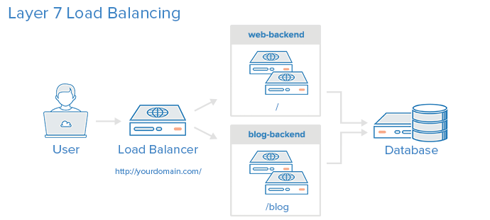

# Training HAProxy

### 목차
 - [Overview](#overview)
 - [Understand HAProxy](#understand-haproxy)
    - [What is Load balancer](#what-is-load-balancer)
    - [How To Work HAProxy](#how-to-work-haproxy)
    - [HAProxy High availability](#haproxy-high-availability)
    
 - [Install HAProxy](#install-haproxy)
 - [Configure HAProxy](#configure-haproxy)
    - [Configure Logging](#configure-logging)
    - [Configure proxy](#configure-proxy)
    - [Test](#test)

 - [Next Step](#next-step)
 
## Overview

앞서 [마라톤 프레임워크](training-marathon.md) 학습 단계에서 우리는 제각각의 주소와 포트를 가진 도커 웹 컨테이너를 다수 보유하고 있습니다.

```
192.168.0.6:31928
192.168.0.6:31094
192.168.0.6:30145
.
.
```

이 섹션에서는 HAProxy 를 이용하여 이 웹 서비스들을 어떠한 스위칭 장비도 없이 하나의 도메인(또는 하나의 아이피) 으로 서비스 하는 법을 배워보도록 합니다.

교재 진행을 위한 사전 이미지는 [https://drive.google.com/open?id=0By_yEUK4bN_weW1CYTF5Z2s4LVE](https://drive.google.com/open?id=0By_yEUK4bN_weW1CYTF5Z2s4LVE) 
을 다운받아 진행하시길 바랍니다.

## Understand HAProxy

HAProxy 는 기존의 하드웨어 스위치를 대체하는 소프트웨어 로드 밸런서로, 
네트워크 스위치에서 제공하는 L4, L7 기능 및 로드 밸런서 기능을 제공합니다. 
HAProxy 는 설치가 쉽고 또한 환경 설정도 어렵지 않으므로 서비스 이중화를 빠르게 구성하는데 용이한 오픈소스입니다.

### What is Load balancer

로드 밸런싱이란 부하 분산을 위해서 가상(virtual) IP를 통해 여러 서버에 접속하도록 분배하는 기능을 말합니다. 로드 밸런싱에서 사용하는 주요 기술은 다음과 같습니다.

 - NAT(Network Address Translation): 사설 IP 주소를 공인 IP 주소로 바꾸는 데 사용하는 통신망의 주소 변조기.
 - DSR(Dynamic Source Routing protocol): 로드 밸런서 사용 시 서버에서 클라이언트로 되돌아가는 경우 목적지 주소를 스위치의 IP 주소가 아닌 클라이언트의 IP 주소로 전달해서 네트워크 스위치를 거치지 않고 바로 클라이언트를 찾아가는 개념.
 - Tunneling: 인터넷상에서 눈에 보이지 않는 통로를 만들어 통신할 수 있게 하는 개념으로, 데이터를 캡슐화해서 연결된 상호 간에만 캡슐화된 패킷을 구별해 캡슐화를 해제할 수 있음.
 
로드 밸런스의 타입과 동작 방식에 대해 간략히 그림으로 표현해보도록 합니다.
  




로드 밸런서의 동작을 간단하게 설명하면, 네트워크에서 IP 주소와 MAC 주소를 이용해 목적지(destination) IP 주소를 찾아가고 출발지로 되돌아오는 구조입니다. 
이 글에서는 4가지의 로드 밸런서 동작 방식을 설명하지만, 
일반적인 로드 밸런서의 동작을 참조하기 위한 것이므로 정확하게 이해하지 못해도 상관없습니다.

#### Bridge/Transparent Mode
 
사용자가 서비스를 요청하면 L4로 전달된 목적지 IP 주소를 real server IP 주소로 변조하고 MAC 주소를 변조해서 목적지를 찾아가는 방식입니다.


1. 요청 전달 시 변조
 
 사용자 > L4 > NAT(IP/MAC 주소 변조) > real server - 사용자가 L4를 호출하면 중간에 NAT가 목적지 IP 주소를 real server IP 주소로 변조하고 MAC 주소도 변조합니다.
 
2. 응답 전달 시 변조
 
 real server > NAT > L4 > 사용자 - real server에서 L4를 거치면서 출발지(source) IP 주소를 L4 가상 IP 주소로 변조합니다. 동일 네트워크 대역이므로 MAC 주소는 변조하지 않습니다.
 
#### Router Mode

Bridge/Transparent Mode와 유사하지만 출발지(source) MAC 주소도 변조됩니다.

#### One Arm Mode

사용자가 real server에 접근할 때 목적지 IP는 L4 스위치 IP를 바라봅니다. 
L4에 도달하면 L4가 클라이언트에게 받은 목적지 IP 주소를 L4 IP 주소에서 real server IP와 real server MAC 주소로 변조합니다. 
되돌아가는 IP는 L4의 IP pool의 IP 주소로 변조합니다.

#### DSR (Direct Server Return) Mode

사용자가 real server에 접근할 때 출발지와 목적지의 IP 주소를 변조하지 않고, L4에서 관리하는 real server의 MAC 주소 테이블을 확인해서 MAC 주소만 변조합니다.

### How To Work HAProxy

HAProxy 는 기본적으로 reverse proxy 형태로 동작합니다. 
우리가 브라우저에서 사용하는 proxy 는 클라이언트 앞에서 처리하는 기능으로, forward proxy 라 합니다. 
reverse proxy 의 역할을 간단히 설명하면, 실제 서버 요청에 대해서 서버 앞 단에 존재하면서, 
서버로 들어오는 요청을 대신 받아서 서버에 전달하고 요청한 곳에 그 결과를 다시 전달하는 것입니다.

HAProxy 의 동작 방식을 알아보고 HAProxy 를 이용해서 어떤 구조로 확장할 수 있는지 알아보도록 합니다.

HAProxy의 동작 흐름은 다음과 같습니다.

1. 최초 접근 시 서버에 요청 전달
2. 응답 시 쿠키(cookie)에 서버 정보 추가 후 반환
3. 재요청 시 proxy 에서 쿠키 정보 확인 > 최초 요청 서버로 전달
4. 다시 접근 시 쿠키 추가 없이 전달 > 클라이언트에 쿠키 정보가 계속 존재함(쿠키 재사용)


### HAProxy High availability

HAProxy 는 기본적으로 VRRP(Virtual Router Redundancy Protocol)를 지원합니다. 
HAProxy 의 성능상 초당 8만 건 정도의 연결을 처리해도 크게 무리가 없지만, 
소프트웨어 기반의 솔루션이기 때문에 HAProxy 가 설치된 서버에서 문제가 발생하면 하드웨어 L4보다는 불안정할 수 있습니다. 
따라서 HA 구성으로 master HAProxy 에 문제가 생기는 경우에도 slave HAProxy 에서 서비스가 원활하게 제공될 수 있는 구성을 알아보겠습니다.

다음 그림과 같은 구성에서는 가상 IP 주소를 공유하는 active HAProxy 서버와 standby HAProxy 서버가 heartbeat 를 주고 받으면서 
서로 정상적으로 동작하는지 여부를 확인합니다. 
active 상태의 서버에 문제가 발생하면 standby HAProxy 가 active 상태로 변경되면서 
기존 active HAProxy 의 가상 IP 주소를 가져오면서 서비스가 무정지 상태를 유지하게 됩니다. 


HA로 설정된 HAProxy 의 동작 흐름이 단일 HAProxy 와 다른 점은 최초 접근 시 쿠키에 바로 서버 정보를 입력하지 않고 
서버에서 jsessionid 가 전달될 때 서버 정보를 합쳐서 전달한다는 것입니다.

1. 쿠키에 정보 추가 없고 X-Forwarded-For 에 정보 추가
2. 쿠키에 추가 없음
3. Jsessionid 추가
4. 서버 정보 + jsessionid 를 쿠키에 추가
5. 쿠키에서 서버 판별 후 jsessionid 만 전달


다음 파트에서 실제로 HAProxy 를 설치하고 실행해보도록 하겠습니다. 

## Install HAProxy

버츄얼 박스에서 [https://drive.google.com/open?id=0By_yEUK4bN_weW1CYTF5Z2s4LVE](https://drive.google.com/open?id=0By_yEUK4bN_weW1CYTF5Z2s4LVE) 
에서 다운받은 이미지로 새로 VM을 생성하도록 합니다. (Mac 주소는 초기화 해 주도록 합니다.)

이 VM에 이름을 haproxy 으로 변경해주고, 아이피는 192.168.0.2 라고 가정합니다.

```
192.168.0.2 haproxy
```

apt 에 레파지토리를 추가하고 설치를 진행합니다.

```
[proxy]$ sudo apt-add-repository -y ppa:vbernat/haproxy-1.5

gpg: keyring `/tmp/tmpvwic6d4e/secring.gpg' created
gpg: keyring `/tmp/tmpvwic6d4e/pubring.gpg' created
gpg: requesting key 1C61B9CD from hkp server keyserver.ubuntu.com
gpg: /tmp/tmpvwic6d4e/trustdb.gpg: trustdb created
gpg: key 1C61B9CD: public key "Launchpad PPA for Vincent Bernat" imported
gpg: Total number processed: 1
gpg:               imported: 1  (RSA: 1)
OK

[proxy]$ sudo apt-get -y update
[proxy]$ sudo apt-get install haproxy

Reading package lists... Done
Building dependency tree       
Reading state information... Done
Suggested packages:
  vim-haproxy haproxy-doc
.
.
```

HAProxy 의 설치가 잘 되었나 확인해봅니다.

```
[proxy]$ sudo service haproxy status 
haproxy is running.
```

## Configure HAProxy

설치된 서버의 /etc/haproxy/haproxy.cfg 를 살펴보면 아래의 내용이 나타나게 됩니다.

```
[proxy]$ cat /etc/haproxy/haproxy.cfg
global
	log /dev/log	local0
	log /dev/log	local1 notice
	chroot /var/lib/haproxy
	stats socket /run/haproxy/admin.sock mode 660 level admin
	stats timeout 30s
	user haproxy
	group haproxy
	daemon

	# Default SSL material locations
	ca-base /etc/ssl/certs
	crt-base /etc/ssl/private

	# Default ciphers to use on SSL-enabled listening sockets.
	# For more information, see ciphers(1SSL). This list is from:
	#  https://hynek.me/articles/hardening-your-web-servers-ssl-ciphers/
	ssl-default-bind-ciphers ECDH+AESGCM:DH+AESGCM:ECDH+AES256:DH+AES256:ECDH+AES128:DH+AES:ECDH+3DES:DH+3DES:RSA+AESGCM:RSA+AES:RSA+3DES:!aNULL:!MD5:!DSS
	ssl-default-bind-options no-sslv3

defaults
	log	global
	mode	http
	option	httplog
	option	dontlognull
        timeout connect 5000
        timeout client  50000
        timeout server  50000
	errorfile 400 /etc/haproxy/errors/400.http
	errorfile 403 /etc/haproxy/errors/403.http
	errorfile 408 /etc/haproxy/errors/408.http
	errorfile 500 /etc/haproxy/errors/500.http
	errorfile 502 /etc/haproxy/errors/502.http
	errorfile 503 /etc/haproxy/errors/503.http
	errorfile 504 /etc/haproxy/errors/504.http
```

여러가지 옵션이 있는데, 이중 주요 옵션 몇가지를 살펴보도록 하겠습니다.

 - global # 전역 옵션 섹션
    - daemon: 백그라운드 모드(background mode)로 실행
    - log: syslog 설정
    - log-send-hostname: hostname 설정
    - uid: 프로세스의 userid를 number로 변경
    - user: 프로세스의 userid를 name으로 변경
    - node: 두 개 이상의 프로세스나 서버가 같은 IP 주소를 공유할 때 name 설정(HA 설정)
    - maxconn: 프로세스당 최대 연결 개수
 - Defaults # 기본 옵션 섹션
    - log: syslog 설정
    - maxconn: 프로세스당 최대 연결 개수

처음 인스톨시에는 기본적인 세팅이 되어있고, 실제 사용을 위해서는 이 파일에 proxy 설정을 추가해야 합니다.

프록시 설정은 다음의 네가지 섹션으로 구성할 수 있습니다.

 - defaults <name>
 - frontend <name>
 - backend  <name>
 - listen   <name>
 
설명하기에 앞서 proxy 구성에 대한 간단한 예제로 나타내보겠습니다.

```
# 예제 1
defaults
    mode http
    timeout connect 5000ms
    timeout client 50000ms
    timeout server 50000ms

listen http-in
    bind *:80
    server server1 127.0.0.1:8000 maxconn 32
    
# 예제 2(예제 1과 동일한 기능)
defaults
    mode http
    timeout connect 5000ms
    timeout client 50000ms
    timeout server 50000ms

frontend http-in
    bind *:80
    default_backend servers

backend servers
    server server1 127.0.0.1:8000 maxconn 32
```


**defaults** 섹션에 명시 된 내용은 다른 모든 섹션이 실행되기 전 기본으로 가지는 파라미터 값입니다.

**frontend** 섹션은 클라이언트로부터 들어오는 커넥션에 대한 처리 방안입니다.

**backend** 섹션은 접속된 커넥션을 어떻게 포워딩 할 것인지에 대한 처리 방안입니다.

**listen** 섹션은 **frontend** 와 **backend** 를 일괄적으로 처리하는 것과 같은 효과를 나타냅니다. 보통 TCP-only 트래픽을 기술할 경우 쓰여집니다.

이 교재에서는 **defaults** 는 초기 세팅을 따르고, **frontend** 와 **backend** 를 편집하여 보도록 하겠습니다.

### Configure Logging

HAProxy 는 rsyslog 를 통해 로그를 기록합니다. 따라서, 우리가 그냥 HAProxy 서버를 시작한다면 로그를 확인할 수 없습니다.

로그를 출력할 수 있게 하기 위해서 다음 순서가 필요합니다.

Step 1. haproxy.cfg 편집

/etc/haproxy/haproxy.cfg 에서 다음 두 라인을 주석처리하고 새로운 라인을 입력합니다.

```
[proxy]$ sudo vi /etc/haproxy/haproxy.cfg

global
        log 127.0.0.1   local0
        log 127.0.0.1   local1 notice
#       log /dev/log    local0
#       log /dev/log    local1 notice
```

Step 2. rsyslog 설치

```
[proxy]$ sudo apt-get install rsyslog
```

Step 3. /etc/rsyslog.d/haproxy.conf 생성

```
[proxy]$ sudo vi /etc/rsyslog.d/haproxy.conf

$ModLoad imudp
$UDPServerRun 514
$template Haproxy, "%msg%\n"
local0.=info -/var/log/haproxy.log;Haproxy
local1.notice -/var/log/haproxy-status.log;Haproxy
local0.* ~
```

Step 4. 서비스 재시작

```
[proxy]$ sudo service rsyslog restart
[proxy]$ sudo service haproxy restart
```

Step 4 까지 진행을 하고 나면 /var/log/haproxy.log 파일이 생성되어 있어야 합니다.

```
[proxy]$ cat /var/log/haproxy.log 
Mar 24 18:06:54 localhost haproxy[2251]: Proxy service started.
Mar 24 18:06:54 localhost haproxy[2251]: Proxy service started.
```

이후 haproxy 의 로그는 이 파일에 기록이 될 것입니다.

### Configure proxy

/etc/rsyslog.d/haproxy.conf 파일에 frontend, backend 섹션을 다음과 같이 기술합니다.

```
frontend service
	bind *:80
	mode http
	default_backend sample-be

backend sample-be
	mode http
	balance roundrobin
	option forwardfor
	cookie SERVERID rewrite
    cookie JSESSIONID prefix
	http-request set-header X-Forwarded-Port %[dst_port]
	server sample-be-0 192.168.0.6:31881 check
	server sample-be-1 192.168.0.6:31028 check
	server sample-be-2 192.168.0.6:31747 check
```

sample-be-0~3 의 아이피들은 마라톤 섹션을 진행하며 생성한 도커 컨테이너 아이피:포트 들이니 알맞은 값으로 바꾸시길 바랍니다.

frontend 와 backend 각 항목의 주요 옵션들을 살펴보겠습니다.

 - mode http: 연결 프로토콜
 - option httpchk: health check
 - option log-health-checks: health 로그 남김 여부
 - option forwardfor: 클라이언트 정보 전달
 - option httpclose: keep-alive 문제 발생 시 off 옵션
 - cookie SERVERID rewrite: 쿠키로 서버 구별 시 사용 여부
 - cookie JSESSIONID prefix: HA 구성 시 prefix 이후에 서버 정보 주입 여부
 - balance roundrobin: 순환 분배 방식
 - stats enable: 서버 상태 보기 가능 여부
 - stats uri /admin: 서버 상태 보기 uri
 - server server [host명] [ip]:[port] cookie [서버쿠키명] check inter [주기(m/s)] rise [서버구동여부점검횟수], fall [서비스중단여부점검횟수]

이 파일을 해석하면 다음의 내용이 됩니다.

1. service 라는 아이디를 가진 frontend 는 80 포트로 들어오는 모든 접속에 대하여, 디폴트로 sample-be 라는 backend 포워딩을 사용하겠습니다.
2. sample-be 라는 backend 는 sample-be-0~3 에서 기술된 아이피:포트 로 트래픽을 분산처리합니다.
3. 분산처리 연결 프로토콜을 http 이며, 로드밸런싱은 roundrobin(순환 분배 방식) 을 사용하도록 합니다.

특히 balance 에는 여러가지 알고리즘이 있는데 정리를 해 보겠습니다.

 - roundrobin: 순차적으로 분배(최대 연결 가능 서버 4128개)
 - static-rr: 서버에 부여된 가중치에 따라서 분배
 - leastconn: 접속 수가 가장 적은 서버로 분배
 - source: 운영 중인 서버의 가중치를 나눠서 접속자 IP를 해싱(hashing)해서 분배
 - uri: 접속하는 URI를 해싱해서 운영 중인 서버의 가중치를 나눠서 분배(URI의 길이 또는 depth로 해싱)
 - url_param: HTTP GET 요청에 대해서 특정 패턴이 있는지 여부 확인 후 조건에 맞는 서버로 분배(조건 없는 경우 round robin으로 처리)
 - hdr: HTTP 헤더 에서 hdr(<name>)으로 지정된 조건이 있는 경우에 대해서만 분배(조건 없는 경우 round robin으로 처리)
 - rdp-cookie: TCP 요청에 대한 RDP 쿠키에 따른 분배
 
### Test

설정을 마친 후 실제 가동하여 보겠습니다.

haproxy 를 재시작합니다.

```
[proxy]$ sudo service haproxy restart
```

그리고, haproxy 서버의 80 포트로 브라우저에 접속하여 봅니다.

메소스 마라톤 과정에서 진행하였던 Hello World 웹 서버가 화면에 출력이 된다면 로드 밸런싱이 성공 한 것입니다.

이때 haproxy 의 로그를 살펴보겠습니다.

```
[proxy]$ sudo tail -f /var/log/haproxy.log 
Mar 24 18:12:12 localhost haproxy[2290]: 192.168.0.23:55237 [24/Mar/2016:18:12:12.631] service sample-be/sample-be-0 0/0/0/1/1 200 156 - - --NN 1/1/0/1/0 0/0 "GET / HTTP/1.1"
Mar 24 18:12:12 localhost haproxy[2290]: 192.168.0.23:55237 [24/Mar/2016:18:12:12.632] service sample-be/sample-be-1 78/0/1/0/79 200 156 - - --NN 1/1/0/1/0 0/0 "GET /favicon.ico HTTP/1.1"
Mar 24 18:12:18 localhost haproxy[2290]: 192.168.0.23:55237 [24/Mar/2016:18:12:12.712] service sample-be/sample-be-2 6118/0/1/0/6119 200 156 - - --NN 1/1/0/1/0 0/0 "GET / HTTP/1.1"
Mar 24 18:12:18 localhost haproxy[2290]: 192.168.0.23:55237 [24/Mar/2016:18:12:18.832] service sample-be/sample-be-0 79/0/1/0/80 200 156 - - --NN 1/1/0/1/0 0/0 "GET /favicon.ico HTTP/1.1"
Mar 24 18:12:21 localhost haproxy[2290]: 192.168.0.23:55237 [24/Mar/2016:18:12:18.913] service sample-be/sample-be-1 2229/0/0/1/2230 200 156 - - --NN 1/1/0/1/0 0/0 "GET / HTTP/1.1"
Mar 24 18:12:21 localhost haproxy[2290]: 192.168.0.23:55237 [24/Mar/2016:18:12:21.142] service sample-be/sample-be-2 72/0/1/1/74 200 156 - - --NN 1/1/0/1/0 0/0 "GET /favicon.ico HTTP/1.1"
.
.
```

클라이언트가 리소스를 요청할 때 마다, sample-be-0~3 까지의 도커 컨테이너에 차례대로 트래픽을 순환분배하는 로그를 볼 수 있습니다.

## Next Step

지금 까지 메소스 마라톤 프레임워크의 사용법을 습득하였고, 도커 컨테이너 웹 어플리케이션을 HAProxy 를 통해 로드밸런싱 하는 것까지 배워보았습니다.

이 밖에도 완전한 웹 어플리케이션을 운용하기 위해서는 DNS 서버, SSL 설정, 데이터베이스 리소스 등의 기능들이 필요합니다.

물론 이 기능들을 모두 하나의 도커 컨테이너에 집어넣어 운용할 수도 있지만, 도커 컨테이너 마다 과다한 리소스를 할애해야 하므로 각 역할에 맞는 컨테이너 이미지를 제작하여 
메소스 프레임워크로 실행시키는 것이 더 나은 선택입니다.

다음 파트에서는 메소스, 마라톤, 그리고 DNS 과 로드밸런싱, 데이터베이스 리소스등을 복잡한 설치 과정 없이 아주 쉽게 구성할 수 있게 해주는 오픈소스 플랫폼인 Beluga 를 학습 해 보겠습니다.

[Beluga 학습 바로가기](../README.md)


    
