# Training Virtual Box

### 목차
 - [Virtual Box Install](#virtual-box-install)
 - [Download ova](#download-ova)
 - [Run ova](#run-ova)
 - [Find address](#find-address)

## Virtual Box Install

버츄얼 박스 다운로드

[https://www.virtualbox.org/wiki/Downloads](https://www.virtualbox.org/wiki/Downloads)

## Download ova

Ubuntu Server 14.04 TLS 가상머신을 구축하기 위해서 ova 파일을 다운받지 않고 직접 서버를 인스톨 하기 위해서는

[https://rorlab.gitbooks.io/railsguidebook/content/appendices/ubuntu14server.html](https://rorlab.gitbooks.io/railsguidebook/content/appendices/ubuntu14server.html)
문서를 참조하시기 바랍니다.

[https://drive.google.com/open?id=0By_yEUK4bN_wOVc5ZlZ4ZkY1akE](https://drive.google.com/open?id=0By_yEUK4bN_wOVc5ZlZ4ZkY1akE)
 을 통해 사전에 설치가 완료된 ova 파일을 다운받을 수 있습니다.

## Run ova

파일 - 가상시스템 가져오기 를 통해 다운로드 받은 ova 를 불러옵니다.

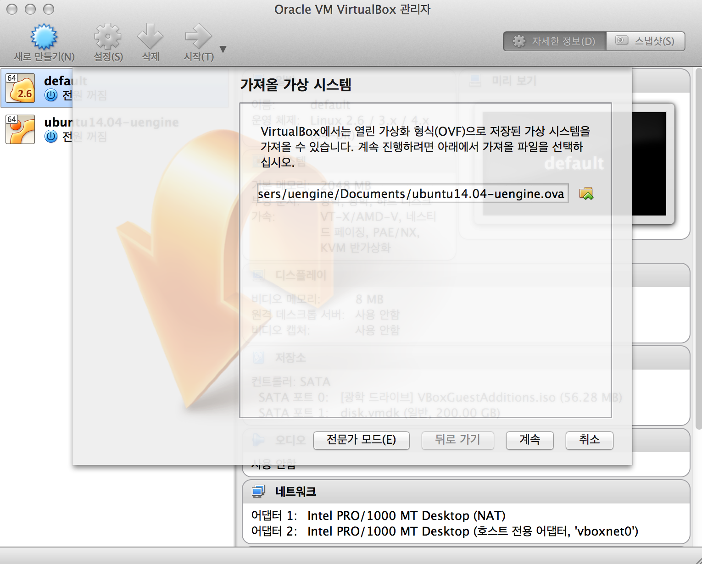

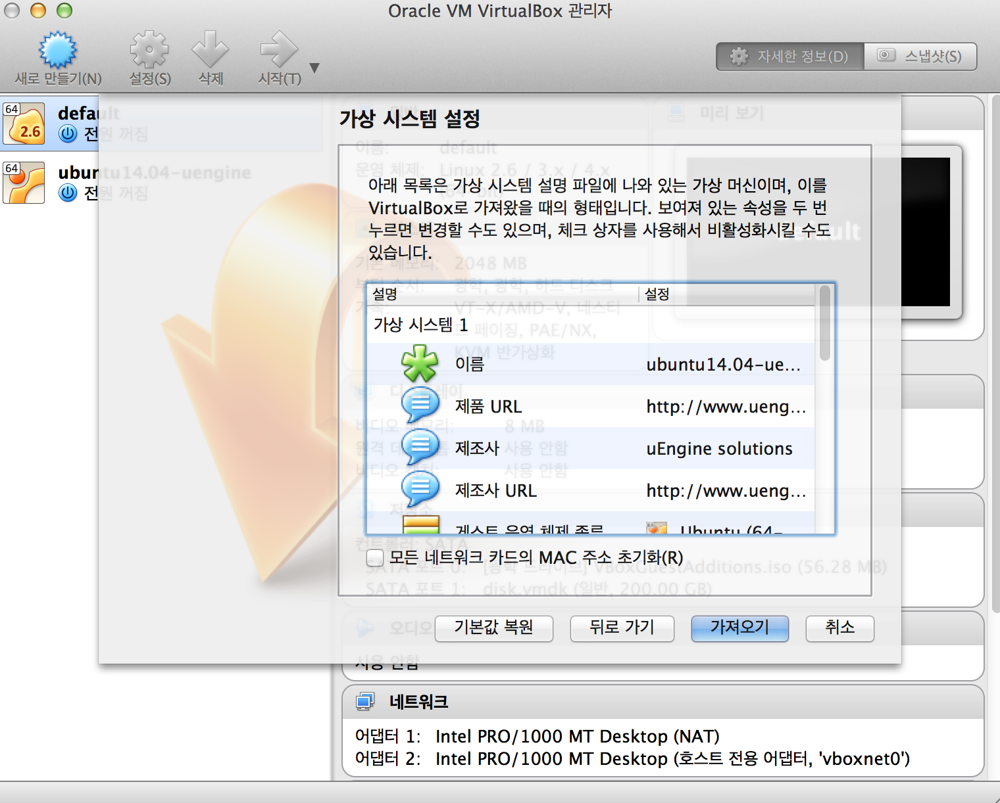

생성 된 가상머신을 우클륵하여 설정 창을 불러옵니다.

### Wifi 환경, 공유기 환경

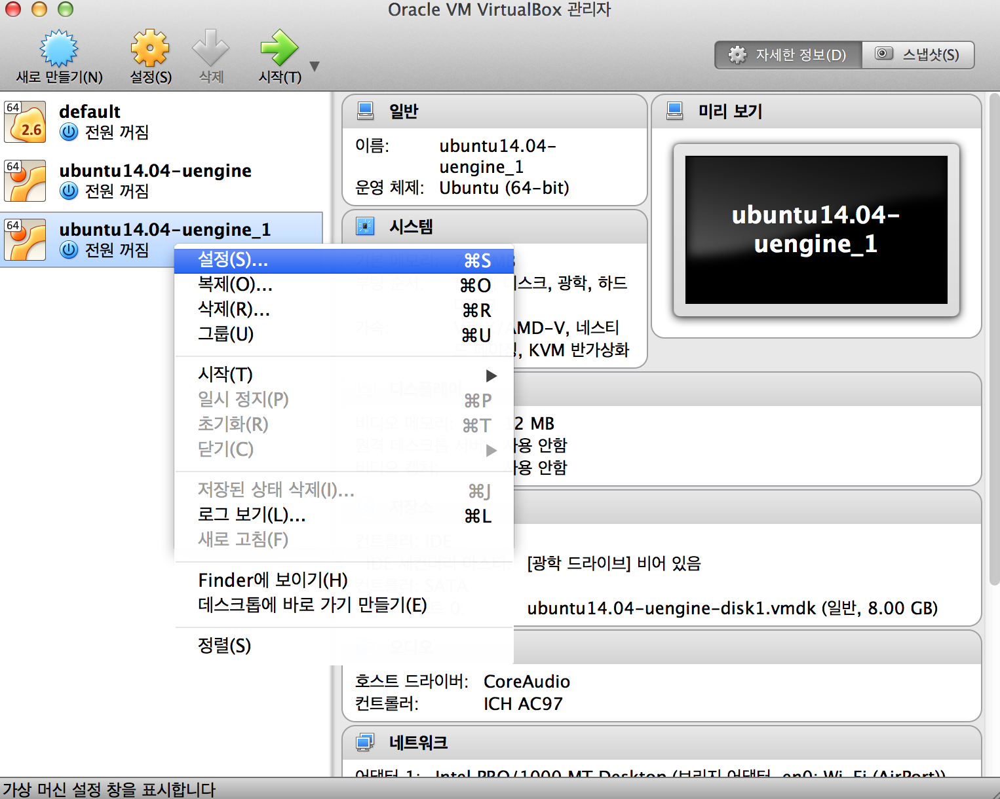

네트워크 탭에서 네트워크 어댑터를 브리지 어댑터로 설정합니다.

브리지 어댑터의 종류는 보통 제일 첫번째 것을 사용하며, 사용자의 인터넷 환경에 맞는 것을 선택하여 줍니다.

네트워크 환경에 따라서는 다른 어댑터를 사용해야 할 수 있습니다.

그 후 하단의 고급 탭을 열어 가상머신의 맥 주소를 리프레쉬 하도록 합니다.

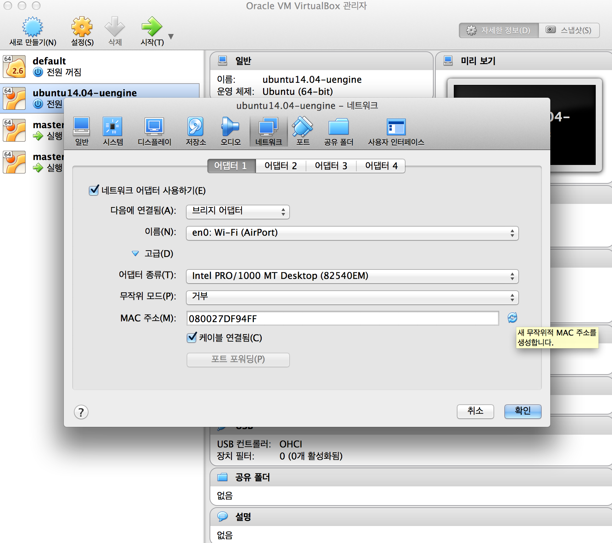

가상 머신을 시작하면 우분투가 구동되는 모습을 볼 수 있습니다.

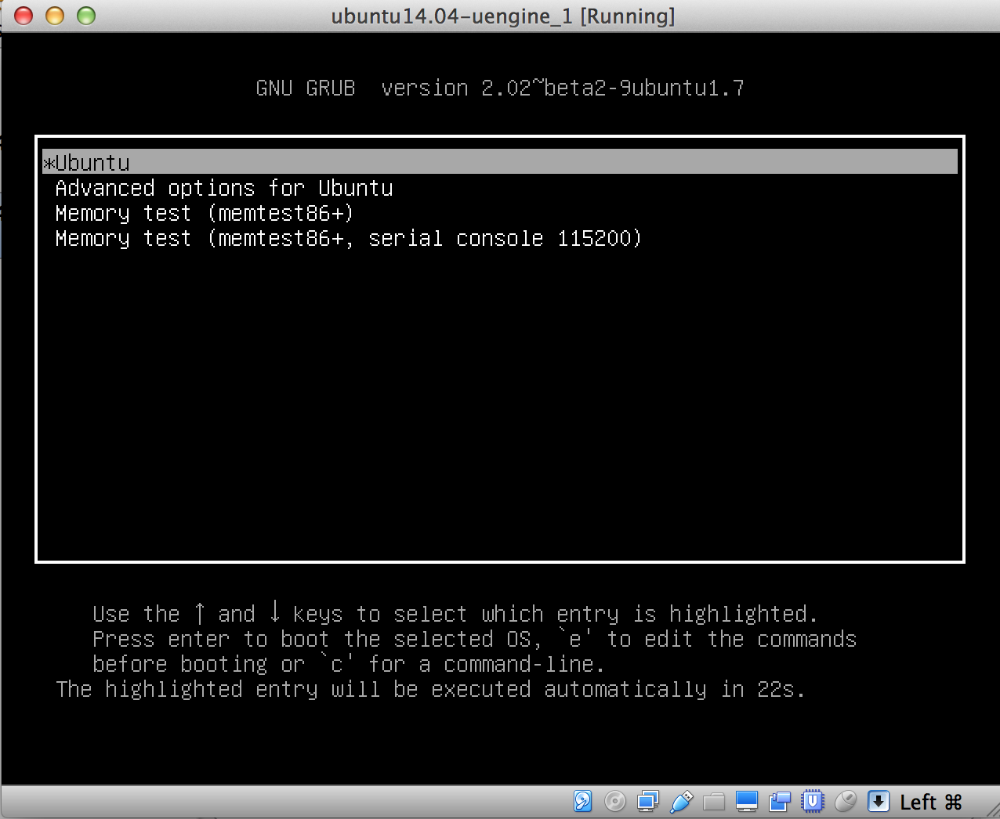

로그인 아이디와 패스워드는 uengine / uengine 으로 되어있습니다.

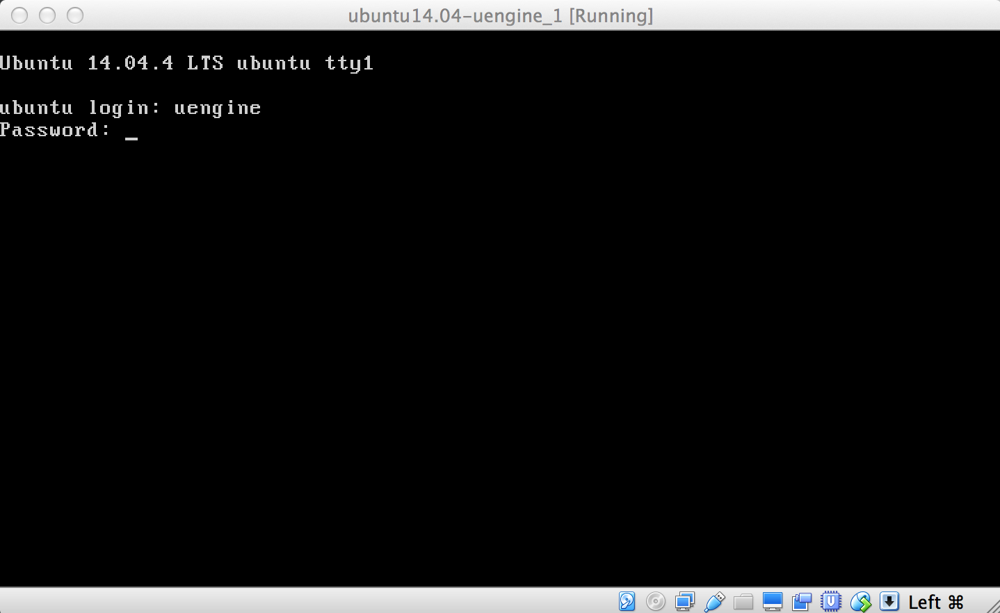

### 고정 네트워크 환경

고정 네트워크 환경에서는 다음과 같이 설정합니다.

먼저, 파일 => 환경설정 => 네트워크 => 호스트 전용 네트워크 탭으로 들어갑니다.

그후, 어댑터의 IPv4 주소를 확인합니다.

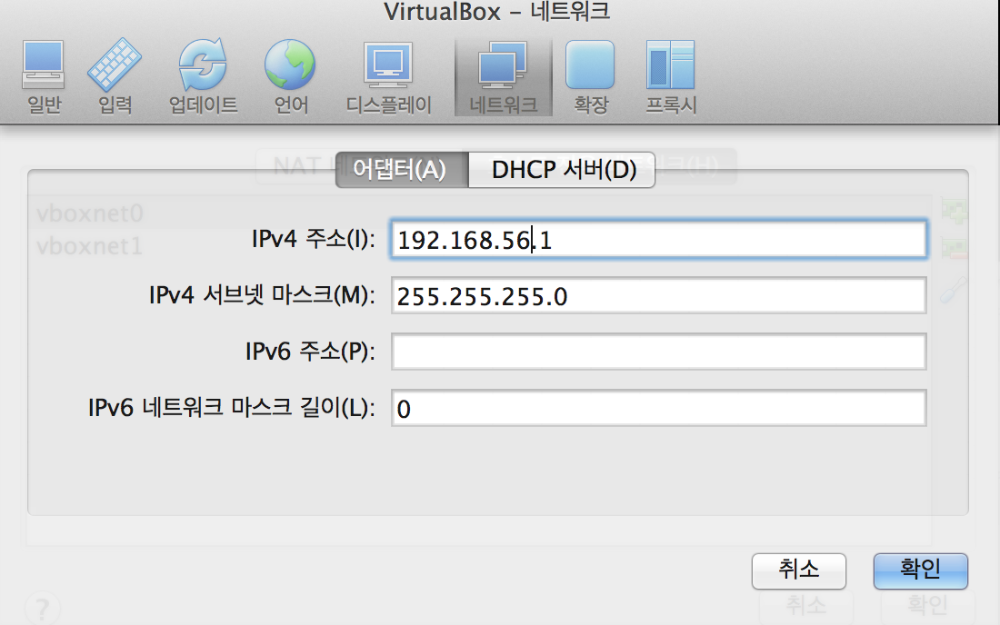

가상머신을 우클릭하여 나온 네트워크 설정 창에서 어댑터들을 다음 차례대로 설정합니다.

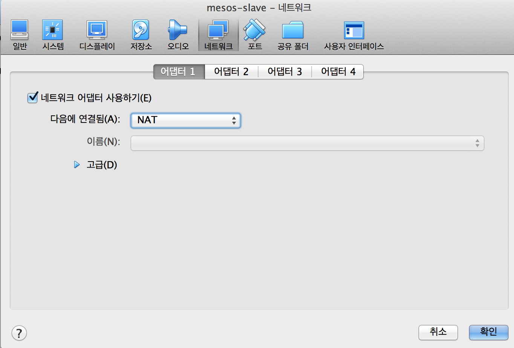

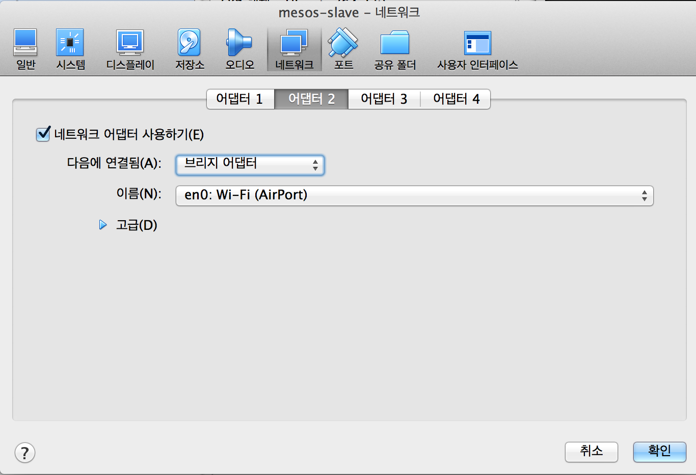

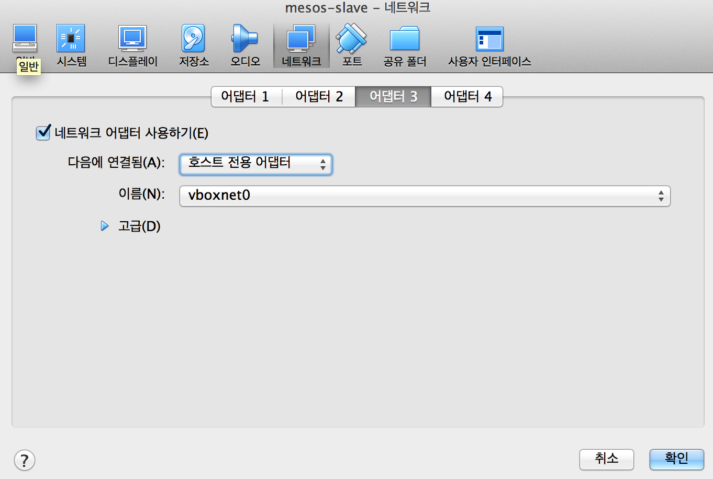

위의 IPv4 주소는 192.168.56.1 입니다.

이제 192.168.56.2 ~ 254 까지의 대역대를 선택하여 가상머신과 호스트컴퓨터와의 통신을, 또 가상머신끼리의 통신을 지원할 수 있게 됩니다.

머신을 시작한 후, 머신의 콘솔에 위의 대역대중에 하나를 선택하여 다음을 작성합니다. 

아래 예제에서는 192.168.56.101 을 쓰도록 합니다.

```
$ sudo ifconfig eth1 192.168.56.101 netmask 255.255.255.0 up

$ sudo vi /etc/network/interfaces
.
.
.
auto eth1
iface eth1 inet static
address 192.168.56.101
netmask 255.255.255.0
network 192.168.56.0
broadcast 192.168.56.255

```

이후, 호스트 머신에서 이 VM 으로 접속하실경우, NAT 네트워크 어댑터에서 포트포워딩을 설정합니다.

예)

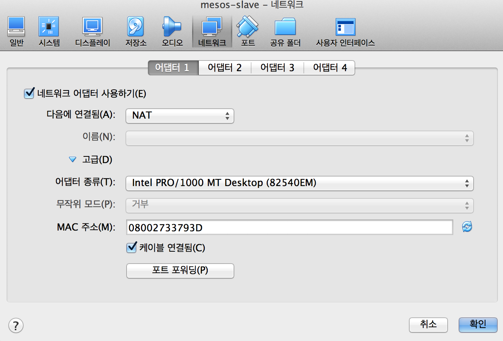

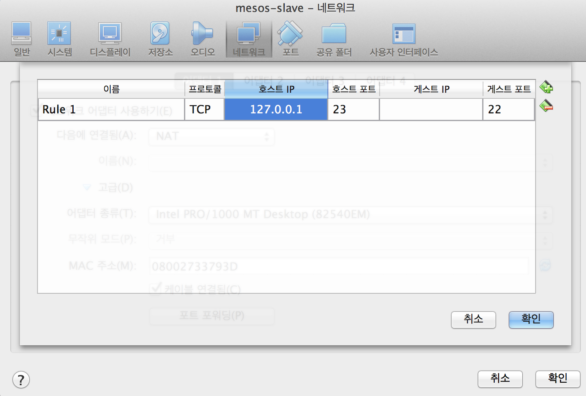


## Find address

구동 된 가상머신의 터미널에서 ifconfig 명령어를 통해 할당 된 아이피를 알 수 있습니다.

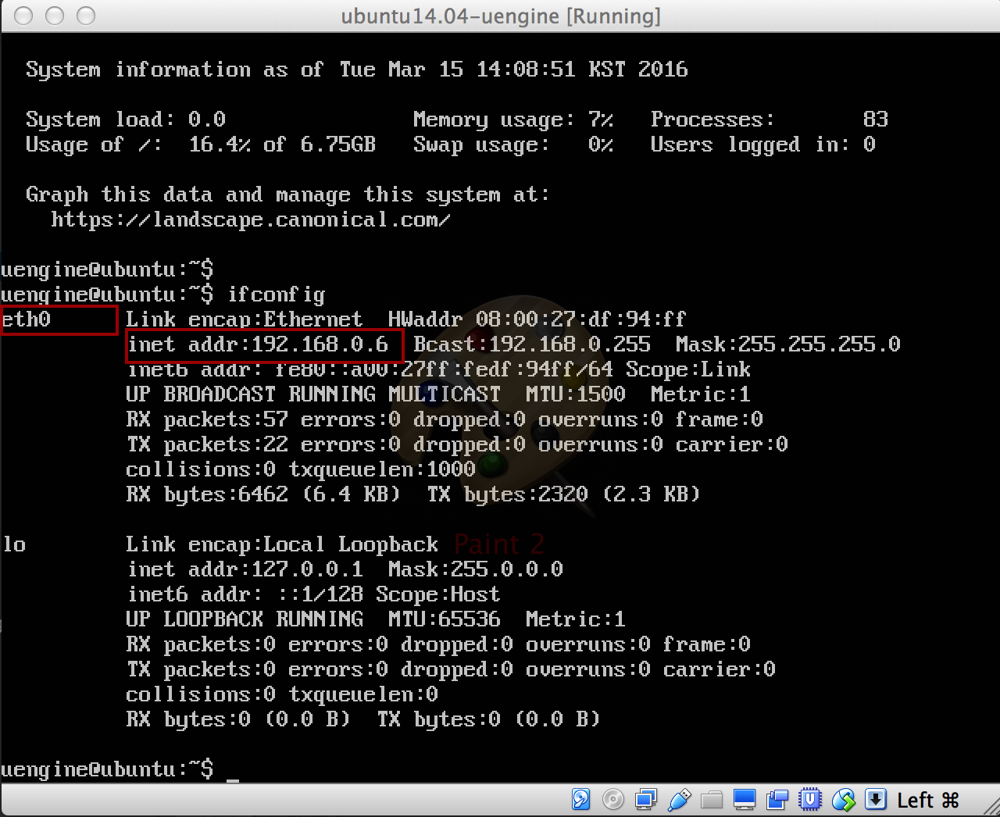


[Download ova](#download-ova) 과정에서 수동으로 서버를 설치하셨을 경우에는, ssh 인스톨을 실행합니다.
```
$ sudo apt-get install ssh
```

putty 또는 mac os x 터미널에서 가상머신으로 접속 할 수 있습니다.

[putty download](https://the.earth.li/~sgtatham/putty/latest/x86/putty.exe)

```
$ ssh uengine@192.168.0.6
uengine@192.168.0.6's password: 
Welcome to Ubuntu 14.04.4 LTS (GNU/Linux 4.2.0-27-generic x86_64)

 * Documentation:  https://help.ubuntu.com/

  System information as of Tue Mar 15 14:08:57 KST 2016

  System load:  0.48              Processes:           98
  Usage of /:   16.4% of 6.75GB   Users logged in:     0
  Memory usage: 9%                IP address for eth0: 192.168.0.6
  Swap usage:   0%

  Graph this data and manage this system at:
    https://landscape.canonical.com/

Last login: Tue Mar 15 14:08:57 2016
$ 
```


 